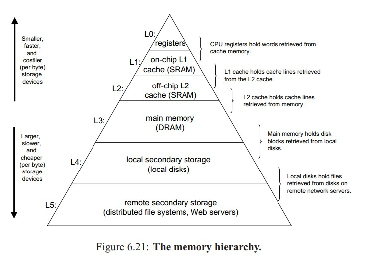
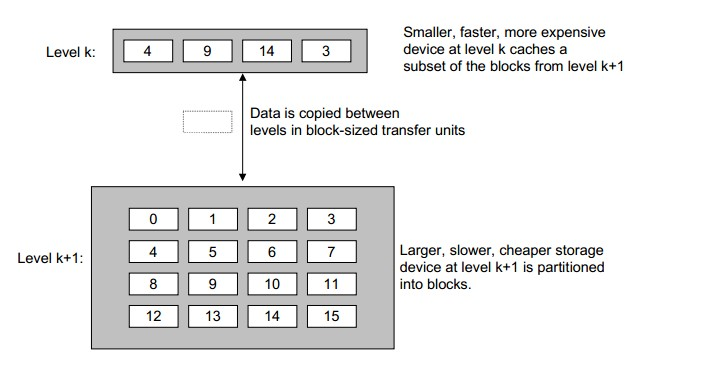
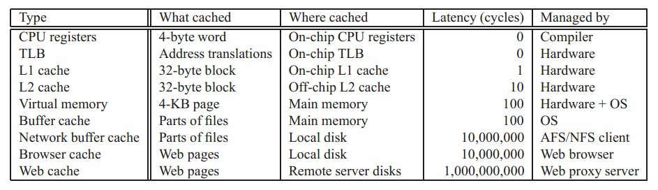

#20180428 提高程序性能 何为缓存__从存储器结构说起

**开篇**

 [上一篇博文](http://www.cnblogs.com/yanlingyin/archive/2012/02/11/2347116.html)

# [局部性原理浅析——良好代码的基本素质](http://www.cnblogs.com/yanlingyin/archive/2012/02/11/2347116.html)

中对程序局部性有了一个简单的介绍。基本上已经知道了如何编写有良好局部性的代码。但是为什么有良好局部性的代码就能有良好的运行效率，这个问题将在这篇博文中给出解答。至于存储器内部的组织实现，将在下篇文章中叙述。

**存储器层次结构**

我们知道，计算机里的存储器有:**硬盘、主存、高速缓存（其中又有一级高速缓存、二级高速缓存等等）、在往上就是寄存器**。

存储器在计算机内部的组织方式如下图所示：

相信上图大家并不陌生。wiki对The memory hierarchy 的介绍的时候也有此图。

我们发现，越往上，**存储器的容量越小、成本越高、速度越快**。

为什么会出现这样的结构呢？早起的存储器层次结构只有三层：**cpu寄存器、DRAM主存以及磁盘存储**。

由于CPU和主存之间巨大的速度差异，系统设计者被迫**在CPU寄存器和主存之间插入了一个小的SRAM高速缓存存储器称为L1缓存，大约可以在2--4个时钟周期内访问。再后来发现L1高速缓存和主存之间还是有较大差距，又在L1高速缓存和主存之间插入了速度更快的L2缓存，大约可以在10个时钟周期内访问**。于是，在这样的模式下，在不断的演变中形成了现在的存储体系。

现在可以知道整个存储器体系被分为了很多层，那么他们之间是如何协调工作以提高运行效率的呢?

**何为缓存**

暂时你可以这样理解:速度快的存储器缓存了速度慢存储器的数据。准确的描述：对于每个k ，位于k层的更快更小的存储器设备作为第k+1层的更大更慢存储设备的缓存。就是说，**k层存储了k+1层中经常被访问的数据。在缓存之间，数据是以块为单位传输的。当然不同层次的缓存，块的大小会不同。一般来说是越往上，块越小。**

请看下图示例

k是k+1的缓存，他们之间的数据传输是以块大小为单位的。如上图中，k中缓存了k+1中块编号为 4、9、14、3的数据。

当程序需要这些块中的数据时，可**直接冲缓存k中得到。这比从k+1层读数据要快**

**缓存命中**

当程序需要第k+1层中的某个数据时d，会首先在它的缓存k层中寻找。如果数据刚好在k层中，就称为缓存命中（cache hit）。

**缓存不命中**

当需要的数据对象d不再缓存k中时，称为缓存不命中。当发生缓存不命中时，第k层的缓存会从k+1层取出包含数据对象d的那个块，如果k层的缓存已经放满的话，**就会覆盖其中的一个块。至于要覆盖哪一个块，这是有缓存中的替换策略决定的，比如说可以覆盖使用频率最小的块，或者最先进入缓存的块。**。这里不再讨论。**在k层从k+1层中取出数据对象d后，程序就能在缓存中读取数据对象d了**。

**缓存命中和局部性**

这里先简单的说说为什么局部性好的程序能有更好的性能

利用时间局部性:由于**时间局部性，同一个数据对象会多次被使用。一旦一个数据对象从k+1层进入到k层的缓存中，就希望它多次被引用。这样能节省很多访问造成的时间开支**。

利用空间局部性:假设缓存k能存n个数据块。在**对数组访问的时候，由于数组是连续存放的**，对第一个元素访问的时候，会把第一个元素后面的一共n个元素（缓存k有n个数据块）拷贝到缓存k中，这样在对第二个元素到第n个元素的访问时就可以直接从缓存里获取，从而提高性能。

同理，访问第n个元素的时候 ，n不在缓存中，缓存管理器会把从n到2n的元素拷贝到缓存中，对它们的访问就可以直接在缓存中进行。

通过空间局部性，我们希望对后面对缓存中其他对象的访问能补偿不命中后拷贝这些块的时间花费。

现代系统中处处有缓存，为了使大家能更好的理解，下表对于计算机中不同层次的存储器和性能等参数做了以总结（仅供参考）

**小结**

 这篇文章主要介绍了计算机存储器内部的组织结构以及他们之间的关系，并简单说了下**缓存实现机制，以及缓存和局部性之间的关系**。

至于缓存内部如何实现，程序如何从缓存内存取数据，将在下一篇中给出	