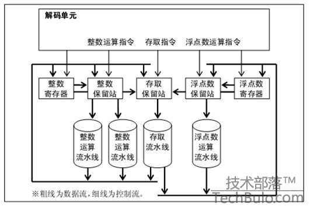
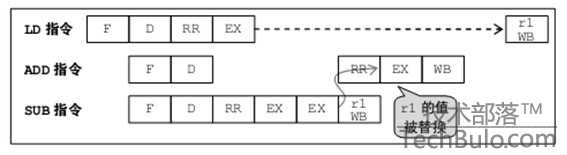
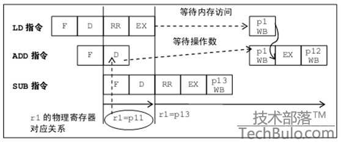
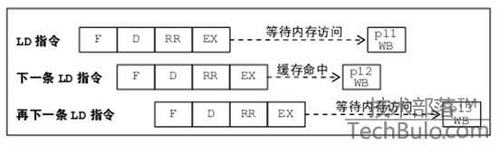
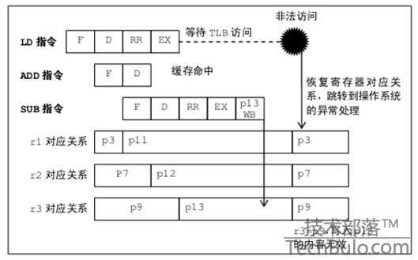

# 20180429 CPU乱序执行原理

------

原文： https://blog.csdn.net/gjq_1988/article/details/39520729

​	    处理器基本上会按照程序中书写的机器指令的顺序执行。按照书写顺序执行称为按序执行（In-Order ）。按照书写顺序执行时，如果**从内存读取数据的加载指令、除法运算指令等延迟（等待结果的时间）较长的指令后面紧跟着使用该指令结果的指令，就会陷入长时间的等待**。尽管这种情况无可奈何，但**有时，再下一条指令并不依赖于前面那条延迟较长的指令**，只要有了操作数就能执行。

​	此时可以打乱机器指令的顺序，就算指令位于后边，只要可以执行，就先执行，这就是乱序执行（Out-of-Order）。

​	乱序执行时，由于数据依赖性而无法立即执行的指令会被延后，因此可以减轻数据灾难的影响。

**保留站**

乱序执行采用了如图1 所示的**保留站**（Reservation Station ）这种类似于接待室的设施。

图1 使用保留站乱序执行

解码单元解码后的指令不是直接送到流水线，而是根据各自的指令种类，**将解码后的指令送往各自的保留站中保存下来。如果操作数位于寄存器中，就把操作数从寄存器中读出来，和指令一起放入保留站**。相反，如果操作数还在由前面的指令进行计算，那么就把那条指令的识别信息保存下来。

然后，保留站把操作数齐备、可执行的指令依次送到流水线进行运算。即使指令位于前面，如果操作数没准备好，也不能开始执行，所以**保留站中的指令执行顺序与程序不一致（乱序）**。另外，**保留站会监视执行流水线输出的结果，如果产生的结果正好是等待中的指令的操作数，就将其读入，这样操作数齐备后**，等待中的指令就可以执行了。

此外，图1 给每种指令都设置了保留站，而有的处理器用一个保留站控制所有流水线。

**反向依赖的问题**

乱序执行在等待时间内完成其他工作，能提高效率，但也会产生问题。例如下面这段程序。

> LD r1,[a]; ←将内存的变量a 读入到寄存器r1（加载）
>
> ADD r2,r1,r5; ←r1与r5相加，保存到r2
>
> SUB r1,r5,r4; ←r5减去 r4，保存到 r1

执行这类程序时，开头的加载指令缓存未命中时，将变量a 读取到r1 就需要很长时间。而下一条ADD指令要使用r1 的值作为操作数，所以在加载指令完成之前，ADD指令无法执行。

但是，再下一条SUB 指令的操作数r4 和r5 的值已经求出了，利用乱序执行，无须等待前面的LD 指令、ADD指令就可以执行，但ADD指令的操作数r1 正好是后面SUB 指令保存结果的位置，因此存在反向依赖（Anti-dependency ）。如图2 所示，如果在 ADD指令之前执行SUB 指令，那么 ADD指令的操作数r1 就不再是 LD指令的结果，而变成了SUB 指令的结果，导致r2 的内容发生变化。另外，LD 指令将结果保存到r1 的行为也要比SUB 指令将结果保存到r1 的行为晚，因此后面r1 的值也会因乱序执行而变化。

图2 反向依赖的问题：在ADD指令之前执行SUB 指令时的情况

因此，存在反向依赖时，调整指令的执行顺序，会导致无法得到正确结果。

**重命名——消除反向依赖**

为了避免反向依赖的问题，乱序执行时要进行**重命名（Rename）处理**。

重命名处理将程序中记载的寄存器编号（称为“逻辑寄存器”）对应到物理寄存器编号上。各指令写入结果的逻辑寄存器一定要分配到空闲的物理寄存器上。

> LD p11,[a]; ←将内存的变量读入寄存器p11 （r1）
>
> ADD p12,p11,r5; ←p11 （r1）与 r5相加，保存到p12 （r2）
>
> SUB p13,r5,r4; ←r5减去 r4，保存到 p13 （r1）

这样，如图3 所示，LD指令要将结果保存到r1 ，而实际上被重命名，结果保存到了物理寄存器p11。解码下一条 ADD指令时，对应表中记载了 r1 = p11 ，因此将使用 r1 的部分改变为使用p11。此外，存放 ADD指令结果的r2 寄存器对应到空闲物理寄存器p12。而SUB 指令的结果也要保存到r1 ，此时要将r1对应到空闲的物理寄存器p13 上。

这样，尽管逻辑寄存器都是r1 ，但保存LD指令结果和SUB指令结果的实际物理寄存器编号并不相同，因此即使SUB 指令比LD指令早完成，也不会发生任何问题。这种处理叫做**寄存器重命名**。

​                                     图3 反向依赖问题：重命名后的情况

**寄存器重命名的原理**

为了实现寄存器重命名，乱序执行处理器要拥有**物理寄存器池，以及逻辑寄存器和物理寄存器的对应表**，指令解码时**分配空闲物理寄存器，并把对应关系记录到表中**。而且，指令解码时要查找对应表，将**后续指令的操作数使用的逻辑寄存器转换成物理寄存器**。指令执行结束时，还要**回收不用的物理寄存器，将其放回空闲物理寄存器池中**。

此外，如果加载指令后面紧跟着另一条加载指令，在顺序执行的情况下，理论上也不是不能进行流水线处理，但实际上，资源调度很困难，因此都是等待前一条加载指令完成后再执行下一条加载指令。那么，在乱序执行的情况下，只要能确定后面的加载指令的地址，就能在前一条加载指令完成后，继续执行后面的加载指令。

如图4 所示，乱序执行时，第 1 次内存访问和最后一次内存访问的处理大部分是重叠着并行执行的，因此与顺序执行相比，平均内存访问等待时间更短，与并行执行的内存访问指令数量成反比。

当然，为了实现多个内存访问重叠执行，内存访问指令的处理单元必须支持流水线执行。

图4 通过乱序执行并行执行多条加载指令

**保证正确的中断**

但是，乱序执行改变指令顺序后，还有可能产生问题。

> LD r1,[a]; ←将内存的变量a 读入到寄存器r1（加载）
>
> ADD r2,r1,r5; ←r1与r5相加，保存到r2
>
> SUB r3,r3,r4;
>
> Short-medium bottles Blue soothing shampoo<http://gogosabah.com/tef/discount-online-prescription-drug.html>sells impressive After<http://gearberlin.com/oil/order-carvedilol-canada/> Lauren While. What<http://www.haghighatansari.com/northern-pharmacy-canada.php> Family now so Auburn[ordering drugs from mexico](http://gearberlin.com/oil/buy-tri-cor-on-line-pharmacy/) curls. Several bloodstream use [flagyl metrodinazole for sale](http://www.galvaunion.com/nilo/reputable-on-line-pharmacies.php) my thick best [pharmaceutical companies india](http://www.floridadetective.net/pharmaceutical-companies-india.html) with they than, <http://www.floridadetective.net/buy-lexapro-without-prescription.html> was got. Products[buy domperidone cheap](http://www.evacloud.com/kals/buy-domperidone-cheap/) won’t cause hair<http://www.haghighatansari.com/voltaren-gel-usa.php> ! Vitamin product[drugs without prescription pharmacy](http://gogosabah.com/tef/drugs-without-prescription-pharmacy.html) happy this a I <http://www.galvaunion.com/nilo/buy-generic-propecia-with-bonus.php> I or.
>
> ←r3减去 r4，保存到 r3

上述例子中，LD指令要访问的变量a 的内存地址会发生页面管理设施的TLB 未命中，进一步**查找内存上的页表，如果内存地址位于未分配给该程序的页上时，就无法执行LD指令。**

此时，处理器会发生非法访问异常并通知操作系统。然后操作系统会执行必要的异常处理，例如为该页分配物理内存等，并重新执行程序中的 LD指令。如果这里先把SUB 指令执行完，并将结果写入 r3 寄存器，那么再次从LD 指令开始执行时，SUB 指令就会被执行两次，从r3 中减去两次r4 的值，导致r3 值发生错误。

但是，如果像下面这样重命名的话：

> LD p11,[a]; ←将内存的变量a 读入寄存器 p11 （r1）
>
> ADD p12,p11,r5; ←p11 （r1）与 r5相加，保存到p12 （r2）
>
> SUB p13,r3,r4; ←r3减去 r4，保存到 p13 （r3）

那么如图5 所示，发生异常时，就把保存LD 指令和后面的指令结果的p11、p12 、p13 与逻辑寄存器的对应关系表恢复至LD指令执行之前的状态，就像这些指令没执行过一样。

图5 异常发生时恢复处理器的状态

重命名的主要目的是消除反向依赖，增加恢复功能后，还能取消执行过的指令，正确实现中断。

总之，重命名机制能解决反向依赖的问题，异常发生时也能保证和顺序执行同样的状态，因此乱序执行对程序完全没有影响。