# 操作系统面试重难点总结

## 知识图谱

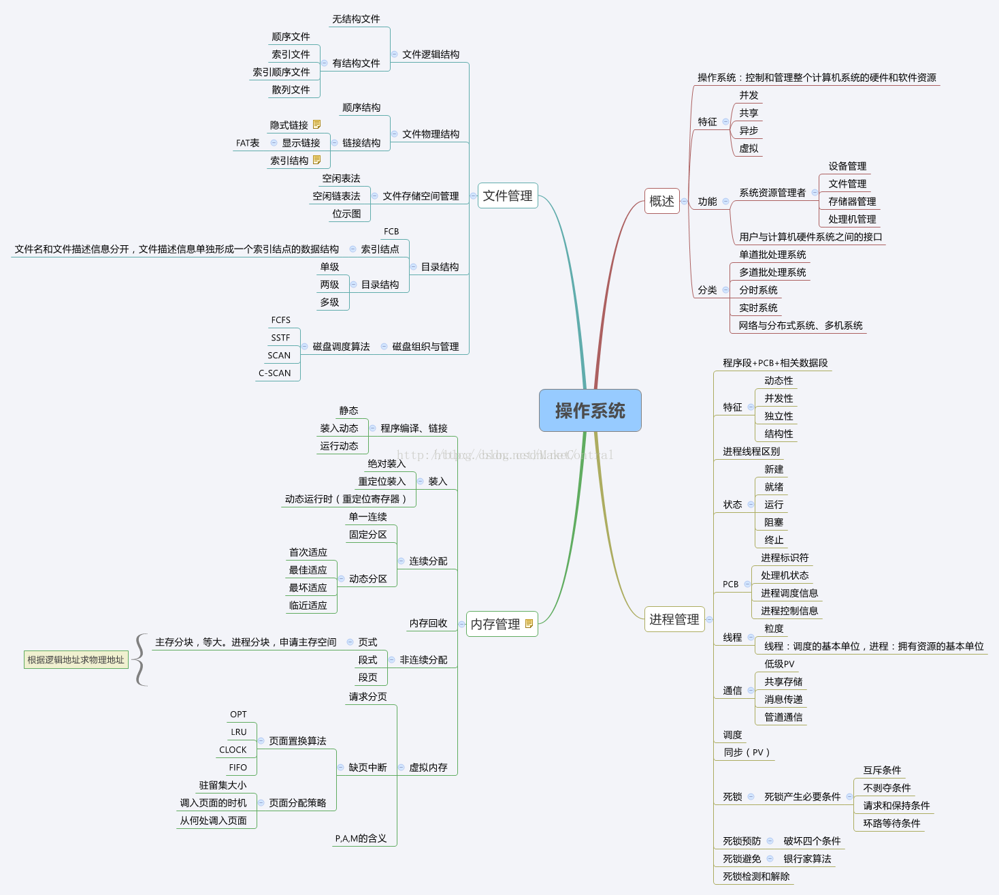 

## 题纲

1- 操作系统的四个特性。

2- 操作系统的主要功能。

3- 进程的有哪几种状态，状态转换图，及导致转换的事件。

4- 进程与线程的区别。

5- 进程通信的几种方式。

6- 进程同步的几种方式
7- 用户态和核心态的区别。
8- 死锁的概念，导致死锁的原因.
9- 导致死锁的四个必要条件。
10- 处理死锁的四个方式。
11- 预防死锁的方法、避免死锁的方法。
12- 进程调度算法。
13- 内存连续分配方式采用的几种算法及各自优劣。
14- 基本分页储存管理方式。
15- 基本分段储存管理方式。
16-分段分页方式的比较各自优缺点。
17- 几种页面置换算法，会算所需换页数
18- 虚拟内存的定义及实现方式。

## 重难点总结

### 1. 操作系统的四个特性

==并发==：==同一段时间内(时间片轮转算法)==多个程序执行(注意区别==并行==和并发，前者是==同一时刻==的多个事件，后者是同一时间段内的多个事件)
 ==共享==：系统中的资源可以被内存中多个并发执行的进线程共同使用
 ==虚拟==：通过==时分复用（如分时系统）以及空分复用（如虚拟内存）==技术实现把一个物理实体虚拟为多个
 ==异步==：系统中的进程是以==走走停停==的方式执行的，且以一种不可预知的速度推进

 

### 2.操作系统的主要功能

==处理机管理==：处理机分配都是==以进程为单位==，所以处理机管理也被看做是==进程管理==。包括==进程控制，进程同步，进程通信和进程调度==
 ==存储器管理==（或者内存管理）：内存分配，内存保护，地址映射，内存扩充
 ==设备管理==：管理所有外围设备，包括完成用户的IO请求；为用户进程分配IO设备；提高IO设备利用率；提高IO速度；方便IO的使用
 ==文件管理==：管理用户文件和系统文件，方便使用同时保证安全性。包括：磁盘存储空间管理，目录管理，文件读写管理以及文件共享和保护
 ==提供用户接口==：程序接口（如API）和用户接口（如GUI）

### 3.进程的状态与转换

**进程的三大态：**

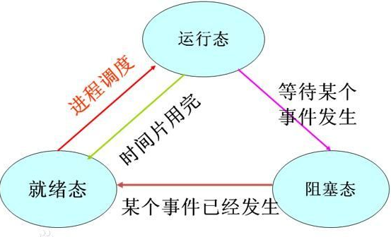

运行状态：进程正在处理机上运行。在单处理机环境下，每一时刻最多只有一个进程处于运行状态。

就绪状态：进程已处于准备运行的状态，即进程获得了除处理机之外的一切所需资源，一旦得到处理机即可运行。

阻塞状态，又称等待状态：进程正在等待某一事件而暂停运行，如等待某资源为可用（不包括处理机）或等待输入/输出完成。即使处理机空闲，该进程也不能运行。

**注意区别就绪状态和等待状态：**就绪状态是指==进程仅缺少处理机==，只要获得处理机资源就立即执行；而等待状态是指进程==需要其他资源（除了处理机）或等待某一事件==。

**就绪状态 -> 运行状态：**处于就绪状态的进程被调度后，获得处理机资源（分派处理机时间片），于是进程由就绪状态转换为运行状态。

**运行状态 -> 就绪状态：**处于运行状态的进程在时间片用完后，不得不让出处理机，从而进程由运行状态转换为就绪状态。此外，在可剥夺的操作系统中，当有更高优先级的进程就 、 绪时，调度程度将正执行的进程转换为就绪状态，让更高优先级的进程执行。

**运行状态 -> 阻塞状态：**当进程请求某一资源（如外设）的使用和分配或等待某一事件的发生（如I/O操作的完成）时，它就从运行状态转换为阻塞状态。进程以系统调用的形式请求操作系统提供服务，这是一种特殊的、由运行用户态程序调用操作系统内核过程的形式。

**阻塞状态 -> 就绪状态：**当进程等待的事件到来时，如I/O操作结束或中断结束时，中断处理程序必须把相应进程的状态由阻塞状态转换为就绪状态。

### 4.进程与线程的区别

**进程：**进程是进程实体的运行过程，是系统进行==资源分配和调度的一个独立单位==（具有动态、并发、独立、异步的特性，以及就绪、执行、阻塞3种状态）；引入进程是为了使多个程序可以==并发==的执行，以提高系统的资源利用率和吞吐量。

**线程：**是比进程更小的==可独立运行的基本单位==，可以看做是轻量级的进程（具有轻型实体，独立调度分派单位，可并发执行，共享进程资源等属性）；引入目的是为了==减少程序在并发执行过程中的开销==，使OS的并发效率更高。

两者的对比：

1. 调度方面：在引入线程的OS中，线程是独立的调度和分派单位，而进程作为资源的拥有单位(相当于把未引入线程的传统OS中的进程的两个属性分开了)。由于==线程不拥有资源，因此可以显著的提高并发度==以及减少切换开销。
2. 并发性：引入了线程的OS中，==进程间可以并发==，而且一个进程内部的==多个线程之间也是可以并发的==，这就使OS具有更好的并发性，有效的提高了系统资源利用率和吞吐量。
3. 拥有资源：无论OS是否支持线程，进程都是基本的资源拥有单位，线程只拥有很少的基本的资源，但是==线程可以访问所隶属的进程的资源==（进程的代码段，数据段和所拥有的系统资源如fd）
4. 系统开销：==创建或者撤销进程的时候，系统要为之创建或回收PCB，系统资源==等，切换时也需要保存和恢复CPU环境。而线程的切换只需要==保存和恢复少量的寄存器，不涉及存储器管理方面==的工作，所以开销较小。此外，统一进程中的多个线程由于共享地址空间，所以通信同步等都比较方便。

5. 一个进程可包含一个或多个线程，反过来则不然。一个进程中的线程在另一个进程中时不可见的。
6. 地址空间：不同进程的地址空间是相互独立的，而同一个进程的各线程共享同一地址空间。
7. 进程间的通信必须使用操作==系统提供的进程间通信机制==，而同一个进程中的各线程间可以通过==直接读写数据段==来进行通信。当然，同一个进程中的各线程间的通信也需要同步和互斥手段的辅助，以确保数据一致性。

### 5.进程通信

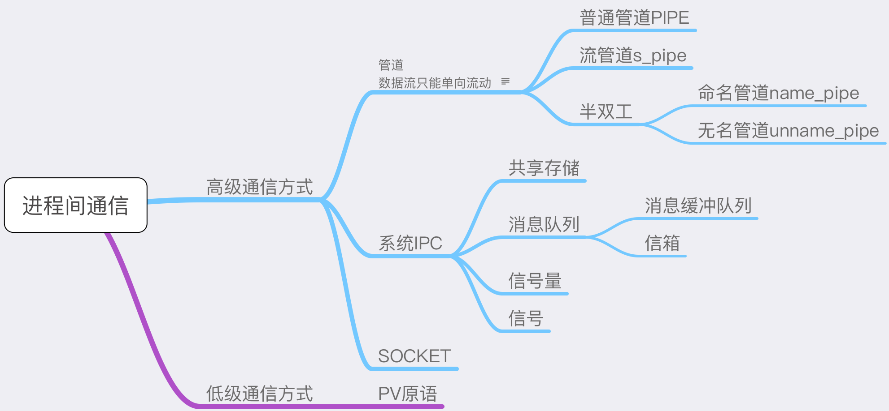

主要分为：管道、系统**IPC**（包括消息队列、信号量、共享存储）、**SOCKET**

管道主要分为：普通管道**PIPE** 、流管道（**s_pipe**）、命名管道（**name_pipe**）

- 管道是一种半双工的通信方式，数据只能单项流动，并且只能在具有亲缘关系的进程间流动，进程的亲缘关系通常是父子进程
- 命名管道也是半双工的通信方式，它允许无亲缘关系的进程间进行通信
- 信号量是一个计数器，用来控制多个进程对资源的访问，它通常作为一种锁机制。
- 消息队列是消息的链表，存放在内核中并由消息队列标识符标识。
- 信号是一种比较复杂的通信方式，用于通知接收进程某个事件已经发生。
- 共享内存就是映射一段能被其它进程访问的内存，这段共享内存由一个进程创建，但是多个进程可以访问。
- 命名管道：可用于非父子进程； 非命名管道：可用于父子进程间通信。 管道的实现是FIFO， 先进先出的方式。

------

（1）**无名管道**( pipe )：管道是一种半双工的通信方式，数据只能单向流动，而且只能在具有亲缘关系的进程间使用。进程的亲缘关系通常是指父子进程关系。   

（2）**有名管道** (named pipe) ： 有名管道也是半双工的通信方式，但是它允许无亲缘关系进程间的通信。   

（3）**信号量**( semophore ) ： 信号量是一个计数器，可以用来控制多个进程对共享资源的访问。它常作为一种锁机制，防止某进程正在访问共享资源时，其他进程也访问该资源。因此，主要作为进程间以及同一进程内不同线程之间的同步手段。   

（4）**消息队列**( message queue ) ： 消息队列是==由消息的链表==，存放在内核中并由消息队列标识符标识。消息队列克服了信号传递信息少、管道只能承载无格式字节流以及缓冲区大小受限等缺点。   

（5）**信号** ( sinal ) ： 信号是一种==比较复杂的通信方式==，用于通知接收进程某个事件已经发生。   

（6）**共享内存**( shared memory ) ：共享内存就是映射一段能被其他进程所访问的内存，这段共享内存由一个进程创建，但多个进程都可以访问。共享内存是最快的 IPC 方式，它是针对其他进程间通信方式运行效率低而专门设计的。它往往与其他通信机制，如信号两，配合使用，来实现进程间的同步和通信。   

（7）**套接字**( socket ) ： 套解口也是一种进程间通信机制，与其他通信机制不同的是，它可用于==不同及其间的进程通信== 

------

进程通信是指进程之间的信息交换。==PV操作是低级通信方式==，**髙级通信方**式是指==以较高的效率传输大量数据的通信方式==。高级通信方法主要有以下三个类。

**共享存储**

在通信的进程之间存在一块可直接访问的共享空间，通过对这片共享空间进行写/读操作实现进程之间的信息交换。在对==共享空间进行写/读操作==时，需要使用==同步互斥工具（如 P操作、V操作==），对共享空间的写/读进行控制。

共享存储又分为两种：

- ==低级方式==的共享是基于==数据结构==的共享；
- ==高级方式==则是基于==存储区==的共享。

操作系统只负责为通信进程提供可共享使用的==存储空间和同步互斥工具==，而数据交换则由用户==自己安排读/写指令==完成

需要注意的是，用户==进程空间一般都是独立==的，要想让两个用户进程共享空间必须通过特殊的==系统调用==实现，而进程内的线程是自然共享进程空间的。

**消息传递**

在消息传递系统中，进程间的数据交换是==以格式化的消息(Message)==为单位的。若通信的进程之间不存在可直接访问的共享空间，则必须利用操作系统提供的消息传递方法实现进程通信。进程通过系统提供的==发送消息和接收消息==两个原语进行数据交换。

1. 直接通信方式：发送进程==直接==把消息发送给接收进程，并将它挂在接收进程的==消息缓冲队列==上，接收进程从消息缓冲队列中取得消息。 消息队列是==以创建文件的方式建立的。==
2. 间接通信方式：发送进程把消息发送到某个中间实体中，接收进程从中间实体中取得消息。这种中间实体一般称为==信箱==，这种通信方式又称为==信箱通信方式==。该通信方式广泛应用于计算机网络中，相应的通信系统称为电子邮件系统。

**管道通信**

管道通信是消息传递的一种特殊方式。所谓“管道”，是指用于==连接一个读进程和一个写进程==以实现它们之间通信的一个==共享文件==，又名==pipe文件==。向管道（共享文件）提供输入的发送进程（即写进程），以字符流形式将大量的数据送入（写）管道；而接收管道输出的接收进程（即读进程），则从管道中接收（读）数据。为了协调双方的通信，管道机制必须提供以下三方面的协调能力：互斥、==同步和确定对方的存在==。

### 6.进程同步

多进程虽然提高了系统资源利用率和吞吐量，但是由于进程的异步性可能造成系统的混乱。进程同步的任务就是对多个相关进程在执行顺序上进行协调，使并发执行的多个进程之间可以有效的共享资源和相互合作，保证程序执行的可再现性

同步机制需要遵循的原则：

1. **空闲让进**：当没有进程处于临界区的时候，应该许可其他进程进入临界区的申请
2. **忙则等待**：当前如果有进程处于临界区，如果有其他进程申请进入，则必须等待，保证对**临界区的互斥访问**
3. **有限等待**：对要求访问临界资源的进程，需要在有限时间内进入临界区，**防止出现死等**
4. **让权等待**：当进程无法进入临界区的时候，需要释放处理机，边陷入忙等

经典的进程同步问题：**生产者-消费者问题；哲学家进餐问题；读者-写者问题**

同步的解决方案：**管程，信号量， 原子操作、信号量机制、自旋锁管程、会合、分布式系统**

推荐阅读：[ 进程同步的几种机制](https://link.zhihu.com/?target=http%3A//www.cnblogs.com/sonic4x/archive/2011/07/05/2098036.html)

 

### 线程同步

- 互斥量：采用互斥对象机制，只有拥有互斥对象的线程才有访问公共资源的权限。因为互斥对象只有一个，所以可以==保证公共资源不会被多个线程==同时访问。
- 信号量：它允许同一时刻多个线程访问同一资源，但是需要==控制同一时刻访问此资源的最大线程数量==。
- 事件（信号）：通过通==知操作的方式来保持多线程同步==，还可以方便的实现==多线程优先级的比较==操作。

临界区已删除

### 7.用户态和核心态

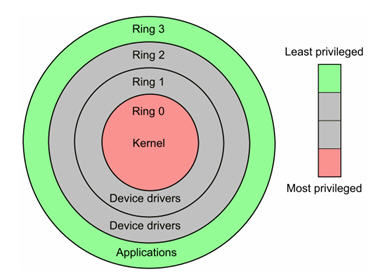

从整体上讲，操作系统一般可分为==“内核”（kernel）和“外壳”（shell）==两大部分。

当程序运行在==3级特权级上==时，就可以称之为==运行在用户态==，因为这是==最低特权级==，是普通的用户进程运行的特权级，大部分用户直接面对的程序都是运行在用户态；

反之，**当程序运行在级特权级上时，就可以称之为运行在==内核态==。**

虽然用户态下和内核态下工作的程序有很多差别，**但最重要的差别就在于特权级的不同，即==权力的不同==。**运行在用户态下的程序不能直接访问操作系统内核数据结构和程序。

当我们在系统中执行一个程序时，==大部分时间是运行在用户态下==的，在其需要操作系统帮助完成某些它没有权力和能力完成的工作时就会切换到内核态。

**用户态切换到内核态的3种方式**

1. 系统调用：这是用户态进程主动要求切换到内核态的一种方式，用户态进程通过系统调用申请使用操作系统提供的服务程序完成工作。而系统调用的机制其核心还是使用了操作系统为用户特==别开放的一个中断==来实现，例如Linux的int 80h中断。
2. 异常：当CPU在执行运行在用户态下的程序时，发生了某些事先不可知的异常，这时会触发由当前运行进程切换到处理此异常的内核相关程序中，也就转到了内核态，比如==缺页异常==。
3. 外围设备的中断：当外围设备完成用户请求的操作后，会==向CPU发出相应的中断信号==，这时CPU会暂停执行下一条即将要执行的指令转而去执行与中断信号对应的处理程序，如果先前执行的指令是用户态下的程序，那么这个转换的过程自然也就发生了==由用户态到内核态的切换==。比如硬盘读写操作完成，系统会切换到硬盘读写的中断处理程序中执行后续操作等。

### 8.死锁

死锁是指多个进程在运行过程中，因为==争夺资源而造成的一种僵局==，如果没有外力推进，处于僵局中的进程就无法继续执行。

**死锁原因：**

1. 竞争资源：请求同一有限资源的进程数多于可用资源数
2. 进程推进顺序非法：进程执行中，**请求和释放资源顺序不合理**，如**资源等待链**

**死锁产生的必要条件**：

1. **互斥条件**:进程对所分配的资源进行排他性的使用
2. **请求和保持条件**（占有并等待）：进程被阻塞的时候并不释放锁申请到的资源
3. **不可剥夺条件**（不可抢占）：进程对于已经申请到的资源在使用完成之前不可以被剥夺
4. **环路等待条件**：发生死锁的时候存在的一个 进程-资源 环形等待链

**死锁处理：** 

1. **预防死锁**：破坏产生死锁的4个必要条件中的一个或者多个；实现起来比较简单，但是如果限制过于严格会降低系统资源利用率以及吞吐量
2. **避免死锁**：在资源的动态分配中，防止系统进入不安全状态(可能产生死锁的状态)-如**银行家算法**
3. **检测死锁**：允许系统运行过程中产生死锁，在死锁发生之后，采用一定的算法进行检测，并确定与死锁相关的资源和进程，采取相关方法清除检测到的死锁。实现难度大
4. **解除死锁**：与死锁检测配合，将系统从死锁中解脱出来（撤销进程或者剥夺资源）。对检测到的和死锁相关的进程以及资源，通过撤销或者挂起的方式，释放一些资源并将其分配给处于阻塞状态的进程，使其转变为就绪态。实现难度大

**常用策略如下：** 

鸵鸟策略、预防策略、避免策略、检测与解除死锁 

推荐阅读：[产生死锁的原因和必要条件+解决死锁的基本方法 ](https://link.zhihu.com/?target=http%3A//blog.csdn.net/bxyill/article/details/8237339)

 

### 9.进程调度算法

**先来先服务调度算法FCFS：**既可以作为**作业**调度算法也可以作为**进程调**度算法；按作业或者进程到达的先后顺序依次调度；因此对于**长作业比较有利**；

**短作业优先调度算法SJF：**作业调度算法，算法从就绪队列中选择**估计时间最短的作业**进行处理，直到得出结果或者无法继续执行；缺点：**不利于长作业；未考虑作业的重要性；运行时间是预估的，并不靠谱 ；**

**高相应比算法HRN：** ==响应比=(等待时间+要求服务时间)/要求服务时间；==

**时间片轮转调度RR：**按到达的先后对进程放入队列中，然后给队首进程分配CPU时间片，时间片用完之后计时器发出中断，暂停当前进程并将其放到队列尾部，循环 ;

**多级反馈队列调度算法：**目前公认较好的调度算法；设置==多个就绪队列并为每个队列设置不同的优先级==，第一个队列优先级最高，其余依次递减。优先级越高的队列分配的时间片越短，进程到达之后按FCFS放入第一个队列，如果调度执行后没有完成，那么放到第二个队列尾部等待调度，如果第二次调度仍然没有完成，放入第三队列尾部…。只有==当前一个队列为空的时候才会去调度下一个队列的进程==。

**优先级：**按照进程的优先权大小来调度，使高优先权进程得到优先处理的调度策略称为优先权调度算法。

### 10.内存连续分配

主要是指动态分区分配时所采用的几种算法。
 动态分区分配又称为==可变分区分配==，是一种==动态划分内存==的分区方法。这种分区方法不预先将内存划分，而是==在进程装入内存时，根据进程的大小动态地建立分区==，并使分区的大小正好适合进程的需要。因此系统中分区的大小和数目是可变的。

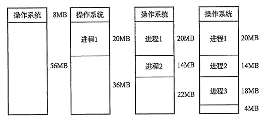

**首次适应(First  Fit)算法：**空闲分区以地址递增的次序链接。分配内存时顺序查找，找到大小能满足要求的第一个空闲分区。

**最佳适应(Best  Fit)算法：**空闲分区按容量递增形成分区链，找到第一个能满足要求的空闲分区。

**最坏适应(Worst  Fit)算法：**又称最大适应(Largest Fit)算法，空闲分区以容量递减的次序链接。找到第一个能满足要求的空闲分区，也就是挑选出最大的分区。

### 11.基本分页储存管理方式

把==主存空间划分为大小相等且固定的块，块相对较小，作为主存的基本单位==。每个进程也以块为单位进行划分，进程在执行时，以块为单位逐个申请主存中的块空间。

因为程序数据存储在不同的页面中，而页面又离散的分布在内存中，**因此需要一个==页表==来记录==逻辑地址和实际存储地址==之间的映射关系，以实现==从页号到物理块号==的映射。**

由于页表也是存储在内存中的，因此和不适用分页管理的存储方式相比，访问分页系统中内存数据需要==**两次的内存访问**== (一次是从==内存中访问页表==，从中找到==指定的物理块号==，加上==页内偏移==得到实际物理地址；第二次就是根据第一次得到的物理地址==访问内==存取出数据)。

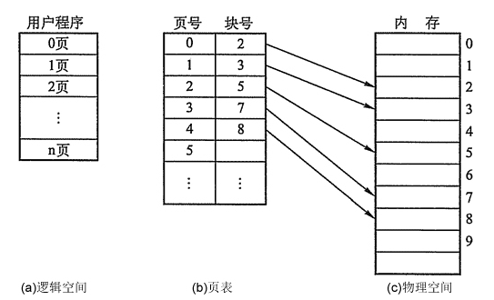

 为了减少两次访问内存导致的效率影响，分页管理中引入了 ==快表机制(相当于缓存)== ，包含快表机制的内存管理中，当要访问内存数据的时候，首先将页号在快表中查询，如果查找到说明要访问的页表项在快表中，那么==直接从快表中读取相应的物理块号==；如果==没有找==到，那么==访问内存中的页表==，从页表中得到物理地址，同时将页表中的该映射表项添加到快表中(可能存在快表换出算法)。

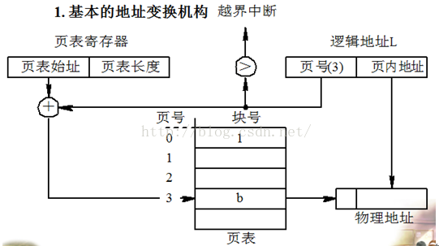

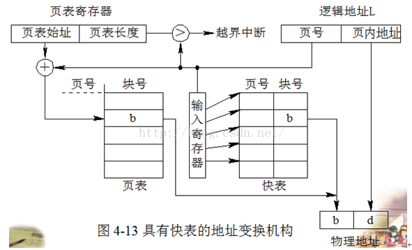

在某些计算机中如果内存的==逻辑地址很大==，将会导致程序的页表项会很多，而页表在内存中是连续存放的，所以相应的就需要较大的连续内存空间。为了解决这个问题，可以采用==**两级页表或者多级页表的方法**==，其中外层页表一次性调入内存且连续存放，内层页表离散存放。相应的访问内存页表的时候需要一次地址变换，访问逻辑地址对应的物理地址的时候也需要一次地址变换，而且一共需要访问内存3次才可以读取一次数据。

### 12.基本分段储存管理方式

**存储器管理的主要功能：**对存储空间进行分配和管理、存储器保护、地址转换、扩充主存容量(虚拟内存)。

**存储器的地址转换**：静态地址转换和动态地址转换（实现非连续存储，为虚拟存储器的实现打下了基础）。

**存储器的分区存储管理**：固定式分区存储管理（内部碎片）和动态分区存储管理（外部碎片）。

分页是为了==提高内存利用率==，而分段是为了满足程序员在编写代码的时候的一些==逻辑需求(比如数据共享，数据保护，动态链接等)==。

分段内存管理当中，**地址是二维的，==一维是段号，一维是段内地址==；其中每个段的长度是不一样的，而且每个段内部都是从0开始编址的**。由于分段管理中，每个段内部是连续内存分配，但是段和段之间是离散分配的，因此也存在一个逻辑地址到物理地址的映射关系，相应的就是段表机制。段表中的每一个表项记录了该段在内存中的起始地址和该段的长度。段表可以放在内存中也可以放在寄存器中。

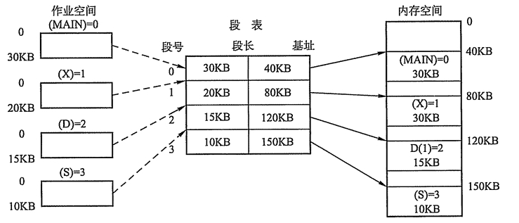

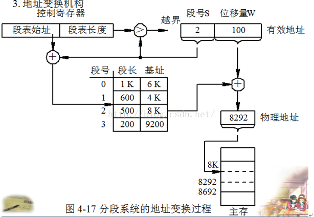

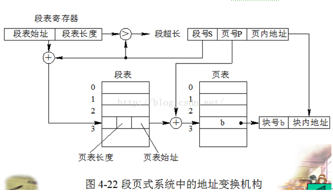

 访问内存的时候根据段号和段表项的长度计算当前访问段在段表中的位置，然后访问段表，得到该段的物理地址，根据该物理地址以及段内偏移量就可以得到需要访问的内存。由于也是==两次内存访问==，所以分段管理中同样引入了联想寄存器。

 

####  分段分页方式的比较

页是信息的==物理单位==，是出于==系统内存利用率==的角度提出的离散分配机制；段是信息的==逻辑单位==，每个段含有一组意义完整的信息，是==出于用户角度==提出的内存管理机制

==页的大小是固定的，由系统决定；段的大小是不确定的，由用户决定==

------

页是信息的物理单位，**分页是为实现离散分配方式**，以消减内存的外零头，提高内存的利用率；或者说，分页仅仅是由于系统管理的需要，而不是用户的需要。

段是信息的逻辑单位，它含有一组其意义相对完整的信息。分段的目的是为了能更好的满足用户的需要。
页的大小固定且由系统确定，把逻辑地址划分为页号和页内地址两部分，是由机器硬件实现的，因而一个系统只能有一种大小的页面。

段的长度却不固定，决定于用户所编写的程序，通常由编辑程序在对源程序进行编辑时，根据信息的性质来划分。
分页的作业地址空间是一维的，即单一的**线性空间**，程序员只须利用一个记忆符，即可表示一地址。分段的作业地址空间是二维的，程序员在标识一个地址时，既需给出段名，又需给出段内地址。

 

### 13.虚拟内存

如果存在一个程序，所需内存空间超过了计算机可以提供的实际内存，那么由于该程序无法装入内存所以也就无法运行。单纯的增加物理内存只能解决一部分问题，但是仍然会出现无法装入单个或者无法同时装入多个程序的问题。但是可以==从逻辑的角度扩充内存容量==，即可解决上述两种问题。

基于局部性原理，**在程序装入时，可以将程序的一部分装入内存，而将其余部分留在外存**，就可以启动程序执行。在程序执行过程中，**当所访问的信息不在内存时，由操作系统将所需要的部分调入内存,然后继续执行程序**。另一方面，操作系统将内存中==**暂时不使用的内容换出到外存上，从而腾出空间存放将要调入内存的信息**==。这样，系统好像为用户提供了一个比实际内存大得多的存储器，称为虚拟存储器。

虚拟存储器的特征：

1. ==多次性==：一个作业可以分多次被调入内存。多次性是虚拟存储特有的属性
2. ==对换性==：作业运行过程中存在换进换出的过程(换出暂时不用的数据换入需要的数据)
3. ==虚拟性==：虚拟性体现在其从逻辑上扩充了内存的容量(可以运行实际内存需求比物理内存大的应用程序)。虚拟性是==虚拟存储器的最重要特征也是其最终目标==。虚拟性建立在多次性和对换性的基础上行，多次性和对换性又建立在离散分配的基础上

### 14.页面置换算法

**最佳置换算法：**只具有理论意义的算法，用来评价其他页面置换算法。置换策略是将当前页面中==在未来最长时间内不会被访问的页置换出去==。

**先进先出置换算法：**简单粗暴的一种置换算法，没有考虑页面访问频率信息。每次淘汰最早调入的页面。

**最近最久未使用算法LRU：**算法赋予每个页面一个访问字段，用来记录上次页面被访问到现在所经历的时间t，每次置换的时候把t值最大的页面置换出去(实现方面可以采用寄存器或者栈的方式实现)。

**时钟算法clock(也被称为是最近未使用算法NRU)：**页面设置一个访问位，并将页面链接为一个环形队列，页面被访问的时候访问位设置为1。页面置换的时候，如果当前指针所指页面访问为为0，那么置换，否则将其置为0，循环直到==遇到一个访问为位0的页面==。

**改进型Clock算法：**在Clock算法的基础上添加一个修改位，替换时根究访问位和修改位综合判断。优先替换访问位和修改位都是0的页面，其次是访问位为0修改位为1的页面。

**最少使用算法LFU：**设置寄存器记录页面被访问次数，每次置换的时候==置换当前访问次数最少的==。

 

以上[参考](https://www.jianshu.com/p/d254b138de03) 

------

## 缓冲区溢出及危害

缓冲区溢出是指当计算机向缓冲区==填充数据时超出了缓冲区本身的容量==，溢出的数据**覆盖**在合法数据上。

危害有以下两点：

- ==程序崩溃==，导致拒绝额服务
- ==跳转并且执行一段恶意代码==

造成缓冲区溢出的主要原因是程序中**没有仔细检查用户输入**。 

如果你想深入了解缓冲区溢出，推荐阅读：[缓冲区溢出攻击](https://link.zhihu.com/?target=http%3A//www.cnblogs.com/fanzhidongyzby/archive/2013/08/10/3250405.html)

## 操作系统的分类

**多批道处理系统、分时系统、实时系统、网络操作系统、分布式操作系统**。

## 中断技术

### 中断在操作系统中的地位

在现代计算机系统中，==中断 和通道技术== 是主机和外部设备并行工作的基础，是多道程序并发执行的推动力，也是整个操作系统的推动力——操作系统是由中断驱动的。

为什么说中断是多道程序并发执行的推动力呢？在单CPU计算机系统中，要使多道程序得以并发执行，关键在于CPU能在这些程序间不断的切换，使得每道程序都有机会在CPU上运行。导致这种切换的动力是什么？主要是**==时钟中断==**。

### 中断的概念、作用和类型

**中断**：中断是指某个事件（电源掉电、加法溢出或外部设备传输结束等）发生时系统终止现行程序的运行，引出中断处理程序对该事件进行处理，完毕后返回断点继续运行，这个过程称为“中断”。

**中断的作用**：CPU与I/O设备并行工作、硬件故障处理、实现人机通信、实现多道程序的并发执行等。

**中断的类型**：**硬件故障中断、程序性中断、外部中断、输入/输出设备中断、访管中断**。

中断响应流程图：

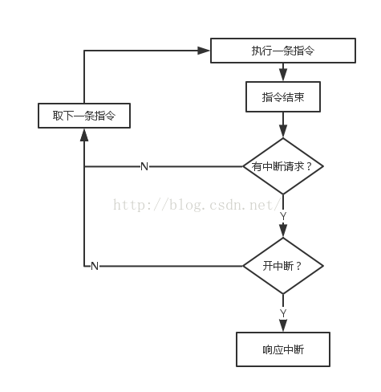

 

### 中断和轮询的特点

对I/O设备的程序轮询的方式，是早期的计算机系统对I/O设备的一种管理方式。它定时对各种设备轮流询问一遍有无处理要求。轮流询问之后，有要求的，则加以处理。在处理I/O设备的要求之后，处理机返回继续工作。尽管轮询需要时间，但==轮询要比I/O设备的速度要快得多==，所以一般不会发生不能及时处理的问题。当然，再快的处理机，能处理的输入输出设备的数量也是有一定限度的。而且，程序轮询毕竟占据了CPU相当一部分处理时间，因此，程序轮询是一种效率较低的方式，在现代计算机系统中已很少应用。

程序中断通常简称中断，是指CPU在正常运行程序的过程中，由于预先安排或发生了各种随机的内部或外部事件，使CPU中断正在

运行的程序，而转到为响应的服务程序去处理。

轮询——**效率低，等待时间很长，CPU利用率不高。**

中断——**容易遗漏一些问题，CPU利用率高**。

 

## 线程的分类

**内核级线程**：这类线程依赖于内核，又称为内核支持的线程或轻量级进程。无论是在用户程序中的线程还是系统进程中的线程，它们的==创建、撤销和切换都由内核==实现。为此，需要在内核中建立一个线程控制块，内核根据该控制块而感知该线程的存在并对线程进行控制。

**用户级线程**：它仅存在于用户级中，这种线程是不依赖于操作系统核心的。应用进程利用线程库来完成其创建、同步、调度和管理线程。因此用户==线程间的切换不需要内核特权==，不需要用户态/核心态切换，速度快，操作系统内核无法感知用户级线程的存在。

**用户级线程和内核级线程的区别**

（1）内核支持线程是OS内核可感知的，而用户级线程是OS内核不可感知的。
（2）用户级线程的创建、撤消和调度不需要OS内核的支持；而内核支持线程的创建、撤消和调度都需OS内核提供支持，而且与进程的创建、撤消和调度大体是相同的。
（3）用户级线程执行系统调用指令时将导致其所属进程被中断，而内核支持线程执行系统调用指令时，只导致该线程被中断。
（4）在只有==用户级线程==的系统内，CPU调度还是以==进程为单位==，处于运行状态的进程中的多个线程，由用户程序控制线程的轮换运行；在有==内核支持线程==的系统内，CPU调度则==以线程为单位==，由OS的线程调度程序负责线程的调度。
（5）用户级线程的程序实体是运行在用户态下的程序，而内核支持线程的程序实体则是可以运行在任何状态下的程序。

**内核线程的优点：**

（1）当有多个处理机时，一个进程的多个线程可以同时执行。

**缺点：**

（1）由内核进行调度。

**用户线程的优点：**

（1） 线程的调度不需要内核直接参与，控制简单。
（2） 可以在不支持线程的操作系统中实现。
（3） 创建和销毁线程、线程切换代价等线程管理的代价比内核线程少得多。
（4） 允许每个进程定制自己的调度算法，线程管理比较灵活。这就是必须自己写管理程序，与内核线程的区别。
（5） 线程能够利用的表空间和堆栈空间比内核级线程多。
（6） 同一进程中只能同时有一个线程在运行，如果有一个线程使用了系统调用而阻塞，那么整个进程都会被挂起。另外，页面失效也会产生同样的问题。

**缺点：**

（1）资源调度按照进程进行，多个处理机下，同一个进程中的线程只能在同一个处理机下分时复用

 

## 页面分配算法

页面分配，是指按什么原则给活动进程分配物理块数。通常有如下三种分配算法：

1、平均分派算法。2、按比例分配算法。3、按优先级分配算法。

## 页面的分配和置换范围

如何在相互竞争的可运行进程之间，选择分配物理块的策略和置换页面的范围。需要考虑如下两个因素：
1、系统的并发性和吞吐率。2、缺页中断率。

基于这些因素，现代操作系统通常采用固定分配和可变分配两种策略，被置换页面的范围分为全局和局部两种。我们将分配策略和置换范围进行组合，可得出4种方式，但是固定分配全局置换方式是不可能的，因此，有如下3种方式：
1、==固定分配==局部置换
2、==可变分配==全局置换
3、可变分配==局部置换==

 

## 抖动

所谓抖动是指，在具有**虚拟存储器**的计算机系统中，由于==频繁的页面置换活动==，使得访问外存储器次数过多，从而引起的系统效率大大降低的一种现象。

 

## 设备管理

### 磁臂调度

1、先来先服务算法。2、最短查找时间优先算法。3、Scan算法(电梯算法)。4、C-Scan（Circular SCAN），扫描方向永远是一个方向。

 

## 文件管理

### LInux操作系统

**Linux中常用到的命令**

显示文件目录命令ls        如ls
改变当前目录命令cd        如cd /home
建立子目录mkdir           如mkdir xiong
删除子目录命令rmdir       如rmdir /mnt/cdrom
删除文件命令rm            如rm /ucdos.bat
文件复制命令cp            如cp /ucdos /fox
获取帮助信息命令man      如man ls
显示文件的内容less        如less mwm.lx

**Linux文件属性有哪些？（共十位）**
-rw-r--r--那个是权限符号，总共是- --- --- ---这几个位。
第一个短横处是文件类型识别符：-表示普通文件；c表示字符设备（character）；b表示块设备（block）；d表示目录（directory）；l表示链接文件（link）；

第一个三个连续的短横是用户权限位（User）

第二个三个连续短横是组权限位（Group）

第三个三个连续短横是其他权限位（Other）。
每个权限位有三个权限，r（读权限），w（写权限），x（执行权限）。

如果每个权限位都有权限存在，那么满权限的情况就是：-rwxrwxrwx；权限为空的情况就是- --- --- ---。
权限的设定可以用chmod命令，其格式位：chmod ugoa+/-/=rwx filename/directory。例如：
一个文件aaa具有完全空的权限- --- --- ---。
chmod u+rw aaa（给用户权限位**设置**（**增加**）读写权限，其权限表示为：- rw- --- ---）
chmod g+r aaa（给组设置权限为可读，其权限表示为：- --- r-- ---）
chmod ugo+rw aaa（给用户、组、其它用户或组设置权限为读写，权限表示为：- rw- rw- rw-）
如果aaa具有满权限- rwx rwx rwx。
chmod u-x aaa（**去掉**用户可执行权限，权限表示为：- rw- rwx rwx）
如果要给aaa**赋予**制定权限- rwx r-x r-x，命令为：
chmod u=rwx，go=rx aaa

## 其他

### CPU中的缓存和操作系统中的缓存分别是什么？

操作系统的缓存是指==快表==。在操作系统中，为提高系统的存取速度，在地址映射机制中增加一个小容量的联想寄存器，即快表，用来存放当前访问最频繁的少数活动页面的页号。当某用户需要存取数据时，根据数据所在的逻辑页号在快表中找到其对应的内存块号，再联系页内地址，形成物理地址。如果在快表中没有相应的逻辑页号，则地址映射仍可以通过内存中的页表进行，得到空闲块号后必须将该块号填入快表的空闲块中。如果快表中没有空闲块，则根据淘汰算法淘汰某一行，再填入新的页号和块号。快表查找内存块的物理地址消耗的时间大大降低了，使得系统效率得到了极大的提高。 
CPU中的缓存是指==高速缓存==。CPU的执行速度越来越快，系统架构越来越先进，而主存的结构和存取速度改进则较慢，因此，高速缓存技术将越来越重要。    高速缓冲存储器是位于CPU和内存之间的临时存储器，它的容量比内存小但交换速度快。在高速缓冲存储器中的数据是内存中的一小部分，但这一小部分是短时间内CPU即将访问的。当CPU调用大量数据时，就可避开内存直接从高速缓冲存储器中调用，从而加快读取速度。

 

## 参考

[1] https://blog.csdn.net/sunxianghuang/article/details/51883496

[2] 操作系统面试刷题笔记： https://www.jianshu.com/p/0db8f0be05ed

[3] 操作系统常见面试总结  http://www.51testing.com/html/09/n-822009.html

[4] 牛人整理的操作系统，计算机网络， 设计模式， LInux编程， 数据结构总结  http://blog.51cto.com/qiaopeng688/1856781

