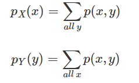
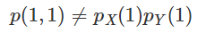

# 20180330_联合分布-边缘概率-条件分布-独立随机变量


原文链接： http://www.cnblogs.com/vamei/p/3224111.html


我之前一直专注于单一的随机变量及其概率分布。我们自然的会想将以前的结论推广到多个随机变量。联合分布(joint distribution)描述了多个随机变量的概率分布，是对单一随机变量的自然拓展。联合分布的多个随机变量都定义在同一个样本空间中。

对于联合分布来说，最核心的依然是概率测度这一概念。 

 

### 离散随机变量的联合分布

我们先从离散的情况出发，了解多个随机变量并存的含义。

之前说，一个随机变量是从样本空间到实数的映射。然而，所谓的映射是人为创造的。从一个样本空间，可以同时产生多个映射。比如，我们的实验是连续三次投硬币，样本空间为


`h`为正面，`t`为反面。在同一样本空间上，我们可以定义多个随机变量，比如:

- `X`: 投掷为正面的总数，可以取值0，1，2，3
- `Y`: 最后一次出现负面的总数，可以取值0，1
- `Z`: 将正面记为10，负面记为5，第一次与第三次取值的差，可以有5, -5, 0

这三个随机变量可以看作一个有三个分量的矢量。所以定义在同一样本空间的多随机变量，是一个从样本空间到矢量的映射。 

(从这个角度上说，单一随机变量是一个从样本空间到一个有一个分量的矢量的映射)

 

如果样本空间Ω中每个结果出现的概率相等。而样本空间中共有8个结果，那么个每个结果的出现的概率都是1/8。据此，我们可以计算联合概率，比如


对于`X=x,Y=y`，我们寻找样本空间中满足这两个取值的所有元素。这些元素构成一个样本空间的子集，该子集的概率就是`P(X=x,Y=y)`的联合概率。`p(x,y)=P(X=x,Y=y)`称为联合概率密度函数(joint PMF, joint probability mass function)。联合概率可以看做两个事件同时发生时的概率，事件A为`X=x`，事件B为`Y=y`，即`P(A∩B)`。

找到所有可能取值组合的概率，就找到了这两个随机变量的联合分布:

| XX   | YY   | P(X,Y)P(X,Y) | 对应子集     |
| ---- | ---- | ------------ | -------- |
| 0    | 0    | 0            | ΦΦ       |
| 1    | 0    | 1/8          | tth      |
| 2    | 0    | 2/8          | thh, hth |
| 3    | 0    | 1/8          | hhh      |
| 0    | 1    | 1/8          | ttt      |
| 1    | 1    | 2/8          | htt, tht |
| 2    | 1    | 1/8          | hht      |
| 3    | 1    | 0            | ΦΦ       |

 联合分布

联合分布描述了所有可能的取值情况。因此，联合概率密度函数的累积和为1。

 

### 连续随机变量的联合分布

我们知道，单个连续随机变量的概率是变量在某个区间(某段线的“长度”)取值的概率。做类似的推广，多个连续随机变量的概率，是这多个随机变量在多维区间的概率。比如两个随机变量，我们需要表达一个二维区间的概率，比如`P(a≤X≤b,c≤Y≤d)`)。这个二维区间可以有一个类似于一个小补丁的“面积”。二维区间对应的概率是一个体积。


 

​									面积对应的体积 

在单变量情况下，概率是一个“面积”，是由区间的“长度”和密度函数(一条曲线)围成的。这里的“体积”是二维区间的“面积”和密度函数(一个曲面)围成的。我们可以使用联合概率密度函数(joint PDF, joint probability density function)来表达多随机变量的分布。对于双变量的联合分布来说，它等于无穷小块的概率，除以无穷小块的面积。

用微积分的语言来说，就是


`f(x,y)`就是描述X和Y的联合分布的联合概率密度函数。

 

联合概率密度函数描述了所有可能取值的情况，因此有


 

**实例**

下面是两个连续随机变量的联合PDF:


通过积分，计算X在0到0.5，而Y在0到1的概率:


我们之前也说到，单个随机变量的概率对应线段到概率密度曲线之间的面积。而两个随机变量的概率对应小块到概率密度面之间的体积。

我们可以绘制`f(x,y)`的分布图形，即一个二维的平面。图中的颜色标记了f(x, y)值的大小。如下: 

可以看到，f(x, y)随X增大而增大，在X值确定时，f(x, y)不随Y变化。

```python
# By Vamei

from mpl_toolkits.mplot3d import Axes3D
from matplotlib import cm
from matplotlib.ticker import LinearLocator, FormatStrFormatter
import matplotlib.pyplot as plt
import numpy as np

fig = plt.figure()
ax = fig.gca(projection='3d')
X = np.arange(0, 1, 0.05)
Y = np.arange(0, 1, 0.05)
X, Y = np.meshgrid(X, Y)
Z = 2*X
surf = ax.plot_surface(X, Y, Z, rstride=1, cstride=1, cmap=cm.coolwarm,
        linewidth=0, antialiased=False)
ax.set_zlim(0.0, 2.5)

ax.zaxis.set_major_locator(LinearLocator(10))
ax.zaxis.set_major_formatter(FormatStrFormatter('%.02f'))

ax.set_xlabel("X")
ax.set_ylabel("Y")
ax.set_zlabel("f(x,y)")
fig.colorbar(surf, shrink=0.5, aspect=5)

plt.show()
```

 

### 边缘概率

联合分布包含了多个随机变量的分布信息。我们当然可以从联合分布中，提取出任意一个单一随机变量的分布，也就是所谓的边缘分布(marginal distribution)。

对于离散随机变量，可以获得边缘概率质量函数(marginal pmf):




在求X的单一边缘分布时， 我们累加了相同x值、不同y值时的多个联合概率，从而获得该x值的的总体概率，即边缘概率。

 

连续随机变量X的边缘密度函数(marginal pdf, marginal probability density function)可以定义为


`fX(x)`是联合密度函数对Y的积分。通过积分，我们将不同Y取值时的联合概率加在一起，就获得纯粹的单一X的分布状况。

类似的，Y的边缘密度函数为


取离散随机分布的例子，即掷三次硬币

|      | 0    | 1    | 2    | 3    | p(y) |
| ---- | ---- | ---- | ---- | ---- | ---- |
| 0    | 0    | 1/8  | 2/8  | 1/8  | 1/2  |
| 1    | 1/8  | 2/8  | 1/8  | 0    | 1/2  |
| p(x) | 1/8  | 3/8  | 3/8  | 1/8  |      |

边缘概率是对各行和列的累加。最后一列p(y)是Y的分布，Y有1/2的概率取0，1/2的概率取1。最后一行p(x)是X的分布。

 

取连续随机分布的例子，即下面的连续分布:


可以得到:


 

### 条件分布

我们之前基于事件介绍了条件概率，即如果事件B发生，那么事件A发生的概率。相同的概念可以引申到随机变量。随机变量取某个值，这可以看做一个事件。我们想知道，随机变量Y取值y，另一个随机变量X为x的概率。

 

与[事件的条件概率](http://www.cnblogs.com/vamei/p/3195381.html)类似，假设`pY(y)≠0`，在Y=y的条件下，随机变量X取值为x的概率定义为: 


即`X=x,Y=y`同时发生的概率，除以Y取值为y的的概率。

 

以掷三次硬币为例。条件为Y值取值0，即最后一次投掷为正面时。此时，X取值为2有两种可能，即前两次为ht和th。由于前两次投掷有四种组合，所以概率为0.5。

我们可以通过条件概率的公式计算并验证:


 

如果说概率是分一个总和为1的大饼，如果大饼分八块，每块就是1/8。假设半个饼上撒胡椒，另半个饼上撒辣椒。那么在胡椒饼(相当于我们的条件)上选取一块的概率，就是1/4。此时，也就是用原来的概率除以胡椒饼所占的比重。

 

对于连续随机变量，假设`fY(y)≠0`，给定Y=y，随机变量X的条件分布为:


 

### 独立随机变量

正如事件之间可以相互独立一样，随机变量之间也可以相互独立。当X独立于Y时，我们可以相像，**Y的取值，将不影响X的概率。**也就是说


这意味着，当且仅当


时，X和Y相互独立。

可以验证，连续投掷三次硬币的例子中，X和Y并不独立，比如


因此，



X和Y并不独立。

对于连续随机变量来说，当且仅当


时，X和Y相互独立。

对于分布


使用之前获得的边际分布，可以验证


因此，对于该分布来说，X和Y相互独立。

 

### 总结

通过联合分布，我们将单随机变量的分布拓展到多随机变量的分布。同样的，在单随机变量中引入的条件概率，也可以使用到多随机变量。我们还探讨了随机变量的独立性。

欢迎继续阅读“[数据科学](http://www.cnblogs.com/vamei/p/3178534.html)”系列文章 