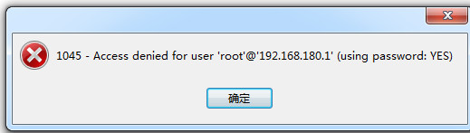
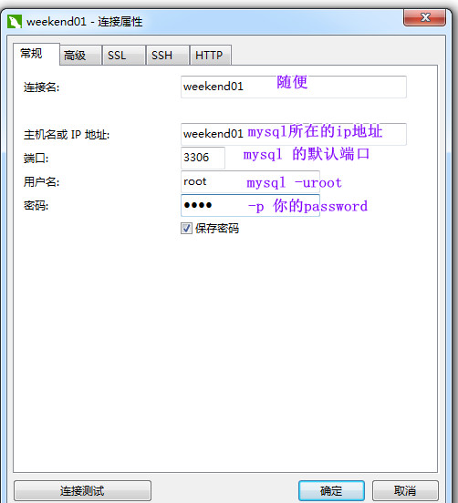
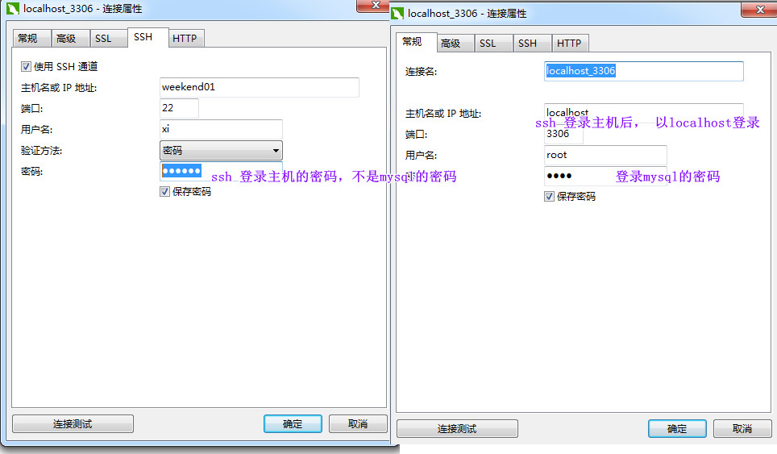

# Navicat for MySQL 安装和破解

软件在大数据那里也有。

参考： https://blog.csdn.net/WYpersist/article/details/79834490

用户权限没解决， 出现 1045 的错误可以参见当前其它文档。




```sh
GRANT ALL PRIVILEGES ON *.* TO 'user'【用户名user】@'192.168.180.1'【ip地址】 IDENTIFIED BY 'root'【密码】 WITH GRANT OPTION;//表示从指定ip从任何主机连接到mysql服务器

FLUSH   PRIVILEGES;
```

然后就可以登录了。 有两种登录方式：



或者以ssh的方式登录：




