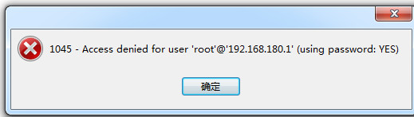

# Navicat 连不上数据库

首先要确保数据库3306端口是对外开放。

在确保端口开放的情况下，如果出现错误代码1045- Host xxx is not allowed to connect to this MariaDb server，说明是权限问题。如图：

如下所示：




有两种解决方法：

1.授权法

授权任意主机ip可用`%`  代替：

```msyql
GRANT ALL PRIVILEGES ON *.* TO 'user'【登录用户的身份，相当于 mysql -uroot(这个参数)】@'%'【主机名】 IDENTIFIED BY 'password'【以root 身份登录mysql的用户密码】 WITH GRANT OPTION; // %:表示从任何主机连接到mysql服务器
FLUSH   PRIVILEGES;
```

或者

授权指定主机

```sh
GRANT ALL PRIVILEGES ON *.* TO 'user'@'116.30.70.187' IDENTIFIED BY 'password' WITH GRANT OPTION;//表示从指定ip从任何主机连接到mysql服务器

FLUSH   PRIVILEGES;
```

查看修改结果：

```mysql
mysql> use mysql
Database changed

mysql> select user,host,password from user where user='root';
+——+——————-+——————————————-+
| user | host | password |
+——+——————-+——————————————-+
| root | % | *A50E066E106320CF4142 |
| root | centos | *A50E066E106320CF4142 |
| root | 127.0.0.1 | *A50E066E1063608320CF4142 |
+——+——————-+——————————————-+
3 rows in set (0.12 sec)
```

<br>

2.改表法

可能是你的帐号不允许从远程登陆，只能在localhost。这个时候只要在localhost的那台电脑，登入MySQL后，更改 "mysql" 数据库里的 "user" 表里的 "host" 项，从"localhost"改称"%"

```sh
mysql -u root -p
mysql>use mysql;
mysql>update user set host = '%' where user = 'root' and host='localhost';
mysql>select host, user from user;

 mysql>FLUSH RIVILEGES
```

然后重启MySQL服务。或再执行 ` mysql>FLUSH RIVILEGES`执行一个语句 使修改生效。

上面改完会有一个问题， 退出再登录不上， `root@localhost` 登录不上， 也就是需要 `mysql -uroot -p123456 -h 127.0.0.1`  才能登录。要死。。。

又需要将localhost 加入授权列表：

```mysql
mysql> use mysql;
mysql> GRANT ALL PRIVILEGES ON *.* TO 'root'@'localhost' IDENTIFIED BY 'root' WITH GRANT OPTION;
Query OK, 0 rows affected (0.01 sec)

mysql> flush privileges;
Query OK, 0 rows affected (0.00 sec)

mysql> select user,host,password from user where user='root';
+------+-----------+-------------------------------------------+
| user | host      | password                                  |
+------+-----------+-------------------------------------------+
| root | %         | *81F5E21E35407D884A6CD4A731AEBFB6AF209E1B |
| root | weekend01 | *81F5E21E35407D884A6CD4A731AEBFB6AF209E1B |
| root | 127.0.0.1 | *81F5E21E35407D884A6CD4A731AEBFB6AF209E1B |
| root | localhost | *81F5E21E35407D884A6CD4A731AEBFB6AF209E1B |
+------+-----------+-------------------------------------------+
4 rows in set (0.00 sec)

mysql> quit;
```

<br>

## 参考

https://blog.csdn.net/LY_Dengle/article/details/77835882 
