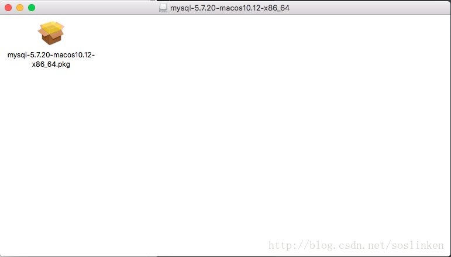
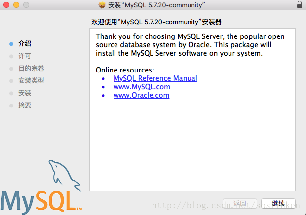
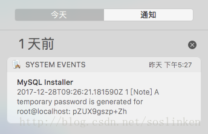

#00 Mac 下安装mysql

1- 最新版本的，安装的时候会让设置root 用户密码。所以不用记录临时密码。

2- 启动

终端界面下输入

```
sudo /usr/local/mysql/support-files/mysql.server start
```

启动mysql服务,启动成功后继续输入

```
mysql -u root -p
```

此时终端将让你输入密码12345678

------

原文:https://blog.csdn.net/soslinken/article/details/78927963

# 下载mysql dmg安装包

在msql 官方网站上下载 mysql 社区版本的dmg安装包

> <https://dev.mysql.com/downloads/mysql/>

# GUI安装

下载完成后，打开dmg文件后，会出现后缀名为pkg的安装文件。 


双击执行，验证安装包结束之后就会进入mysql的gui安装界面。 
 
然后就下一步下一步下一步，直到安装结束。

# 默认root 密码

与windows下安装不同的是，mac os 下安装完成后不会让你配置root用户。会默认生成一个root用户并给予一个随机的密码。随机密码生成后会在mac os的系统通知里生成一条系统通知消息。

#### **随机生成的密码一定要用记事本记下来，后面要用，非常重要，非常重要，非常重要！！！**

系统状态栏 右上角 列表图标 


点击列表图标后，展开系统通知界面 
 
在其中就能看到随机生成的root密码。

# 配置环境变量

```shell
$ cd ~
$ vim ./.bash_profile
```

进入vim 编辑环境。 
按下i 进入 insert 模式 
输入

```shell
export PATH=$PATH:/usr/local/mysql/bin
```

按下esc 退出 insert 模式 
输入

```
:wq
```

保存配置文件。 
在终端界面下输入

```
source ~/.bash_profile 
echo $PATH
```

查看系统环境变量是否设置成功。

# 启动 mysql 服务

终端界面下输入

```
sudo /usr/local/mysql/support-files/mysql.server start
```

启动mysql服务,启动成功后继续输入

```
mysql -u root -p
```

此时终端将让你输入密码，使用之前在系统通知中获取到的随机密码。 


登录进入msql 控制台后，使用 set password 指令将随机密码修改为用户自定义的密码。

```
set password = password('123456');
```

至此安装mysql 成功！此时就可以愉快的使用mysql 服务了。

# 没有记录随机密码的重置密码方案

```
mysqladmin -u root password [password]
```

执行该命令，会有一个警告提示，但是密码仍旧是修改成功了。 
再使用修改后的密码登录，即可使用mysql服务。


------

## ERROR! The server quit without updating PID file (/usr/local/mysql/data/CookiedeMacBook-Pro.local.pid).

这种问题一查是第三种：https://blog.csdn.net/cjfeii/article/details/48494089

即安装完就已经启动了。

### 1 可能是/home/mysql/data/mysql.pid文件没有写的权限

```
# chown -R mysql:mysql /home/mysql/data
or
# chmod -R 755 /home/mysql/data1
```

### 2 初始化数据库

```
/usr/bin/mysql_install_db --user=mysql
```

### 3 可能进程里已经存在mysql进程

```
# ps -ef|grep mysqld
# kill -9  ${mysql_pid}
```

### 4 可能是第二次在机器上安装mysql，有残余数据影响了服务的启动。

```
# rm /home/mysql/data/mysql-bin.index
```

### 5 selinux惹的祸，如果是centos系统，默认会开启selinux

```
# cat /etc/selinux/config
SELINUX=disabled

# reboot
```


