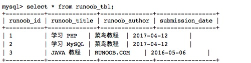

#12 MySQL 插入数据

插入表格的VARCHAR 类型的字段时，`''` 单引号也可以。

------

MySQL 表中使用 **INSERT INTO** SQL语句来插入数据。

你可以通过 mysql> 命令提示窗口中向数据表中插入数据，或者通过PHP脚本来插入数据。

### 语法

以下为向MySQL数据表插入数据通用的 **INSERT INTO** SQL语法：

```Mysql
INSERT INTO table_name ( field1, field2,...fieldN )
                       VALUES
                       ( value1, value2,...valueN );
```

如果数据是字符型，必须使用单引号或者双引号，如："value"。

------

## 通过命令提示窗口插入数据

以下我们将使用 SQL **INSERT INTO** 语句向 MySQL 数据表 runoob_tbl 插入数据

### 实例

以下实例中我们将向 runoob_tbl 表插入三条数据:

```Mysql
root@host# mysql -u root -p password;
Enter password:*******
mysql> use RUNOOB;
Database changed
mysql> INSERT INTO runoob_tbl 
    (runoob_title, runoob_author, submission_date)
    VALUES
    ("学习 PHP", "菜鸟教程", NOW());
Query OK, 1 rows affected, 1 warnings (0.01 sec)
mysql> INSERT INTO runoob_tbl
	(runoob_title, runoob_author, submission_date)
	VALUES
	("学习 MySQL", "菜鸟教程", NOW());
Query OK, 1 rows affected, 1 warnings (0.01 sec)
mysql> INSERT INTO runoob_tbl
	(runoob_title, runoob_author, submission_date)
	VALUES
	("JAVA 教程", "RUNOOB.COM", '2016-05-06');
Query OK, 1 rows affected (0.00 sec)
mysql>
```

**注意：** 使用箭头标记 -> 不是 SQL 语句的一部分，它仅仅表示一个新行，如果一条SQL语句太长，我们可以通过回车键来创建一个新行来编写 SQL 语句，SQL 语句的命令结束符为分号 ;。

在以上实例中，我们**并没有提供 runoob_id 的数据，因为该字段我们在创建表的时候已经设置它为 AUTO_INCREMENT**(自动增加) 属性。 所以，该字段**会自动递增而不需要我们去设置**。实例中 **NOW() 是一个 MySQL 函数**，该函数**返回日期和时间**。

接下来我们可以通过以下语句查看数据表数据：

## 读取数据表：

```mysql
select * from runoob_tbl;
```


输出结果：

