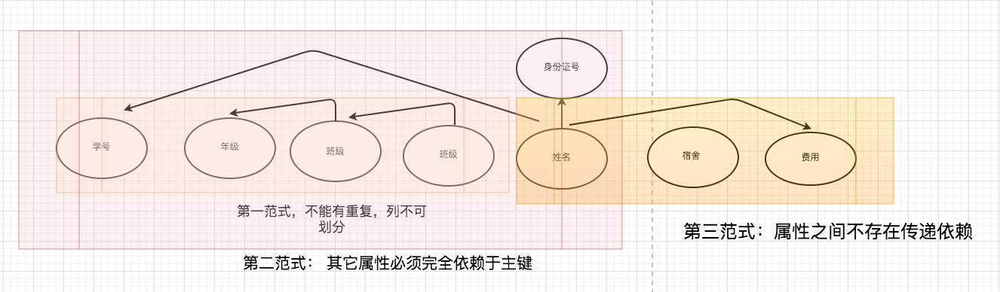
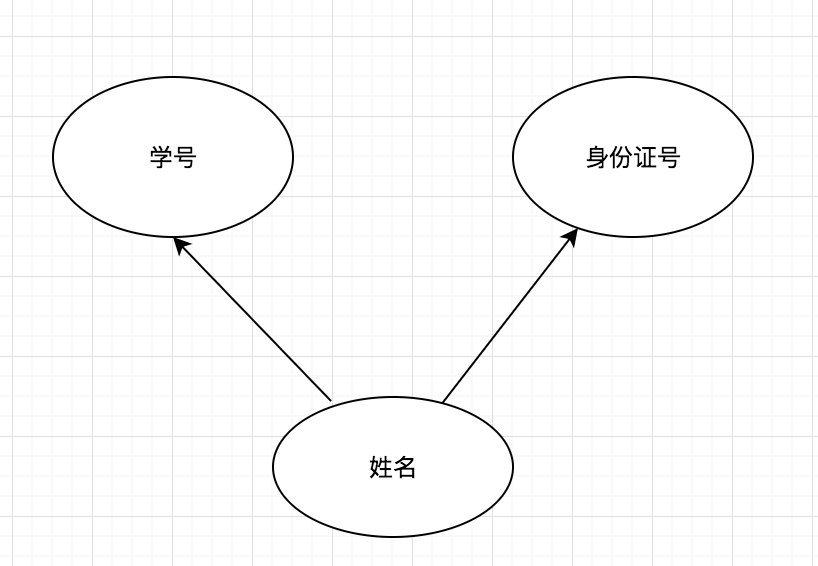
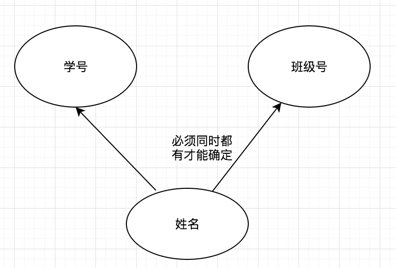
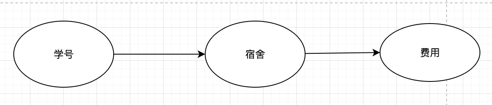

# 部分函数依赖，传递函数依赖，完全函数依赖 和三种范式的区别

```mysql
1- 三大依赖关系：
	- 部分函数依赖：姓名可根据学号确定，也可根据身份证号确定
	- 完全函数依赖： 姓名 需要同时有学号和班级才能确定
	- 传递函数依赖： 学号 来获得 宿舍， 根据宿舍 来获得 费用

2- 3 范式和允许的依赖
第一范式就是无重复的列。 
第二范式：非主属性完全依赖于关键字。 不能存在部分函数依赖，比如说姓名即依赖于 学号， 又依赖于 另一个关键字。 那就应该单独列出来做为实体。
【属性必须完全依赖于主关键字】

第三范式：第三范式就是属性不依赖于其它非主属性。【属性之间不存在依赖关系】
满足第二范式的基础上，切不存在传递函数依赖

第三范式： 有完全依赖，不能有传递依赖和部分依赖

 BC范式（BCNF）：关系模式R属于第一范式，且每个属性都不传递依赖于键码。【第一范式的升级版】
```

三大范式一览：




要讲清楚范式，就先讲讲几个名词的含义吧：

**部分函数依赖：**设X,Y是关系R的两个属性集合，存在X→Y，若X’是X的真子集，存在X’→Y，则称Y部分函数依赖于X。

举个例子：学生基本信息表R中（学号，身份证号，姓名）当然学号属性取值是唯一的，在R关系中，（学号，身份证号）->（姓名），（学号）->（姓名），（身份证号）->（姓名）；所以姓名部分函数依赖与（学号，身份证号）；




**完全函数依赖：**设X,Y是关系R的两个属性集合，X’是X的真子集，存在X→Y，但对每一个X’都有X’!→Y，则称Y完全函数依赖于X。

例子：学生基本信息表R（学号，班级，姓名）假设不同的班级学号有相同的，班级内学号不能相同，在R关系中，（学号，班级）->（姓名），但是（学号）->(姓名)不成立，（班级）->(姓名)不成立，所以姓名完全函数依赖与（学号，班级）；

  

**传递函数依赖：**设X,Y,Z是关系R中互不相同的属性集合，存在X→Y(Y !→X),Y→Z，则称Z传递函数依赖于X。

例子：在关系R(学号 ,宿舍, 费用)中，(学号)->(宿舍),宿舍！=学号，(宿舍)->(费用),费用!=宿舍，所以符合传递函数的要求；




 

 **1 、第一范式（1NF）**

  在任何一个关系数据库中，第一范式（1NF）是对关系模式的基本要求，不满足第一范式（1NF）的数据库就不是关系数据库。

  所谓第一范式（1NF）是指数据库表的每一列(即每个属性)都是不可分割的基本数据项，同一列中不能有多个值，即实体中的某个属性不能有多个值或者不能有重复的属性。简而言之，第一范式就是无重复的列。

  **2、 第二范式（2NF）**

  第二范式（2NF）是在第一范式（1NF）的基础上建立起来的，即满足第二范式（2NF）必须先满足第一范式（1NF）。第二范式（2NF）要求数据库表中的每个实例或行必须可以被唯一地区分。为实现区分通常需要为表加上一个列，以存储各个实例的唯一标识。员工信息表中加上了员工编号（emp_id）列，因为每个员工的员工编号是唯一的，因此每个员工可以被唯一区分。这个唯一属性列被称为主关键字或主键、主码。

  第二范式（2NF）要求实体的属性完全依赖于主关键字**。所谓完全依赖是指不能存在仅依赖主关键字一部分的属性，如果存在，那么这个属性和主关键字的这一部分应该分离出来形成一个新的实体，新实体与原实体之间是一对多的关系。**为实现区分通常需要为表加上一个列，以存储各个实例的唯一标识。简而言之，第二范式就是非主属性依赖于主关键字。

  **3 、第三范式（3NF）**

  满足第三范式（3NF）必须先满足第二范式（2NF）。在满足第二范式的基础上，切不存在传递函数依赖，那么就是第三范式。简而言之，**第三范式就是属性不依赖于其它非主属性。**

最后简单的总结一下：

1、第一范式（1NF）：一个关系模式R的所有属性都是不可分的基本数据项。 

2、第二范式（2NF）：关系模式R属于第一范式，且每个非主属性都完全函数依赖于键码。 

3、第三范式（3NF）：关系模式R属于第一范式，且每个非主属性都不伟递领带于键码。 

4、 BC范式（BCNF）：关系模式R属于第一范式，且每个属性都不传递依赖于键码。

第三范式以上的范式在数据库中也很少用到，而且三级数据库一般也不会考，这里就不提了吧，呵呵，偷个懒