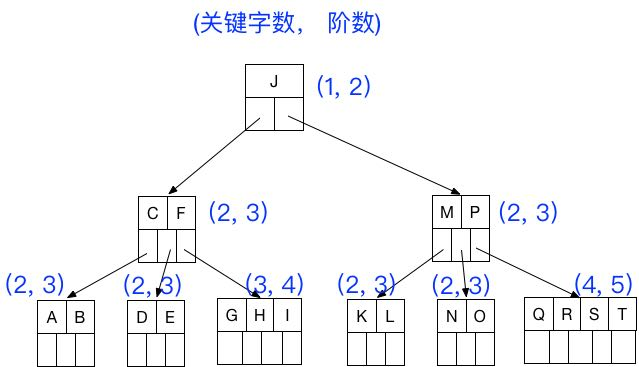
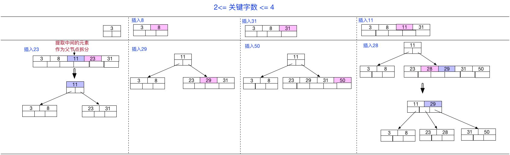
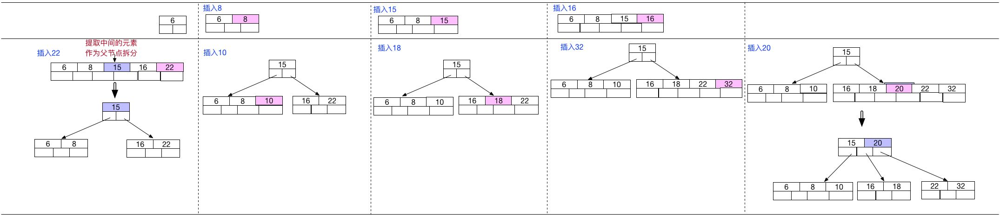

# B tree

## 概念

注意:之前有看到有很多文章把**B树**和**B-tree**理解成了两种不同类别的树，其实这两个是**同一种树**;

也可叫成**B 减树** 。

1、概念：B树和平衡二叉树稍有不同的是B树属于 **多叉树** 又名 **平衡多路查找树**（查找路径不只两个），**数据库索引**技术里大量使用者B树和B+树的数据结构，让我们来看看他有什么特点;

 

## 规则

1- 几个规则：

（1）树种的每个节点最多拥有m个子节点且m>=2,空树除外（注：**m阶**代表一个树节点最多**有多少个查找路径**，m阶=m路,当m=2则是2叉树,m=3则是3叉）；

（2）除根节点外每个节点的关键字数量大于等于ceil(m/2)-1个小于等于m-1个，**非根节点关键字数必须>=2**;（注：ceil()是个朝正无穷方向取整的函数 如ceil(1.1)结果为2)

（3）所有叶子节点均在同一层、叶子节点除了包含了关键字和关键字记录的指针外也有指向其子节点的指针只不过其指针地址都为null对应下图最后一层节点的空格子

（4）如果一个非叶节点有N个子节点，则该节点的关键字数等于N-1;

（5）所有节点关键字是按递增次序排列，并遵循左小右大原则；

 

2- 最后我们用一个图和一个实际的例子来理解B树（这里为了理解方便我就直接用**实际字母的大小来排列**C>B>A）

3- m 是阶数，是需要手动规定的阶数， 例如5阶（最多5叉树）， 则除了根节点外， 其它节点的关键字数的范围为： $\lceil \frac{m}{2}-1\rceil  \leq 关键字数 \leq m-1$ , 所以关键字数的范围 $2 \leq 关键字数 \leq 4$ .

 

 

## 查询

1- B 树的查询流程以查找上图的 D 为例：

（1）获取根节点的关键字进行比较，当前根节点关键字为J，D要小于J（26个字母顺序），所以往找到指向左边的子节点（二分法规则，左小右大，左边放小于当前节点值的子节点， 右边放大于当前节点值的子节点）；

（2）拿到关键字 C 和 F ，C<D<F 所以直接找到C和F中间的节点；

（3）拿到 D 和 E ，因为 D=D 所以直接返回关键字和指针信息（如果树结构里面**没有包含所要查找的节点则返回null**）； 

 

## 插入

1- 定义一个5阶树（平衡5路查找树;），现在我们要把3、8、31、11、23、29、50、28 这些数字构建出一个5阶树出来; 

遵循规则：

（1）当前是要组成一个5路查找树，那么此时m=5,关键字数必须大于等于ceil（5/2） -1小于等于5-1（ **关键字数小于cei(5/2) -1就要进行节点合并，大于5-1就要进行节点拆分**, 非根节点关键字数>=2）；

（2）满足节点本身比左边节点大，比右边节点小的排序规则;

 

2- B树相对于平衡二叉树的不同是，每个节点包含的**关键字增多了**，特别是在B树应用到数据库中的时候，数据库充分**利用了磁盘块的原理**（磁盘数据存储是采用块的形式存储的，每个块的大小为4K，每次IO进行数据读取时，同一个磁盘块的数据可以一次性读取出来）把节点大小限制和**充分使用在磁盘快大小范围**；把树的节点关键字增多后树的层级比原来的二叉树少了，减少数据查找的次数和复杂度;

 

3- 举个例：

一个空的5阶B-树，依次插入关键字序列，6 8 15 16 22 10 18 32 20，插入完成后关键字6所在节点包含的关键字字数为 **3**,	

  

 

## 参考

[1]  还有B+ 树 和 B* 树没看完。

 https://zhuanlan.zhihu.com/p/27700617  