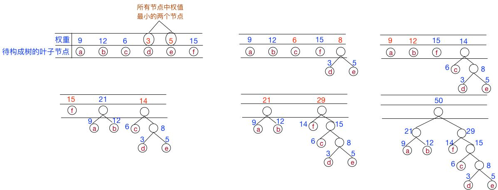
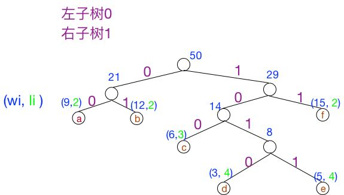

# 哈夫曼树和哈夫曼编码

```
1- 哈夫曼树是带权的二叉树
2- 权值越大，离根越近
3- 权值是从根到叶子的路径长度。（即经过的节点数 - 1 ）
4- 数值越大，频率越高，编码长度越短

5- 区分不同频率或者概率上不同的相同类型操作上，利用统计数据得出的规律构建最优化选择树结构，避免了过多的无用分支，提升整体操作性能。
```


##  基本概念

a、路径和路径长度

若在一棵树中存在着一个结点序列 k1，k2，……，kj， 使得 ki是kj 的双亲（1<=i<j），则称此结点序列是从 k1 到 kj 的路径。

从 k1 到 kj 所经过的分支数称为这两点之间的==路径长度==，它等于==路径上的结点数减1==.

b、结点的权和带权路径长度

在许多应用中，常常将树中的结点赋予一个有着某种意义的实数，我们称此==实数==为该结点的==权==，(如下面一个树中的==蓝色数字==表示结点的权)

结点的==带权路径长度==规定为从**树根结点到该结点之间的路径长度(路径上的节点数-1)与该结点上权的乘积**。

c、树的带权路径长度

树的带权路径长度定义为树中所有叶子结点的带权路径长度之和，公式为：

$$ WPL = \sum^n_{i=1} w_il_i $$ 

其中，n表示叶子结点的数目，wi 和 li 分别表示**叶子结点** ki 的权值和树根结点到 ki 之间的路径长度。

如下图中树的带权路径长度 WPL = 9 x 2 + 12 x 2 + 15 x 2 + 6 x 3 + 3 x 4 + 5 x 4  =  122

下图， 叶子节点分别标出了**权重和路径长度** , 以及标注了字母。


d、哈夫曼树

哈夫曼树又**称==最优二叉树==。它是 n 个带权叶子结点构成的所有二叉树中，==带权路径长度 WPL 最小的二叉树==。**

如下图为一哈夫曼树示意图。

【注意，哈夫曼关注的是**叶子节点**， 尽量**让权值大的叶子靠近根节点**， 这样路径长度比较小，wpl 也越小】


## 构造哈夫曼树

假设**有n个权值**，则构造出的哈夫曼树有**n个叶子结点**。 n个权值分别设为 w1、w2、…、wn，则哈夫曼树的构造规则为：

(1) 将w1、w2、…，wn看成是有**n 棵树的森林**(每棵树仅有一个结点)；

(2) 在森林中**选出两个根结点的权值最小的树合并**，作为一棵新树的左、右子树，且**新树的根结点权值为其左、右子树根结点权值之和**；

(3)从森林中**删除选取的两棵树，并将新树加入森林**；

(4)重复(2)、(3)步，直到森林中只剩一棵树为止，该树即为所求得的哈夫曼树。

 如：对 下图中的六个带权叶子结点来构造一棵哈夫曼树，步骤如下：



**注意：为了使得到的哈夫曼树的==结构尽量唯一==，通常规定生成的哈夫曼树中==每个结点的左子树根结点的权小于等于右子树根结点的权==。**

 构造哈夫曼树的程序如下：

```cpp
//2、根据数组 a 中 n 个权值建立一棵哈夫曼树，返回树根指针
BTreeNode* CreateHuffman(vector<ElemType> a){

    if(a.size() == 0)
        return NULL;
    else if(a.size() == 1)
        return  new BTreeNode(a[0]);

    vector<BTreeNode *> b;
    for( int i=0; i< a.size();i++ ){
        b.push_back(new BTreeNode(a[i]));
    }

    BTreeNode* q = NULL;                 // for return

    int i,j;
    //进行 n-1 次循环建立哈夫曼树
    for (i = 1; i < a.size(); i++){
        //k1表示森林中具有最小权值的树根结点的下标，k2为次最小的下标
        int k1 = -1, k2;

        //让k1初始指向森林中第一棵树，k2指向第二棵
        for (j = 0; j < a.size(); j++){
            if (b[j] != NULL && k1 == -1){
                k1 = j;
                continue;
            }
            if(b[j] != NULL){
                k2 = j;
                break;
            }
        }

        // 找最小和次小值
        //从当前森林中求出最小权值树和次最小
        for (j = k2; j < a.size(); j++){
            if (b[j] != NULL){
                if (b[j]->data < b[k1]->data){
                    k2 = k1;
                    k1 = j;
                }
                else if (b[j]->data < b[k2]->data)
                    k2 = j;
            }
        }

        //由最小权值树和次最小权值树建立一棵新树，q指向树根结点
        q = new BTreeNode( b[k1]->data + b[k2]-> data );
        q->left = b[k1];
        q->right = b[k2];

        b[k1] = q;//将指向新树的指针赋给b指针数组中k1位置
        b[k2] = NULL;//k2位置为空
    }

    return q; //返回整个哈夫曼树的树根指针
}
```

<br>

## 哈夫曼编码

在电报通信中，电文是以二进制的0、1序列传送的，每个字符对应一个二进制编码，**为了缩短电文的总长度，采用不等长编码方式，构造哈夫曼树，**

将**每个字符的出现频率作为字符结点的权值赋予叶子结点，每个分支结点的左右分支分别用0和1编码**，从树根结点到每个叶子结点的路径上

所经分支的0、1编码序列等于该叶子结点的二进制编码。如上文所示的哈夫曼编码如下：



a 的编码为：00

b 的编码为：01

c 的编码为：100

d 的编码为：1010

e 的编码为：1011

f 的编码为：11

<br>

## 前缀编码

引申

提到哈夫曼树自然少不了==前缀编码==，前缀编码的依据也就是哈夫曼树所提供的优化判断功能，由树结构可知，每一个原始节点都被构造为哈夫曼树的叶子节点，使得到达任一叶子节点(原始节点)都不可能经过其他叶子节点(原始节点)，这听起来像是一句废话，但这确实是前缀编码的定义：==不存在一个字符的编码是另一个字符的前缀==。

而前缀编码一个很明显的特性就是**提供了对不等长编码的优化，即所有讲哈夫曼编码都会提到的例子，给出现==频率高的字符分配较短的编码，给出现频率低的字符分配较长的编码==，此不等长编码刚好借助哈夫曼树的特征来避免编码与另一个编码的前缀相同的问题**，即实现了前缀编码(名字真有意思，**前缀编码表示不存在一个编码的前缀等于另一个编码**)。

<br>

## 哈夫曼树的全部操作运算

C++ 程序如下：

输出数结构用到的广义表形式，其实就是==前序遍历==

```cpp
#include<stdio.h>
#include<stdlib.h>
#include <vector>
#include <algorithm>
using namespace std;
typedef int ElemType;

/// 二叉树结构
struct BTreeNode
{
    ElemType data;
    struct BTreeNode* left;
    struct BTreeNode* right;
    BTreeNode(int val):data(val),left(NULL),right(NULL){
    }
};

//1、输出二叉树，可在前序遍历的基础上修改。采用广义表格式，元素类型为int[广义表是前序遍历的意思]
void PrintBTree_int(struct BTreeNode* BT)
{
    if (BT != NULL)
    {
        printf("%d", BT->data); //输出根结点的值
        if (BT->left != NULL || BT->right != NULL)
        {
            printf("(");
            PrintBTree_int(BT->left); //输出左子树
            if (BT->right != NULL)
                printf(",");
            PrintBTree_int(BT->right); //输出右子树
            printf(")");
        }
    }
}

//2、根据数组 a 中 n 个权值建立一棵哈夫曼树，返回树根指针
BTreeNode* CreateHuffman(vector<ElemType> a){

    if(a.size() == 0)
        return NULL;
    else if(a.size() == 1)
        return  new BTreeNode(a[0]);

    vector<BTreeNode *> b;
    for( int i=0; i< a.size();i++ ){
        b.push_back(new BTreeNode(a[i]));
    }

    BTreeNode* q = NULL;                 // for return

    int i,j;
    //进行 n-1 次循环建立哈夫曼树
    for (i = 1; i < a.size(); i++){
        //k1表示森林中具有最小权值的树根结点的下标，k2为次最小的下标
        int k1 = -1, k2;

        //让k1初始指向森林中第一棵树，k2指向第二棵
        for (j = 0; j < a.size(); j++){
            if (b[j] != NULL && k1 == -1){
                k1 = j;
                continue;
            }
            if(b[j] != NULL){
                k2 = j;
                break;
            }
        }

        // 找最小和次小值
        //从当前森林中求出最小权值树和次最小
        for (j = k2; j < a.size(); j++){
            if (b[j] != NULL)
            {
                if (b[j]->data < b[k1]->data)
                {
                    k2 = k1;
                    k1 = j;
                }
                else if (b[j]->data < b[k2]->data)
                    k2 = j;
            }
        }

        //由最小权值树和次最小权值树建立一棵新树，q指向树根结点
        q = new BTreeNode( b[k1]->data + b[k2]-> data );
        q->left = b[k1];
        q->right = b[k2];

        b[k1] = q;//将指向新树的指针赋给b指针数组中k1位置
        b[k2] = NULL;//k2位置为空
    }

    return q; //返回整个哈夫曼树的树根指针
}

//3、求哈夫曼树的带权路径长度
ElemType WeightPathLength(struct BTreeNode* FBT, int len)//len初始为0
{
    if (FBT == NULL) //空树返回0
        return 0;
    else
    {
        if (FBT->left == NULL && FBT->right == NULL)//访问到叶子结点
            return FBT->data * len;
        else //访问到非叶子结点，进行递归调用，返回左右子树的带权路径长度之和，len递增
            return WeightPathLength(FBT->left,len+1)+WeightPathLength(FBT->right,len+1);
    }
}

//4、哈夫曼编码（可以根据哈夫曼树带权路径长度的算法基础上进行修改）
void HuffManCoding(struct BTreeNode* FBT, int len)//len初始值为0
{
    static int a[10];//定义静态数组a，保存每个叶子的编码，数组长度至少是树深度减一
    if (FBT != NULL)//访问到叶子结点时输出其保存在数组a中的0和1序列编码
    {
        if (FBT->left == NULL && FBT->right == NULL)
        {
            int i;
            printf("结点权值为%d的编码：", FBT->data);
            for (i = 0; i < len; i++)
                printf("%d", a[i]);
            printf("\n");
        }
        else//访问到非叶子结点时分别向左右子树递归调用，并把分支上的0、1编码保存到数组a
        {   //的对应元素中，向下深入一层时len值增1
            a[len] = 0;
            HuffManCoding(FBT->left, len + 1);
            a[len] = 1;
            HuffManCoding(FBT->right, len + 1);
        }
    }
}

//主函数
int main()
{
    int n, i;

    struct BTreeNode* fbt;
    printf("从键盘输入待构造的哈夫曼树中带权叶子结点数n：\n");
    while(1)
    {
        scanf("%d", &n);
        if (n > 1)
            break;
        else
            printf("重输n值：\n");
    }

    vector<ElemType > a(n,0);
    printf("从键盘输入%d个整数作为权值：\n", n);
    for (i = 0; i < n; i++)
        scanf(" %d", &a[i]);
    fbt = CreateHuffman(a);
    printf("广义表形式的哈夫曼树：");
    PrintBTree_int(fbt);
    printf("\n");
    printf("哈夫曼树的带权路径长度：");
    printf("%d\n", WeightPathLength(fbt, 0));
    printf("树中每个叶子结点的哈夫曼编码：\n");
    HuffManCoding(fbt, 0);

    return  0;
}
```

测试结果如下：

```cpp
从键盘输入待构造的哈夫曼树中带权叶子结点数n：
6
从键盘输入6个整数作为权值：
3 9 5 12 6 15
广义表形式的哈夫曼树：50(21(9,12),29(14(6,8(3,5)),15))
哈夫曼树的带权路径长度：122
树中每个叶子结点的哈夫曼编码：
结点权值为9的编码：00
结点权值为12的编码：01
结点权值为6的编码：100
结点权值为3的编码：1010
结点权值为5的编码：1011
结点权值为15的编码：11
```

<br>

## 总结

哈夫曼树作为一种优化判断的树结构，在**区分==不同频率==或者==概率上不同的相同类型== ** 操作上，利用统计数据得出的规律构建最优化选择树结构，避免了过多的无用分支，提升整体操作性能。

<br>

## 参考

[1] https://www.cnblogs.com/zhangming-blog/p/5395950.html


