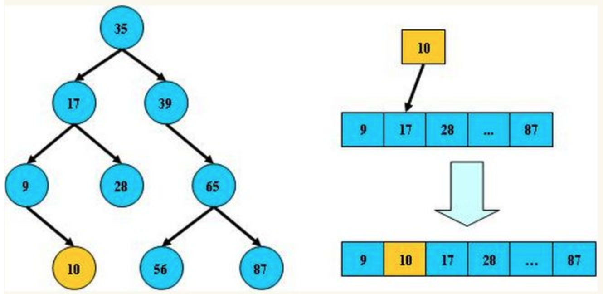
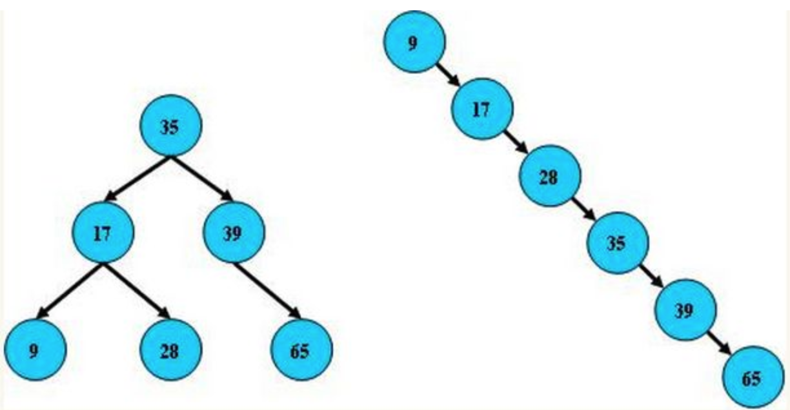

# 平衡二叉树

（1）由来：平衡二叉树是基于二分法的策略==提高==数据的==查找速度的二叉树==的数据结构；

（2）特点：

平衡二叉树是采用二分法思维把数据按规则组装成一个树形结构的数据，用这个树形结构的数据减少无关数据的检索，大大的提升了数据检索的速度；平衡二叉树的数据结构组装过程有以下规则：

非叶子节点只能允许==最多两个子节点==存在，每一个非叶子节点数据分布规则为==左边的子节点小==当前节点的值，==右边的子节点大==于当前节点的值(这里值是基于自己的算法规则而定的，比如hash值)；

平衡树的层级结构：因为平衡二叉树查询性能和树的层级（h高度）成反比，h值越小查询越快、为了保证树的结构左右两端数据==大致平衡==降低二叉树的查询难度一般会采用==一种算法机制==实现节点数据结构的平衡，实现了这种算法的有比如**AVL、[Treap](http://link.zhihu.com/?target=http%3A//baike.baidu.com/item/Treap)、红黑树**，使用平衡二叉树能保证数据的左右两边的节点层级相差不会大于1.，通过这样**避免树形结构由于删除增加变成线性链表**影响查询效率，保证数据**平衡的**情况下**查找数据的速度近于二分法查找**；

总结平衡二叉树特点：

（1）非叶子节点最多拥有两个子节点；

（2）非叶子节值大于左边子节点、小于右边子节点；

（3）树的左右两边的**层级数相差不会大于1**;

（4）**没有值相等重复的节点**;

