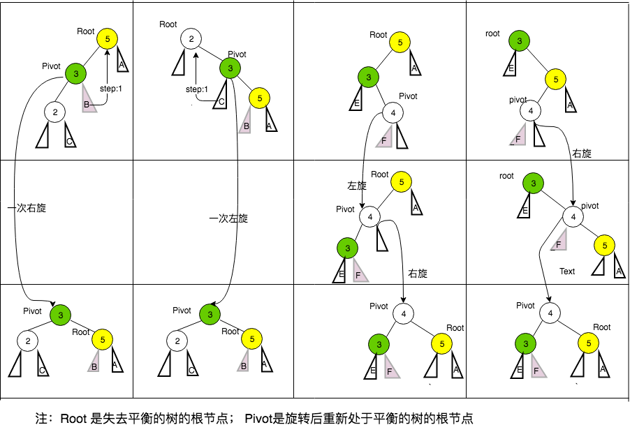

# 平衡二叉树（AVL） 高度平衡树

```sh
1- 注意，平衡二叉树首先就是二叉搜索树[满足左小，右大的特征]。 但是二叉搜索树不太平衡，最极端的情况会出现单链树

2- 往右转就右旋，判断该怎么旋，看Pivot 节点的方向。

```


##1- 平衡二叉树的概念

在[计算机科学](http://zh.wikipedia.org/wiki/%E8%AE%A1%E7%AE%97%E6%9C%BA%E7%A7%91%E5%AD%A6)中，**AVL树**是最先发明的[自平衡二叉查找树](http://zh.wikipedia.org/wiki/%E8%87%AA%E5%B9%B3%E8%A1%A1%E4%BA%8C%E5%8F%89%E6%9F%A5%E6%89%BE%E6%A0%91)。在AVL树中任何节点的两个[子树](http://zh.wikipedia.org/w/index.php?title=%E5%AD%90%E8%8A%82%E7%82%B9&action=edit&redlink=1)的高度最大差别为一，所以它也被称为[高度平衡树](http://zh.wikipedia.org/w/index.php?title=%E9%AB%98%E5%BA%A6%E5%B9%B3%E8%A1%A1%E6%A0%91&action=edit&redlink=1)。查找、插入和删除在平均和最坏情况下都是[O](http://zh.wikipedia.org/wiki/%E5%A4%A7O%E7%AC%A6%E5%8F%B7)（log *n*）。增加和删除可能需要通过一次或多次[树旋转](http://zh.wikipedia.org/wiki/%E6%A0%91%E6%97%8B%E8%BD%AC)来重新平衡这个树。

节点的**平衡因子**是它的左子树的高度减去它的右子树的高度（有时相反）。带有平衡因子1、0或 -1的节点被认为是平衡的。带有平衡因子 -2或2的节点被认为是不平衡的，并需要重新平衡这个树。平衡因子可以直接存储在每个节点中，或从可能存储在节点中的子树高度计算出来。


## 2- 平衡二叉树的四种旋转情况

以下图表以四列表示四种情况，每行表示在该种情况下要进行的操作。在左左和右右的情况下，只需要进行一次旋转操作；在左右和右左的情况下，需要进行两次旋转操作。




> 1.单向右旋：由于在*a的左子树根节点的右子树上插入节点，a的平衡因子由1变为2，向右顺时针旋转。
>
> 2.单向左旋：由于在*a的右子树根节点的右子树上插入节点，a的平衡因子由1变为2，向左顺时针旋转。
>
> 3.先左后右：由于在*a的右子树根节点的右子树上插入节点，a的平衡因子由1变为2，做两次旋转，先左旋转，再右旋转。
>
> 4.先右后左：由于在*a的右子树根节点的左子树上插入节点，a的平衡因子由1变为2，做两次旋转，先右旋转，再左旋转。

      **精华：**

```
	LL：单右转

    RR：单左转

    LR：先左后右

    RL：先右后左
```


## 3- 插入

向AVL树插入可以通过如同它是未平衡的二叉查找树一样把给定的值插入树中，接着自底向上向根节点折回，于在插入期间成为不平衡的所有节点上进行旋转来完成。因为折回到根节点的路途上最多有1.44乘log n个节点，而每次AVL旋转都耗费恒定的时间，**插入处理在整体上耗费O(log n) 时间。**


##  4- 删除

从AVL树中删除可以通过**把要删除的节点向下旋转成一个叶子节点，接着直接剪除这个叶子节点来完成。因为在旋转成叶子节点期间最多有log n个节点被旋转，**而每次AVL旋转耗费恒定的时间，删除处理在整体上耗费O(log n) 时间。


## 5- 查找

可以像普通二叉查找树一样的进行，所以耗费O(log *n*)时间，因为**AVL树总是保持平衡**的。不需要特殊的准备，树的结构不会由于查找而改变。（这是与[伸展树](http://zh.wikipedia.org/wiki/%E4%BC%B8%E5%B1%95%E6%A8%B9)查找相对立的，它会因为查找而变更树结构。）


------

左左

```cpp
//左左  LL
TreeNode *SingleRotateLeft(TreeNode *t2)  
{  
    TreeNode *t1;  
    t1 = t2->left;  
        t2->left = t1->right;  
    t1->right = t2;  
  
    t2->height = max(getHeight(t2->left),getHeight(t2->right)) + 1;  
    t1->height = max(getHeight(t1->left),getHeight(t1->right)) + 1;  
    return t1;  
} 
```

```cpp
//右右  
 TreeNode *SingleRotateRight(TreeNode *t2)  
 {  
     TreeNode *t1;  
     t1 = t2->right;  
     t2->right = t1->left;  
     t1->left = t2;  
  
     t2->height = max(getHeight(t2->left),getHeight(t2->right)) + 1;  
     t1->height = max(getHeight(t1->left),getHeight(t1->right)) + 1;  
     return t1;  
 }  
```


对于**“左右”**和**“右左”**则要进行一次**双旋转**，

```cpp
//左右  
TreeNode * DoubleRotateLR(TreeNode *t3)  
{  
 t3->left = SingleRotateRight(t3->left);  
 return SingleRotateLeft(t3);  
}  
```

```cpp
//右左  
TreeNode * DoubleRotateRL(TreeNode *t3)  
{  
 t3->right = SingleRotateLeft(t3->right);  
 return SingleRotateRight(t3);  
}  
```

插入操作:

进行插入操作时必须判断平衡树是否失衡，如果是则要进一步判断是用单旋转调整或者是双旋转进行调整。注意每次旋转调整后还要进行树高调整。

```cpp

 int getHeight(TreeNode *t)
 {
    if(t == NULL) return -1;
    else return t->height;
 }
 bool isBalanced(TreeNode *left,TreeNode *right)
 {
	 return abs(getHeight(left) - getHeight(right)) < 2;
 }

 TreeNode* insert(int v, TreeNode *root)
 {
	if(root == NULL)
	{
		root = new TreeNode(v);
		return root;
	}
	if(v > root->value) //节点插入在右子树中
	{
		root->right = insert(v,root->right);
		if(!isBalanced(root->left,root->right)){
			if(v > root->right->value)
				root = SingleRotateRight(root);
			else
				root = DoubleRotateRL(root);
		}
	}else{
		root->left = insert(v,root->left);
		if(!isBalanced(root->left,root->right)){
			if(v < root->left->value)
				root = SingleRotateLeft(root);
			else
				root = DoubleRotateLR(root);
		}
	}
	root->height = max(getHeight(root->left),getHeight(root->right)) + 1;
	return root;
 }
```


举个例子

```cpp

#include<bits/stdc++.h>
using namespace std;
struct TreeNode
{
    int bf;
    int height;
    int data;
    TreeNode *leftchild;
    TreeNode *rightchild;
    TreeNode *parent;
};
int max(int a, int b)
{
    return a>b?a:b;
}

template<class obj_s>
class AVLTree
{
public:
    TreeNode *root;
public:
    AVLTree()
    {
        root=NULL;
    }
    int getHeight(TreeNode *node);

    int reComHeight(TreeNode *root);//重新计算高度
    //四种旋转方式
    TreeNode* LLclockRotation(TreeNode* x);
    TreeNode* RRantiRotation(TreeNode* x);
    TreeNode* LRanti_clockRotation(TreeNode* x);
    TreeNode* RLclock_antiRotation(TreeNode* x);
    //
    TreeNode* reBalance(TreeNode* cur,int bf);
    //插入和删除
    TreeNode* insert(TreeNode* curr,TreeNode* prev,int num);
    TreeNode* findDelPosition(TreeNode* root,int key);
    //
    TreeNode* clearTarget(TreeNode* root);
    //
    void toPrint(TreeNode* root,int depth=0);
    //找待删除结点的前驱结点
    TreeNode* FindMin(TreeNode* least);
};

template<class obj_s>
int AVLTree<obj_s>::getHeight(TreeNode* node)
{
    if(node)
        return node->height;
    else
        return -1;
}

template<class obj_s>
int AVLTree<obj_s>::reComHeight(TreeNode* root)
{
    root->height = max(getHeight(root->leftchild), getHeight(root->rightchild)) + 1;
    root->bf = getHeight(root->leftchild) - getHeight(root->rightchild);
    return root->bf;
}

template<class obj_s>
TreeNode* AVLTree<obj_s>::LLclockRotation(TreeNode* x)
{
    TreeNode* y = x->leftchild;
    x->leftchild = y->rightchild;
    if (y->rightchild)
        y->rightchild->parent = x;
    y->rightchild = x;
    y->parent = x->parent;
    x->parent = y;
    reComHeight(x);
    reComHeight(y);
    return y;
}
template<class obj_s>
TreeNode* AVLTree<obj_s>::RRantiRotation(TreeNode* x){
    TreeNode* y = x->rightchild;
    x->rightchild = y->leftchild;
    if (y->leftchild)
        y->leftchild->parent = x;
    y->leftchild = x;
    y->parent = x->parent;
    x->parent = y;
    reComHeight(x);
    reComHeight(y);
    return y;
}


template<class obj_s>
TreeNode* AVLTree<obj_s>::LRanti_clockRotation(TreeNode* x)
{
    x->leftchild = RRantiRotation(x->leftchild);
    return LLclockRotation(x);
}
template<class obj_s>
TreeNode* AVLTree<obj_s>::RLclock_antiRotation(TreeNode* x)
{
    x->rightchild = LLclockRotation(x->rightchild);
    return RRantiRotation(x);
}
template<class obj_s>
TreeNode* AVLTree<obj_s>::reBalance(TreeNode* curr, int bf)
{
    if(abs(bf)<2)
        return curr;
    else
    {
        if(bf == -2)					/// 右边的深了
        {
            if (curr->rightchild->bf>0)	
                return RLclock_antiRotation(curr);
            else
                return RRantiRotation(curr);
        }
        else if(bf == 2)
        {
            if (curr->leftchild->bf < 0)
                return LRanti_clockRotation(curr);
            else
                return LLclockRotation(curr);
        }
    }
    //return NULL;
}
template<class obj_s>
TreeNode* AVLTree<obj_s>::insert(TreeNode* curr, TreeNode* prev, int num){
    int x = 0;
    if (!curr)
    {
        curr = (TreeNode*)malloc(sizeof(TreeNode));
        curr->data = num;
        curr->bf = 0;
        curr->height = 0;
        curr->parent = prev;
        curr->leftchild = curr->rightchild = NULL;
        x = num;
    }
    else if(num<(curr->data))
        curr->leftchild = insert(curr->leftchild, curr, num);
    else if(num>(curr->data))
        curr->rightchild = insert(curr->rightchild, curr, num);
    curr=reBalance(curr,reComHeight(curr));
    return curr;
}
template<class obj_s>
void AVLTree<obj_s>::toPrint(TreeNode* root, int depth)
{
    if(root->rightchild)
        toPrint(root->rightchild, depth + 1);
    for(int i = 0; i< depth; i++)
        printf("\t");
    printf("%d(%d,%d)\n", root->data,root->height, root->bf);
    if (root->leftchild)
        toPrint(root->leftchild, depth + 1);
}
template<class obj_s>
TreeNode* AVLTree<obj_s>::FindMin(TreeNode* least){
    if(!least->leftchild)
        return least;
    else
        FindMin(least->leftchild);
}
template<class obj_s>
TreeNode* AVLTree<obj_s>::clearTarget(TreeNode* root){
    TreeNode* par = root->parent, * temp = root;
    if (root->leftchild&&root->rightchild){
        temp = FindMin(root->rightchild);
        root->data = temp->data;
        root->rightchild = findDelPosition(root->rightchild, root->data);
    }
    else
    {
        if (root->leftchild){
            root->leftchild->parent = par;
            if (par->leftchild == root) par->leftchild = root->leftchild;
            else if (par->rightchild == root) par->rightchild = root->leftchild;
            root = root->leftchild;
        }
        else if (root->rightchild){
            root->rightchild->parent = par;//认可问题
            if (par->leftchild == root) par->leftchild = root->rightchild;
            else if (par->rightchild == root) par->rightchild = root->rightchild;
            root = root->rightchild;
        }
        else root = NULL;//都为NULL
        free(temp);
    }
    if (root) reComHeight(root);
    return root;
}
template<class obj_s>
TreeNode* AVLTree<obj_s>::findDelPosition(TreeNode* root, int key){
    if(key == root->data)
        root = clearTarget(root);
    else if(key<root->data)
        root->leftchild = findDelPosition(root->leftchild, key);
    else if(key>root->data)
        root->rightchild = findDelPosition(root->rightchild, key);
    if(root)
        root = reBalance(root, reComHeight(root));
    return root;

}
int main()
{

    int temp[10] = { 40, 60, 20, 80, 50, 30, 10, 70, 25,65 };
    AVLTree<int> avl;
    for (int i = 0; i < 10; i++)
        avl.root = avl.insert(avl.root, avl.root, temp[i]);
    //avl.findDelPosition(avl.root, 40); 删除操作
    avl.toPrint(avl.root);
    system("pause");
    return 0;
}
```


