# 20180411 决策树 CART

```
ID3: 只能处理离散型分类，对于连续性问题无能为力。
     ID3 其次ID3算法的分支也属于多分支，即通过一个特征可以分出很多的子数据集
     
CART 是一种树构建算法，这种算法既可以处理离散型的问题，也可以处理连续型的问题。在处理连续型问题时，主要通过使用二元切分来处理连续型变量，即特征值大于某个给定的值就走左子树，或者就走右子树。

在ID3算法中我们使用的信息熵和信息增益的概念。信息熵就代表了数据集的紊乱程度。对于连续型的问题，我们可以使用方差的概念来表达混乱程度，方差越大，越紊乱。所以我们要找到使得切分之后的方差最小的划分方式。

- C4.5采用信息增益率来作为分支特征的选择标准，而CART则采用Gini系数；
- C4.5不一定是二叉树，但CART一定是二叉树。

CART 的过拟合： 控制终止条件避免树形结构分支过细，要么就是通过对已经形成的决策树进行剪枝来避免过拟合
```


决策树算法主要有ID3，C4.5和CART，其中ID3和C4.5主要用于分类，CART可以解决回归问题。ID3算法可见博文“[简单易学的机器学习算法——决策树之ID3算法](http://blog.csdn.net/google19890102/article/details/28611225)”，CART算法可见博文“[简单易学的机器学习算法——CART之回归树](http://blog.csdn.net/google19890102/article/details/32329823)”。对于单层决策树是无法求解上面这样的问题的。


# 一、树回归的概念

​    对于一般的线性回归，其拟合的模型是基于全部的数据集。这种全局的数据建模对于一些复杂的数据来说，其建模的难度也会很大。其后，我们有了局部加权线性回归，其只利用数据点周围的局部数据进行建模，这样就简化了建模的难度，提高了模型的准确性。树回归也是一种局部建模的方法，其通过构建决策点将数据切分，在切分后的局部数据集上做回归操作。

​    在博文“[简单易学的机器学习算法——决策树之ID3算法](http://blog.csdn.net/google19890102/article/details/28611225)”中介绍了ID3算法的思想，ID3算法主要是用来处理离散性的问题，然而对于连续型的问题，ID3算法就无能无力了。其次ID3算法的分支也属于多分支，即通过一个特征可以分出很多的子数据集。分类回归树(Classification and Regression Tree, CART)是一种树构建算法，这种算法既可以处理离散型的问题，也可以处理连续型的问题。在处理连续型问题时，主要通过使用二元切分来处理连续型变量，即特征值大于某个给定的值就走左子树，或者就走右子树。

# 二、回归树的分类

​    在构建回归树时，主要有两种不同的树：

- 回归树(Regression Tree)，其每个叶节点是单个值
- 模型树(Model Tree)，其每个叶节点是一个线性方程

# 三、基于CART算法的回归树

​    在进行树的左右子树划分时，有一个很重要的量，即给定的值，特征值大于这个给定的值的属于一个子树，小于这个给定的值的属于另一个子树。这个给定的值的选取的原则是使得划分后的子树中的“混乱程度”降低。如何定义这个混乱程度是设计CART算法的一个关键的地方。**在ID3算法中我们使用的信息熵和信息增益的概念。信息熵就代表了数据集的紊乱程度。对于连续型的问题，我们可以使用方差的概念来表达混乱程度，方差越大，越紊乱。所以我们要找到使得切分之后的方差最小的划分方式。**


------

原文： https://blog.csdn.net/baimafujinji/article/details/53269040

在2006年12月召开的 IEEE 数据挖掘国际会议上（ICDM， International Conference on Data Mining），与会的各位专家选出了当时的十大数据挖掘算法（ top 10 data mining algorithms ），可以参见文献【1】。本博客已经介绍过的位列十大算法之中的算法包括：

- [1] *k*-means算法（<http://blog.csdn.net/baimafujinji/article/details/50570824>）
- [2] 支持向量机SVM（<http://blog.csdn.net/baimafujinji/article/details/49885481>）
- [3] EM算法（<http://blog.csdn.net/baimafujinji/article/details/50626088>）
- [4] 朴素贝叶斯算法（<http://blog.csdn.net/baimafujinji/article/details/50441927>）
- [5] kkNN算法（<http://blog.csdn.net/baimafujinji/article/details/6496222>）
- [6] C4.5决策树算法（<http://blog.csdn.net/baimafujinji/article/details/53239581>）

决策树模型是一类算法的集合，在数据挖掘十大算法中，具体的决策树算法占有两席位置，即C4.5和CART算法。本文主要介绍分类回归树（CART，Classification And Regression Tree）也属于一种决策树，希望你在阅读本文之前已经了解前文已经介绍过之内容：

- [《数据挖掘十大算法之决策树详解（1）》](http://blog.csdn.net/baimafujinji/article/details/51724371)
- [《数据挖掘十大算法之决策树详解（2）》](http://blog.csdn.net/baimafujinji/article/details/53239581)

欢迎关注白马负金羁的博客 <http://blog.csdn.net/baimafujinji>，为保证公式、图表得以正确显示，强烈建议你从该地址上查看原版博文。本博客主要关注方向包括：数字图像处理、算法设计与分析、数据结构、机器学习、数据挖掘、统计分析方法、自然语言处理。

------

## **CART**生成

CART假设决策树是二叉树，内部结点特征的取值为“是”和“否”，左分支是取值为“是”的分支，右分支是取值为“否”的分支。这样的决策树等价于递归地二分每个特征，将输入空间即特征空间划分为有限个单元，并在这些单元上确定预测的概率分布，也就是在输入给定的条件下输出的条件概率分布。

CART算法由以下两步组成：

1. **决策树生成**：基于训练数据集生成决策树，生成的决策树要尽量大；
2. **决策树剪枝**：用验证数据集对已生成的树进行剪枝并选择最优子树，这时损失函数最小作为剪枝的标准。

CART决策树的生成就是递归地构建二叉决策树的过程。CART决策树既可以用于分类也可以用于回归。本文我们仅讨论用于分类的CART。对分类树而言，CART用**Gini系数最小化准则**来进行特征选择，生成二叉树。 CART生成算法如下：

**输入**：训练数据集D，停止计算的条件： 
**输出**：CART决策树。

根据训练数据集，从根结点开始，递归地对每个结点进行以下操作，构建二叉决策树：

1. 设结点的训练数据集为D，计算现有特征对该数据集的Gini系数。此时，对每一个特征A，对其可能取的每个值a，根据样本点对A=a的测试为“是”或 “否”将D分割成D1和D2两部分，计算A=a时的Gini系数。
2. 在所有可能的特征A以及它们所有可能的切分点a中，选择Gini系数最小的特征及其对应的切分点作为最优特征与最优切分点。依最优特征与最优切分点，从现结点生成两个子结点，将训练数据集依特征分配到两个子结点中去。
3. 对两个子结点递归地调用步骤l~2，直至满足停止条件。
4. 生成CART决策树。

算法停止计算的条件是结点中的**样本个数小于预定阈值，或样本集的Gini系数小于预定阈值**（样**本基本属于同一类），或者没有更多特征。**


## **一个具体的例子**

下面来看一个具体的例子。我们使用[《数据挖掘十大算法之决策树详解（1）》](http://blog.csdn.net/baimafujinji/article/details/51724371)中图4-6所示的数据集来作为示例，为了便于后面的叙述，我们将其再列出如下： 

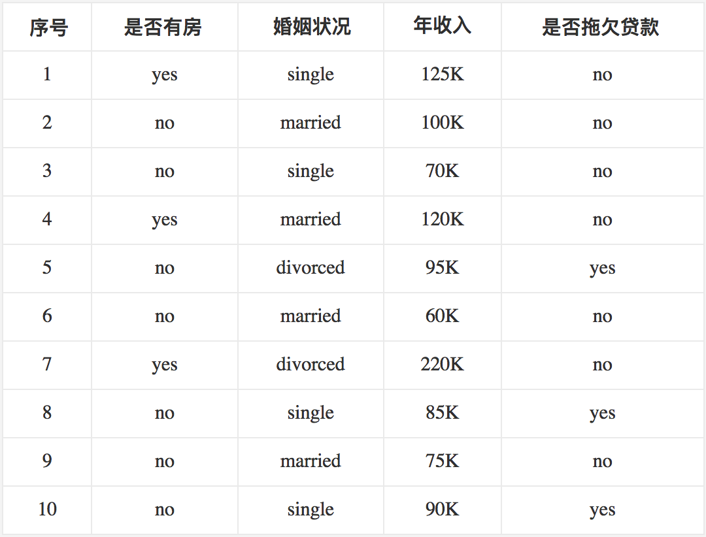

首先对数据集非类标号属性{是否有房，婚姻状况，年收入}分别计算它们的Gini系数增益，取Gini系数增益值最大的属性作为决策树的根节点属性。根节点的Gini系数 

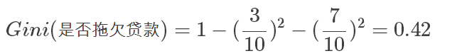

当根据**是否有房**来进行划分时，Gini系数增益计算过程为 

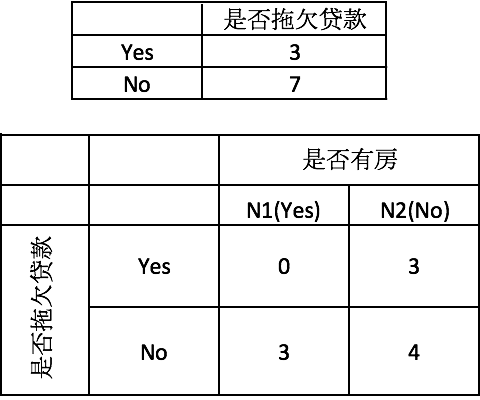

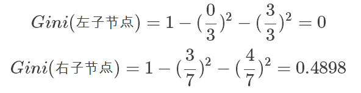

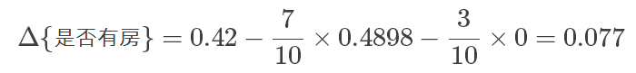

若按婚姻状况属性来划分，属性婚姻状况有三个可能的取值{married，single，divorced}，分别计算划分后的

```
{married} | {single,divorced}
{single} | {married,divorced}
{divorced} | {single,married}
```

的Gini系数增益。 
当分组为{married} | {single,divorced}时，S_l表示婚姻状况取值为married的分组，S_r表示婚姻状况取值为single或者divorced的分组 

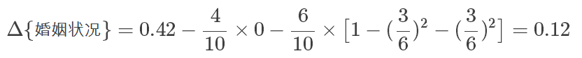

当分组为{single} | {married,divorced}时， 

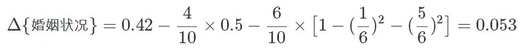

当分组为{divorced} | {single,married}时， 

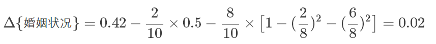

对比计算结果，根据婚姻状况属性来划分根节点时**取Gini系数增益最大**的分组作为划分结果，也就是{married} | {single,divorced}。

最后考虑年收入属性，我们发现它是一个连续的数值类型。我们在前面的文章里已经专门介绍过如何应对这种类型的数据划分了。对此还不是很清楚的朋友可以参考之前的文章，这里不再赘述。

对于年收入属性为数值型属性，首先需要对数据按升序排序，然后从小到大依次用相邻值的中间值作为分隔将样本划分为两组。例如当面对年收入为60和70这两个值时，我们算得其中间值为65。倘若以中间值65作为分割点。S_l作为年收入小于65的样本，S_r表示年收入大于等于65的样本，于是则得Gini系数增益为 

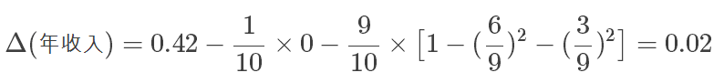

其他值的计算同理可得，我们不再逐一给出计算过程，仅列出结果如下（最终我们取其中使得增益最大化的那个二分准则来作为构建二叉树的准则）：

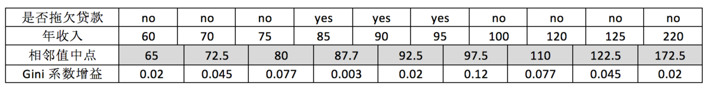

注意，这与我们之前在《数据挖掘十大算法之决策树详解（1）》中得到的结果是一致的。**最大化增益等价于最小化子女结点的不纯性度量（Gini系数）的加权平均值**，之前的表里我们列出的是Gini系数的加权平均值，现在的表里给出的是**Gini系数增益。现在我们希望最大化Gini系数的增益**。根据计算知道，三个属性划分根节点的增益最大的有两个：年收入属性和婚姻状况，他们的增益都为0.12。此时，**选取首先出现的属性作为第一次划分**。

接下来，采用同样的方法，分别计算剩下属性，其中根节点的Gini系数为（此时是否拖欠贷款的各有3个records）

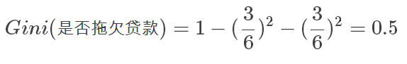

与前面的计算过程类似，对于是否有房属性，可得 

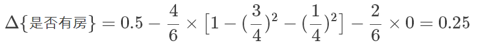

对于年收入属性则有：

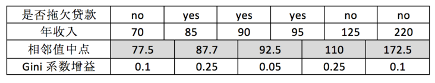

最后我们构建的CART如下图所示：

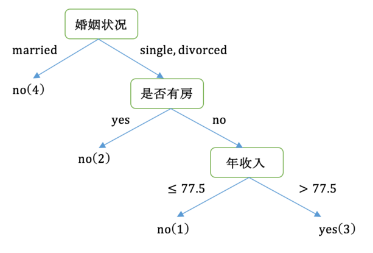

后我们总结一下，CART和C4.5的主要区别：

- C4.5采用信息增益率来作为分支特征的选择标准，而CART则采用Gini系数；
- C4.5不一定是二叉树，但CART一定是二叉树。


### 处理过拟合

## **关于过拟合以及剪枝**

决策树很容易发生过拟合，也就是由于对train数据集适应得太好，反而在test数据集上表现得不好。这个时候我们要么是通过阈值**控制终止条件避免树形结构分支过细，要么就是通过对已经形成的决策树进行剪枝来避免过拟合**。另外一个克服过拟合的手段就是基于Bootstrap的思想建立随机森林（Random Forest）。关于剪枝的内容可以参考文献【2】以了解更多，如果有机会我也可能在后续的文章里讨论它。


## 参考文献

【1】Wu, X., Kumar, V., Quinlan, J.R., Ghosh, J., Yang, Q., Motoda, H., McLachlan, G.J., Ng, A., Liu, B., Philip, S.Y. and Zhou, Z.H., 2008. Top 10 algorithms in data mining. Knowledge and information systems, 14(1), pp.1-37. (<http://www.cs.uvm.edu/~icdm/algorithms/10Algorithms-08.pdf>） 
【2】李航，统计学习方法，清华大学出版社