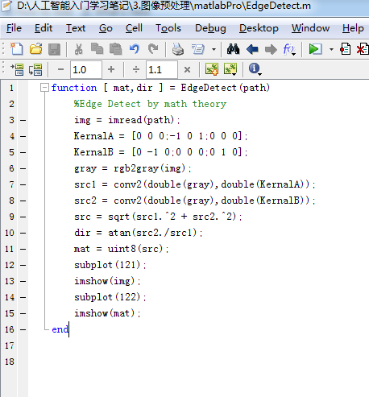

# 20180411图像预处理中的特征提取

```cpp
1- 图像预处理，可以对图像进行Otsu 最小二乘，二值化，转成向量（如1024 纬度）
2- 颜色特征提取：
	1- 灰度直方图，直接打印灰度的统计结果
	2- HOG 特征： 先灰度化，Gamma矫正（调整亮度），梯度方向分为9 个区间， 每个单元在各个方向进行直方图统计【计算各个方向的梯度 和 梯度方向】（一个9 维的特征向量），每相邻4个单元（每个单元3X3）构成一个块【一个块有 9 x 4 =36 维特征向量】， 然后再移动一个3x3 的单元。 最后把 所有特征都连起来。 
	3- LBP 特征： 先把图像转为灰度图，把图像分成3*3的块，通过中心相对的高低来计算对应的纹理凹凸值，这样就能把一块块的纹理给计算出来了。【主要是计算纹理的】
	4- Hear-like (边缘特征检测)： 白色块的所有像素之和 - 黑色快的所有像素之和。 和AdaBoost 一起用。
	5- 角点特征和轮廓特征： 计算机图形学中有重要地位。	

```

​	

------

原文链接：https://blog.csdn.net/qq_31622541/article/details/78227358

  我们知道，在机器学习的算法实现之前，我们首先要提取图像的特征，将图像变成一个个向量，只有这样，图像才能被计算机学习，准确说，只有从我们人类概念下的图像变成离散型的变量，然后给离散型的变量赋予具体的含义，这样才能够借助计算机来实现接下来的机器学习之类的工作，为了提高学习效率，我们依然可以学习一些图形学内处理的方式，这样就可以大大的提升开发效率，可以说，现在大部分的重复性工作在于前人故意的埋坑，这里就不具体说明了。

接下来，我们借助第一个例子来说明图像预处理：

Kaggle竞赛入门 Digital recognition：

这里采用的预处理方式相当暴力，适用方式也是十分的小，因为这里连基本的数据归一化都不用做了，直接暴力）01就好了。

首先，我们直接将文件改成.txt的格式，完全读取后直接二值化，最后转成同一个大小的变量，接着就可以直接识别了。这里我们也讲下，.csv文件的读取。

<http://blog.csdn.net/u012162613/article/details/41768407>

   代码如下：这里会简单的使用KNN来实现暴力搜索，时间复杂度和空间复杂度都高的一匹，具体怎么使用自行百度，这里没用什么函数，**就是自己拿一张图设为固定点，接着直接把其他的东西带入暴力匹配就结了**，主要这个K值可能设的比较蛋疼（C++代码就不贴了，写着卵疼）。


##1- 图像Otsu 最小二乘法（二值化）

​       我们先来实现一个最简单的OpenCV图片直接二值化为1024维向量的过程：

​       MATLAB代码：


其中二值化算法一般借助**于Otsu最小二乘法**，一般这种情况下的这种拟合是最好的，平均拟合一般是最差的选择，选择了这个以后，我们相当于暴力提取特征，虽然如果是无差别训练，而非“对症下药”，这种做法可能会莫名的好用，尤其是我们做神经网络的时候，我估计slam也是直接暴力提取的，接着我们在这里使用暴力KNN计算（这节主要讲的是图像预处理，提取特征的方式，所以学习和分类算法会比较简单的带过，晚上还要学习和打比赛呢……）。


这些代码在后续KNN那里会详细讲解，但是这里，就直接跳过了。

​      

接着我们来讲讲第二种提取方式，那就是我们在CNN和RNN里面预处理的方式，这种方式相对于原本的方法比较高级了点，不过这里准确说是强化特征，而特征使用的还是整体特征，没有专门钻出一个来作为真实特征。

首先拿CNN（卷积神经网络）来看：这里对图像的操作是卷积，我们首先简单理解下那个卷积是什么东西，从信号系统来看，卷积就是信号1经过信号2的时候发生的变化，是信号的累加过程。


在信号处理过程中，我们认为影响信号无穷大，但图像过程中我们把正无穷看成高斯卷积核的大小就好了，实际上，我们不可能无限放大信号影响域，这时候，我们只要简单的使用小的一个域就好了，为了保证中心效应，我们一般使用的是奇数，最终累加相乘的内积就是了，采用不同的核最终得到的结果的代表意义也是不一样的。

卷积核的计算：


 

参考网站：

<http://blog.csdn.net/chaipp0607/article/details/72236892?locationNum=9&fps=1>

 

直接使用OpenCv程序（C++）: 


 

MATLAB 程序：


复杂度高的一匹，但确实是这么算的，如果加入了浮点运算直接算崩掉，一点办法都没有。 

接下来，我们来讲下其他特征提取方式，其中主要有颜色特征，形状特征，区域特征。

 

##2-  **颜色特征提取：** 

###2.1 灰度直方图（按灰度分布生成向量）

代码如下：

 


效果如下：


我们直接把灰度分布打印出来就是特征向量，结果如下：


结果就是上面显示的一个列向量，简单训练的时候直接带进去就好了，基本都不用考虑好坏的，因为神经网络不就是那么无脑的东西吗，但是，单靠他是达不到我们梦想的高度的，一定要知道这一点，不然就陷入了大误区。

 

###2.2    HOG特征（进行物体检测描述算子，图像梯度加梯度方向）

特征获取过程：

1.    **灰度化（将图像变成一个x,y,z（灰度）的三维图像）。**


2.    **采用Gamma校正法对输入图像进行颜色空间的标准化（归一化），调节图像的对比度，降低图像局部阴影和光照变化所造成的影响，同时可以抑制噪声**（主要因为局部表层的曝光贡献比重比较大，所以这种压缩处理能够**有效降低图像局部阴影和光照变化**，因为**颜色信息作用不大，所以通常先转为灰度图**），但归一化不是什么时候都能用的，**在曝光不严重的时候是会失真的**（详见计算机图形学）。


公式如下：

  （减缓曝光效果，转为人眼适应的值）

3.    计算每个像素的梯度（包括大小和方向），捕获轮廓信息的同时，弱化光照的干扰。


4.    将图像分为小cell（例如6*6像素/cell）


5.    统计每个cell的直方图（不同梯度的个数），**一般统计梯度方向**，分为8个区间统计就可以了，每个直方图统计出来就是每个cell的descriptor。


6.    将每几个cell组成一个block，一个block中所有的cell特征的descriptor串联起来便得到该block的HOG特征的descriptor。


7.    将图像中所有的block的HOG特征的descriptor**串联起来**后就可以得到该image的HOG特征的descriptor了，这就是我们最终使用的特征向量了，**用这个向量再去计算SVM就可以实现一些简单的行人检测或者再识别的东西了。**


8.    特征数计算方法（后面你就会知道为什么会算那么慢了，结合**滑动窗口统计**之后，我们会发现，每次迭代的量都是上万的，这样不慢才怪）。

把样本图像分割为若干个像素的单元（cell），把梯度方向平均划分为9个区间（bin），在每个单元里面对所有像素的**梯度方向在各个方向区间进行直方图统计，得到一个9维的特征向量，每相邻的4个单元构成一个块（block），把一个块内的特征向量联起来得到36维的特征向量**，用块对样本图像进行扫描，**扫描步长为一个单元。最后将所有块的特征串联起来，就得到了人体的特征**。例如，对于64  x 128的图像而言，每16 x 16的像素组成一个cell，每2 x 2个cell组成一个块，因为每个cell有9个特征，所以每个块内有4 x 9=36个特征，以8个像素为步长，那么，水平方向将有7个扫描窗口，垂直方向将有15个扫描窗口。也就是说，64 x 128的图片，总共有36*7*15=3780个特征。

代码如下：

1.边缘特征提取以及图像归一化处理



效果如下：


接下来，我们来计算一段区域提取出来的直方图。

程序源码：


实现效果：

 

接着就十分的简单了，我们只需要简单的把之前的东西计算到blocks里面后再重新计算到一个向量里面了，接下来我就不接着写下去了，因为接下来的东西就涉及到学习算法了，脱离了这里的主题了（好吧，其实是我懒了，接着直接教大家怎么调包吧）。

Python直接调包：


 

C++直接调包：

 

数据格式：

 


 

###2.3    LBP特征（描述局部纹理特征）

原始LBP特征的提取：**先把图像转为灰度图，把图像分成3*3的块，通过中心相对的高**

**低来计算对应的纹理凹凸值，这样就能把一块块的纹理给计算出来了**，我们先写个简

单的计算程序来显示下最简单的特征样式，表现在图像上。


简单纹理特征提取（MATLAB代码）：


提取出来后的结果：


用了我们可爱的发妈妈的美照（我不会被打吧）。。。不过上面的程序的复杂度高的一匹，

所以怎么说呢，这个程序还不是那么的尽善尽美的，所以大家可以努力一起搞下，把复杂度降低一点，这样就可以了。

 

为了提高程序的鲁棒性，我们基本会采用这种按圆形获取整体形状，然后把几个不同圆

半径的图像进行编码，**最终实现比较稳定的纹理特征的提取**，而不会因为一些特殊原因

导致奇怪的问题，对了，还有一点就是要去除过度曝光。

公式和大致图形过程如下：


 

###2.4 Haar-like特征（边缘检测特征)

矩形特征的值， 是指图像上两个或多个形状大小相同的矩形内部所有像素灰度值之和差值，即使用**白色矩形区域所有像素灰度值之和减去黑色矩形区域所有像素灰度值之和**（这个可以说是相当的简单，看下东西就好了，这种方法一般都是和AdaBoost方法一起使用的，而基本的特征提取简单的一匹）。


公式：


###2.5   角点特征和轮廓特征

（机器学习无关，但是在某些匹配算法和计算机图形学中的填充算法中有着十分重要的地位，比如Harris，检测出来角点和边缘之后在计算机图形学中的重要程度简直就高的有点可怕，不过这里就不重点讲了，详见Opencv—python turtotials）。

 

然后介绍完所有的特征和写好所有的特征提取代码之后，我想说的一件事是不要遇到什么特征就去抓，不然你的每一波训练都是麻瓜，你需要**先去把特征都找出来之后，然后去对比每个特征相对的权重**，Andrew Ng老师的课程里面虽然说了那些无效特征到最后都会自己在神经网络之类的训练模型里面变成皮皮虾，但**在svm里面，不是直接带值，这样一来，特征的选择就更加重要了**，按前人的分类选择特征，然后**对应选择合适的方法，SVM还是DeepLearning，还是暴力KNN或者稍微带点脑子但是慢的一匹的K-means**，所以**选好特征再在原本基础上使用最小二乘法实现最小值获取**，这样就可以开始搞事情了。