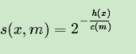
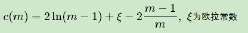

#20180412_ 随机森林 RF

随机森林算法小结：

1- GBDT的子采样是无放回采样，而Bagging的子采样是放回采样。

2- 大约36.8%的没有被采样到的数据，我们常常称之为袋外数据(Out Of Bag, 简称OOB)。这些数据没有参与训练集模型的拟合，因此可以用来检测模型的泛化能力。

3- bagging对于弱学习器没有限制，这和Adaboost一样。但是最常用的一般也是决策树和神经网络。

4- 集合策略也比较简单，对于分类问题，通常使用简单投票法，得到最多票数的类别或者类别之一为最终的模型输出。对于回归问题，通常使用简单平均法，对T个弱学习器得到的回归结果进行算术平均得到最终的模型输出。

5- **随机森林(Random Forest,以下简称RF)**就好理解了。它是**Bagging算法的进化版**，也就是说，它的思想仍然是bagging,但是进行了独有的改进:

​	1）- RF使用了CART决策树作为弱学习器，这让我们想到了梯度提示树GBDT。

​	2-） 第二，在使用决策树的基础上，RF对决策树的建立做了改进，对于普通的决策树，我们会在节点上所有的n个样本特征中选择一个最优的特征来做决策树的左右子树划分，但是RF通过**随机选择节点上的一部分样本特**征`n_sub`, 然后再在子集中选择最优的特征。【n_sub = n 和 CART一样， n_sub 越小，方差越小，偏倚越大，泛化能力越好】

​	注意：两次随机，一次是随机选择样本，一次是随机选择样本特征。

除此之外，RF 和 bagging 算法一样。

------------------------

优缺点：

　RF的算法原理也终于讲完了，作为一个可以高度并行化的算法，RF在大数据时候大有可为。 这里也对常规的随机森林算法的优缺点做一个总结。

　　　　RF的主要优点有：

　　　　1） 训练可以高度并行化，对于大数据时代的大样本训练速度有优势。个人觉得这是的最主要的优点。

　　　　2） 由于可以随机选择决策树节点划分特征，这样在样本特征维度很高的时候，仍然能高效的训练模型。

　　　　3） 在训练后，可以给出各个特征对于输出的重要性

　　　　4） 由于采用了随机采样，训练出的模型的方差小，泛化能力强。

　　　　5） 相对于Boosting系列的Adaboost和GBDT， RF实现比较简单。

　　　　6） 对部分特征缺失不敏感。

　　　　RF的主要缺点有：

　　　　1）在某些噪音比较大的样本集上，RF模型容易陷入**过拟合**。

　　　　2) **取值划分比较多的特征**容易对RF的决策产生更大的影响，从而影响拟合的模型的效果。

-----------------------------------------------------------------------

extra tree 【RF的改进版本】

和RF的不同点：

​	1- 每次选择固定的原始数据集

​        2-  非选择最优特征，随机选择一个特征划分，很激进。 决策树的规模会增大，方差减小，偏倚相对于RF更进一步增大， 泛化能力增强。

------

Totally Random Trees Embedding(以下简称 TRTE):

 对非监督学习进行数据转化，数据从低维映射到高维（和 SVM 不同， 是通过建立T个决策树来拟合数据，通过在各棵数中叶子 节点的编码，最后炼成一串）作为高维特征。

------------------------

Isolation Forest(检测异常的)

和RF 有三点不同： 

1- 也是随机采样，但需要的训练个数 远小于 RF（不需要那么多样本来检测异常数据）

2- 每一颗决策树是随机选择一个阈值，这和RF不同（选择最优特征）

3- 树的最大决策深度会比较小（max_depth 小）， 原因同1，少量的异常点检测一般也不需要这么大规模的决策树。

-------------------------

原文： https://www.cnblogs.com/pinard/p/6156009.html

　在[集成学习原理小结](http://www.cnblogs.com/pinard/p/6131423.html)中，我们讲到了集成学习有两个流派，一个是boosting派系，它的特点是各个弱学习器之间有依赖关系。另一种是bagging流派，它的特点是各个弱学习器之间没有依赖关系，可以并行拟合。本文就对集成学习中Bagging与随机森林算法做一个总结。

　　　　随机森林是集成学习中可以和梯度提升树GBDT分庭抗礼的算法，尤其是它可以很方便的并行训练，在如今大数据大样本的的时代很有诱惑力。

# 1.  bagging的原理

　　　　在[集成学习原理小结](http://www.cnblogs.com/pinard/p/6131423.html)中，我们给Bagging画了下面一张原理图。

　　　　从上图可以看出，Bagging的弱学习器之间的确没有boosting那样的联系。它的特点在“随机采样”。那么什么是随机采样？

　　　　随机采样(bootsrap)就是从我们的训练集里面采集固定个数的样本，但是每采集一个样本后，都将样本放回。也就是说，之前采集到的样本在放回后有可能继续被采集到。对于我们的Bagging算法，一般会随机采集和训练集样本数m一样个数的样本。这样得到的采样集和训练集样本的个数相同，但是样本内容不同。如果我们对有m个样本训练集做T次的随机采样，则由于随机性，**T个采样集各不相同。**

　　　　注意到这和GBDT的子采样是不同的。**GBDT的子采样是无放回采样，而Bagging的子采样是放回采样。**

　　　　对于一个样本，它在某一次含m个样本的训练集的随机采样中，每次被采集到的概率是1/m。不被采集到的概率为1−1/m。如果m次采样都没有被采集中的概率是(1−1/m)^m。当m→∞时，(1−1/m)^m→1/e ≃ 0.368。也就是说，在bagging的每轮随机采样中，训练集中大约有36.8%的数据没有被采样集采集中。

　　　　对于这部分**大约36.8%的没有被采样到的数据，我们常常称之为袋外数据(Out Of Bag, 简称OOB)。这些数据没有参与训练集模型的拟合，因此可以用来检测模型的泛化能力**。

　　　　**bagging对于弱学习器没有限制，这和Adaboost一样。但是最常用的一般也是决策树和神经网络。**

　　　　bagging的**集合策略也比较简单，对于分类问题，通常使用简单投票法，得到最多票数的类别或者类别之一为最终的模型输出。对于回归问题，通常使用简单平均法，对T个弱学习器得到的回归结果进行算术平均得到最终的模型输出。**

　　　　由于Bagging算法每次都进行采样来训练模型，因此泛化能力很强，对于降低模型的方差很有作用。当然对于训练集的拟合程度就会差一些，也就是模型的偏倚会大一些。

# 2.  bagging算法流程

　　　　上一节我们对bagging算法的原理做了总结，这里就对bagging算法的流程做一个总结。相对于Boosting系列的Adaboost和GBDT，bagging算法要简单的多。

　　　　输入为样本集`D={(x,y1),(x2,y2),...(xm,ym)}`，弱学习器算法, 弱分类器迭代次数T。

　　　　输出为最终的强分类器`f(x)`

　　　　1）对于`t=1,2...,T`:

　　　　　　a)对训练集进行第t次随机采样，共采集m次，得到包含m个样本的采样集`D_t`

　　　　　　b)用采样集`D_t`训练第`t`个弱学习器`Gt(x)`

　　　　2) 如果是分类算法预测，则T个弱学习器投出最多票数的类别或者类别之一为最终类别。如果是回归算法，T个弱学习器得到的回归结果进行算术平均得到的值为最终的模型输出。

# 3. 随机森林算法

　　　　理解了bagging算法，**随机森林(Random Forest,以下简称RF)**就好理解了。它是Bagging算法的进化版，也就是说，它的思想仍然是bagging,但是进行了独有的改进。我们现在就来看看RF算法改进了什么。　　　

　　　　首先，**RF使用了CART决策树作为弱学习器，这让我们想到了梯度提示树GBDT。第二，在使用决策树的基础上，RF对决策树的建立做了改进，对于普通的决策树，我们会在节点上所有的n个样本特征中选择一个最优的特征来做决策树的左右子树划分，但是RF通过随机选择节点上的一部分样本特征**，这个数字小于n，假设为`n_sub`，然后在这些随机选择的`n_sub`个样本特征中，选择一个最优的特征来做决策树的左右子树划分。这样进一步增强了模型的泛化能力。　　　　

　　　　**如果`n_sub=n`，则此时RF的CART决策树和普通的CART决策树没有区别。n_sub越小，则模型约健壮，当然此时对于训练集的拟合程度会变差。也就是说`n_sub`越小，模型的方差会减小，但是偏倚会增大。**在实际案例中，一般会通过**交叉验证**调参获取一个合适的`n_sub`的值。

　　　　除了上面两点，**RF和普通的bagging算法没有什么不同**， 下面简单总结下RF的算法。

　　　　输入为样本集`D={(x,y1),(x2,y2),...(xm,ym)}`，弱分类器迭代次数T。

　　　　输出为最终的强分类器f(x)

　　　　1）对于`t=1,2...,T`:

　　　　　　a)对训练集进行第t次随机采样，共采集m次，得到包含m个样本的采样集`Dt`

　　　　　　b)用采样集`Dt`训练第t个决策树模型`Gt(x)`，在训练决策树模型的节点的时候， 在节点上**所有的样本特征中选择一部分样本特征**， 在这些随机选择的部分样本特征中**选择一个最优的特征**来做决策树的左右子树划分

　　　　2) 如果是分类算法预测，则T个弱学习器**投出最多票数**的类别或者类别之一为最终类别。如果是回归算法，T个弱学习器得到的回归结果进行**算术平均**得到的值为最终的模型输出。

# 4. 随机森林的推广

　　　　由于RF在实际应用中的良好特性，基于RF，有很多变种算法，应用也很广泛，不光可以用于分类回归，还可以用于特征转换，异常点检测等。下面对于这些RF家族的算法中有代表性的做一个总结。

##  4.1 extra trees

　　　　extra trees是RF的一个变种, 原理几乎和RF一模一样，仅有区别有：

　　　　1） 对于每个决策树的训练集，RF采用的是**随机采样bootstrap**来选择采样集作为每个决策树的训练集，而**extra trees一般不采用随机采样，即每个决策树采用原始训练集**。

　　　　2） 在选定了划分特征后，RF的决策树**会基于信息增益，基尼系数，均方差之类的原则，选择一个最优的特征值划分点，这和传统的决策树相**同。但是extra trees比较的**激进，他会随机的选择一个特征值来划分决策树。**

　　　　从第二点可以看出，由于随机选择了特征值的划分点位，而**不是最优点位，这样会导致生成的决策树的规模一般会大于RF所生成的决策树。**也就是说，模型的**方差相对于RF进一步减少，但是偏倚相对于RF进一步增大。**在某些时候，extra trees的**泛化能力比RF更好。**

## 4.2 Totally Random Trees Embedding

　　　　Totally Random Trees Embedding(以下简称 TRTE)是一种**非监督学习的数据转化方法。它将低维的数据集映射到高维**，从而让映射到高维的数据更好的运用于分类回归模型。我们知道，在支持向量机中运用了核方法来将低维的数据集映射到高维，此处TRTE提供了另外一种方法。

　　　　TRTE在数据**转化的过程也使用了类似于RF的方法，建立T个决策树来拟合数据**。当决策树建立完毕以后，数据集里的每个数据在T个决策树中叶子节点的位置也定下来了。比如我们有3颗决策树，每个决策树有5个叶子节点，某个数据特征`x`划分到第一个决策树的第2个叶子节点，第二个决策树的第3个叶子节点，第三个决策树的第5个叶子节点。则x映射后的特征编码为`(0,1,0,0,0,     0,0,1,0,0,     0,0,0,0,1)`, **有15维的高维特征。这里特征维度之间加上空格是为了强调三颗决策树各自的子编码。**

　　　　映射到高维特征后，可以**继续使用监督学习**的各种分类回归算法了。

## 4.3 Isolation Forest

　　　　Isolation Forest（以下简称IForest）是一种**异常点检测**的方法。它也使用了类似于RF的方法来检测异常点。

　　　　对于在T个决策树的样本集，IForest也会对训练集进行随机采样,但是采样个数不需要和RF一样，对于RF，需要采样到采样集样本个数等于训练集个数。但是IForest不需要采样这么多，一般来说，**采样个数要远远小于训练集个数？为什么呢？因为我们的目的是异常点检测**，只需要部分的样本我们一般就可以将异常点区别出来了。

　　　　对于**每一个决策树的建立， IForest采用随机选择一个划分特征，对划分特征随机选择一个划分阈值。这点也和RF不同。**

　　　　另外，IForest一般会选择一个**比较小的最大决策树深度max_depth**,原因同样本采集，用少量的异常点检测一般不需要这么大规模的决策树。

　　　　对于异常点的判断，则是将测试样本点`x`拟合到T颗决策树。计算在每颗决策树上该样本的叶子节点的深度`ht(x)`。，从而可以计算出平均高度`h(x)`。此时我们用下面的公式计算样本点`x`的异常概率:

　　　　其中，m为样本个数。c(m)的表达式为：

　　　　s(x,m)的取值范围是[0,1],取值**越接近于1，则是异常点的概率也越大。**

# 5. 随机森林小结

　　　　RF的算法原理也终于讲完了，作为一个可以高度并行化的算法，RF在大数据时候大有可为。 这里也对常规的随机森林算法的优缺点做一个总结。

　　　　RF的主要优点有：

　　　　1） 训练可以高度并行化，对于大数据时代的大样本训练速度有优势。个人觉得这是的最主要的优点。

　　　　2） 由于可以随机选择决策树节点划分特征，这样在样本特征维度很高的时候，仍然能高效的训练模型。

　　　　3） 在训练后，可以给出各个特征对于输出的重要性

　　　　4） 由于采用了随机采样，训练出的模型的方差小，泛化能力强。

　　　　5） 相对于Boosting系列的Adaboost和GBDT， RF实现比较简单。

　　　　6） 对部分特征缺失不敏感。

　　　　RF的主要缺点有：

　　　　1）在某些噪音比较大的样本集上，RF模型容易陷入过拟合。

　　　　2) 取值划分比较多的特征容易对RF的决策产生更大的影响，从而影响拟合的模型的效果。