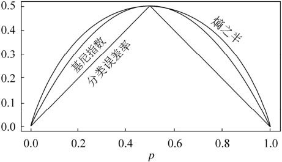

# 20180827信息增益_信息增益率_Gini

==决策树算法==的人都知道ID3以及C4.5两种算法，当然也非常清楚**信息增益**以及**信息增益率**两个概念。

回正题了，这三个指标均是决策树用来划分属性的时候用到的，其中==信息增益（Info Gain）用于ID3，Gini用于CART，信息增益率（Info Gain Ratio）用于C4.5==。提到前两个指标的计算时，首先要讲到的是关于熵（Entropy）的计算。

| 函数                        | 方法 | 特点                                            |
| --------------------------- | ---- | ----------------------------------------------- |
| 信息增益(Info Gain)         | ID3  | 节点M的信息熵E1与其全部子节点信息熵之和E2的差。 |
| 信息增益率(Info Gain Ratio) | C4.5 | 节点信息增益与节点分裂信息度量的比值。          |
| 基尼系数(Gini)              | CART |                                                 |

C4.5==继承了ID3的优点==，并改进了：

（1）使用信息增益率来选择属性，==克服了用信息增益选择属性时偏向特征值多的不足==；

（2）在构树过程中进行==剪枝==；

（3）能够完成对连续属性的离散化处理；

   (4）能够对不完整数据进行处理； 

 

## 熵(Entropy)

理论上来说用于==决策树的属性选择函数==，为方便计算，往往是定义为其==属性的不纯性度量==，那么必须满足如下三个条件：

- 当结点很纯时，其度量值应为0
- 当==不纯性最大时==（比如所有类都有同样的可能），其度量值应最大
- 度量应该服从==多级特性==，这样决策树才能分阶段建立起来

而熵（Entropy）能够满足以上三点特性。熵（Entropy）是由“信息论之父”==香农==提出的，更多的各种历史、数学理论请查看参考[1]。接下来，看看熵的计算公式如下：

$$ Entropy(s) = -p_{+}log_2{p_{+}} -  p_{-}log_2{p_{-}} $$

其实，熵也可以用另外一种意思来解释：

> Given a probability distribution, the info required to predict an event is the distribution’s entropy. Entropy gives the information required in bits (this can involve fractions of bits!)

可以简单的理解==为“熵”描述了用来预测的信息位数==。接下来看个例子：

如下表所述的天气数据，学习目标是预测Play or not play?

天气预报数据集例子

| **Outlook** | **Temperature** | **Humidity** | **Windy** | **Play?** |
| ----------- | --------------- | ------------ | --------- | --------- |
| sunny       | hot             | high         | false     | no        |
| sunny       | hot             | high         | true      | no        |
| overcast    | hot             | high         | false     | yes       |
| rain        | mild            | high         | false     | yes       |
| rain        | cool            | normal       | false     | yes       |
| rain        | cool            | normal       | true      | no        |
| overcast    | cool            | normal       | true      | yes       |
| sunny       | mild            | high         | false     | no        |
| sunny       | cool            | normal       | false     | yes       |
| rain        | mild            | normal       | false     | yes       |
| sunny       | mild            | normal       | true      | yes       |
| overcast    | mild            | high         | true      | yes       |
| overcast    | hot             | normal       | false     | yes       |
| rain        | mild            | high         | true      |           |

共14个实例，9个正例（yes），5个负例（no）。

### **熵的计算**

$$E(S) = info([9, 5]) = -\frac{9}{14}log_2{\frac{9}{14}} - \frac{5}{14}log_2{\frac{5}{14}} = 0.940$$ 

 

### 条件熵    

 根据条件熵的定义,分类系统中的条件熵指的是当样本的某一特征X固定时的信息熵。由于该特征X可能的取值会有（x1，x2，……，xn），当计算条件而需要把它固定的时候，每一种可能都要固定一下，然后求统计期望。因此样本特征X取值为xi的概率是Pi，该特征被固定为值xi时的条件信息熵就是H(C|X=xi)，那么 ，H(C|X)就是分类系统中==特征X被固定时的条件熵==（X=（x1，x2，……，xn））：

 

## 信息增益

定义： $Gain(S, A) = E(S) - E(S|A)$

按名称来理解的话，就是==前后信息的差值==，在决策树分类问题中，即就是决策树在进行属性选择划分前和划分后的信息差值，

**通过对outlook属性来划分，有{sunny,overcast,rain}三个类别，个数分别为5,4,5；**

选择 outlook 这个属性后， 分别计算其子树的基尼系数：

$E(S_{sunny}) = info([2,3]) = -\frac{2}{5}log_2{\frac{2}{5}} -  -\frac{3}{5}log_2{\frac{3}{5}} = 0.97 = I(p_1, n_1)$

$E(S_{overcast}) = info([4,0]) = -\frac{4}{4}log_2{\frac{4}{4}} -  -\frac{0}{4}log_2{\frac{0}{4}} = 0 = I(p_2, n_2)$

$E(S_{rain}) = info([3,2]) = -\frac{3}{5}log_2{\frac{3}{5}} -  -\frac{2}{5}log_2{\frac{2}{5}} = 0.971 = I(p_3, n_3)$

故outlook的期望信息为：

$E(outlook) =  E(S|A) = \frac{5}{14}I(p_1, n_1) + \frac{4}{14}I(p_2, n_2) +  \frac{5}{14}I(p_3, n_3)  = 0.694$

其中， $I$ 前面的系数代表的是各个类别分别占总类的百分比；

那么信息增益由  $Gain(S, A) = E(S) - E(S|A)$, 可得

$Gain(S, outlook) = E(S) - E(S|A) = 0.940 - 0.694 = 0.246 $

上面只是举如果按照outlook 划分算得的信息增益， 那么如果按照Temperature	、 Humidity、 Windy 划分呢？

$Gain(S, Temperature) = 0.029$

$Gain(S, Humidity) = 0.151$

$Gain(S, Windy) = 0.048$

==选择最大的信息增益属性进行划分==，然后再重复进行上述步骤，直至建好一棵树为止；在本例中第一个分支节点的属性是outlook；

 

## 信息增益率

1- 定义： 

$$Gain_{ratio} = \frac{Gain(S, A)}{I(S, A)}$$

其中， $Gain(S, A)$ 为按A划分时的信息增益， $I(S, A)$ 为按A划分的==分裂信息度量==。

由 **信息增益** 计算得 $Gain(S, outlook) = 0.246$, 

$I(S, outlook) = info([5, 4, 5]) =  -\frac{5}{14}log_2{\frac{5}{14}}   -\frac{4}{14}log_2{\frac{4}{14}}  - \frac{5}{14}log_2{\frac{5}{14}} = 1.5774$

所以， $Gain_{ratio}(outlook) = \frac{0.246}{1.5774}  = 0.15595$ 

 

2- 同理，可得 $Gain_{ratio}(Temperature) = 0.01863 $

 $Gain_{ratio}(Humidity) = 0.151 $

 $Gain_{ratio}(Windy) = 00487$

 

## Gini

但是无论是ID3还是C4.5,都是基于信息论的熵模型的，这里面会==涉及大量的对数运算（为了避免这个问题）==。能不能简化模型同时也不至于完全丢失熵模型的优点呢？有！CART分类树算法使用基尼系数来代替信息增益比，基尼系数代表了模型的不纯度，==基尼系数越小，则不纯度越低（纯度越高），特征越好==。这和信息增益(比)是相反的。

具体的，在分类问题中，假设有==K个类别==(如上面的天气只有两类， Play = (Yes, No))，第k个类别的概率为$p_k$, 则基尼系数的表达式为：

$$Gini(p) = \sum_{k=1}^{K} p_{k}(1- p_{k}) = 1- \sum_{k=1}^{K} (p_k)^2$$ 

如果是二类分类问题，计算就更加简单了，如果属于第一个样本输出的概率是p，则基尼系数的表达式为：

$$Gini(p) = 1- \sum_{k=1}^{K} (p_k)^2 = 1- (p^2 + (1-p)^2) = 2p - 2p^2 = 2p(1-p)$$   

对于个给定的样本D,假设有K个类别, 第k个类别的数量为$C_k$ (如上，yes 有9个， no 有5个),则样本D的基尼系数表达式为：

$$Gini(D) = 1-  \sum_{k=1}^{K} (\frac{|C_k|}{|D|})^2$$  

 

### 条件Gini

1- 特别的，对于样本D,如果==根据特征A的某个值a,把D分成D1和D2两部分（如上，根据outlook 的不同属性可以将D分成 Sunny , Overcat,  rain 三个部分, 但其实有在计算每个基尼系数的时候，D1 代表的是sunny， D2 代表的是其它）== 【类别是按结果分类的，如上分成 ==K类==； 根据属性时把样本划分成几个子样本，如根据overlook 的属性可分为三==部分==】，则在特征A的条件下，D的基尼系数表达式为：

$$Gini(D, A) = \frac{|D1|}{|D|}Gini(D1)  + \frac{|D2|}{|D|}Gini(D2)$$

2- 那么根据 outlook 属性， 算出的基尼系数为：

$$Gini(D, A=sunny) = \frac{5}{14}Gini(D_{sunny}) +  \frac{9}{14}Gini(D_{others}) $$  

其中， $Gini(D_{sunny}) = 1- ((\frac{2}{5})^2 + ((\frac{3}{5})^2 ) = 0.48$   ,

 $Gini(D_{others}) = 1- ((\frac{7}{9})^2 + ((\frac{2}{9})^2 ) = 0.3457$     ,  

所以， $Gini(D, A=sunny) = \frac{5}{14}\times 0.48 +  \frac{9}{14}\times0.3457 = 0.3937 $   

 

3- 同理，可以计算得，

$$Gini(D, A=overcat) = \frac{4}{14}Gini(D_{overcat}) +  \frac{10}{14}Gini(D_{others})  =  \frac{4}{14}(1- ( (\frac{4}{4})^2 ) + ((\frac{0}{4})^2) ) +  \frac{10}{14}(1- ( (\frac{5}{10})^2 ) + ((\frac{5}{10})^2) )  = 0.3571$$   

$$Gini(D, A=rain) = \frac{5}{14}Gini(D_{rain}) +  \frac{9}{14}Gini(D_{others})  =  \frac{5}{14}(1- ( (\frac{3}{5})^2 ) + ((\frac{2}{5})^2) ) +  \frac{9}{14}(1- ( (\frac{6}{9})^2 ) + ((\frac{3}{9})^2) )  = 0.2857$$  

4- 如果A 代表的是特征outlook的话， 那么用B、C、D   分别代表Temperature, Humitidy、Windy 四个特征。

计算出$Gini(D, B = hot)$ 、$Gini(D, B = mild)$ 、 $Gini(D, B = cold)$ ; 

$Gini(D, C = high)$ 、$Gini(D, C = normal)$ ;

$Gini(D, D = true)$ 、$Gini(D, D = false)$ ; 

 

4- 在所有10个基尼系数中（A(3) + B(3) + C(2) + D(2) = 10） 选出最小的基尼系数作为切分点；

打个比方， $Gini(D, A=rain)$ 最小， 则 rain 作为一个最优切分点， 然后在 B、C、D中选出下一个最优划分点。

……. 依次类推。

可以比较下基尼系数表达式和熵模型的表达式，二次运算是不是比对数简单很多？尤其是二类分类的计算，更加简单。但是简单归简单，==和熵模型的度量方式比，基尼系数对应的误差有多大呢==？对于==二类分类，基尼系数和熵之半==的曲线如下：

概率==p是划分为正类的概率==， 如上例， 判断天气为 Yes 或 No。 如果 $p = 0.5$ 就是各占一半，最难划分的情形。

从上图可以看出，基尼系数和熵之半的曲线非常接近，仅仅在45度角附近误差稍大。因此，==基尼系数可以做为熵模型的一个近似替代==。而CART分类树算法就是使用的基尼系数来选择决策树的特征。同时，为了进一步简化，CART分类树算法==每次仅仅对某个特征的值进行二分，而不是多分，这样CART分类树算法建立起来的是二叉树，而不是多叉树==。这样一可以进一步简化基尼系数的计算，二可以建立一个更加优雅的二叉树模型。

## 参考

1- https://blog.csdn.net/Txiaomiao/article/details/50219817

