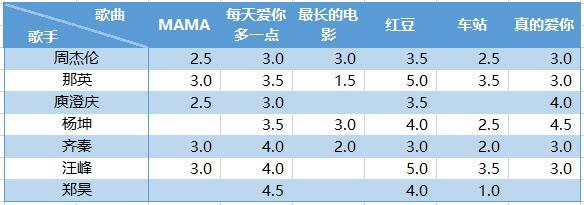
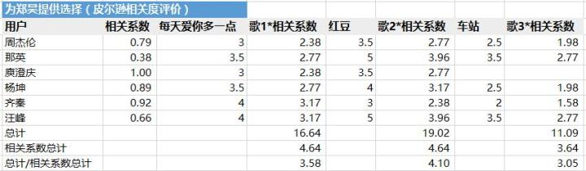

# 20180828协同过滤的一个例子

来自「集体智慧编程」。

基于用户的协作型过滤和基于物品的协作型过滤。

## 基于用户的协同过滤

1- 根据用户行为建立评价规则, 不能随意变更。

2- 得到用户对每首歌的评分, 左侧不是歌手，应该是用户A、B、C。。。

3- 寻找相近的用户，计算相似度有两种方法：

- 欧几里得距离 
- 和 皮尔逊相关度

以歌曲为坐标轴，寻找相近的用户：

欧几里得距离是直接看距离，很直观 。

 

4- 皮尔逊相关度评价是相对复杂的， 计算两组数据与某一直线拟合度的相关系数，来判断两个对象的兴趣相似度。

计算更复杂， 但能解决==数据不太规范的情形==。（例如， 甲的用户偏好评分普遍高， 而乙则相反， 用欧几里地距离通常南辕北辙）， 但皮尔逊能给出更好的结果。

比较两个用户对共同音乐的评分情况：

《真的爱你》 两个用户分别评分为3， 3， 所以在(3,3) 位置处。

虚线是最佳拟合线（采用OLS模型， 让线尽可能靠近所有数据点）。 如果两位用户对所有歌曲的偏好相同， 那么这条直线将会穿过所有点，并且是对角线。

 

5- 下面来一个相关系数较高的例子：

皮尔逊的最大好处，就是==修正了“夸大分值”==（grade inflation），虽然汪峰总是倾向于比周杰伦打更高的分，但最终的虚线几乎是拟合的，表示他们有==相对近似的偏好==。

 

### 推荐歌曲

1- 如果要给A推荐歌曲，可以找一个与A相近的人推荐。但太随意。

可通过一个加权的平均值为歌曲打分， 评分结果即排名结果。

但我们需要取得所有其他用户的相关分数， 借此得到相关系数，再乘以它们与相关歌曲的分数，得到所需要的评价值。

相关系数： 来自皮尔逊相关度评价；

将总计除以相关系数的之和（避免总分一直增大），可以得到歌曲排名。

最后一行即使推荐的结果。

2- 总结： 

用户甲 —》 偏好相近的用户 —》 他们对相关歌曲的评分 —》 推荐列表

 

## 基于物品的协同过滤

1- 歌曲A —》 相关用户 —》 相关歌曲—》推荐列表；（听了这首歌的人还听了。。。）可以看成是找类似的歌；

2- 用户甲—》 偏好歌曲 —》 推荐列表；

另外一个例子是： https://www.cnblogs.com/exlsunshine/p/4214357.html

