# 推荐系统_潜在因子算法_20180827

作者：nick lee

链接：https://www.zhihu.com/question/26743347/answer/34714804

来源：知乎

潜在因子（Latent Factor）算法。这种算法是在==NetFlix==（没错，就是用大数据捧火《纸牌屋》的那家公司）的推荐算法竞赛中获奖的算法，最早被应用于电影推荐中。这种算法在实际应用中比现在排名第一的 [@邰原朗](http://www.zhihu.com/people/296727f65ac7121dce72e2424edbd552)  所介绍的==算法误差（RMSE）==会小不少，效率更高。我下面仅利用==基础的矩阵知识==来介绍下这种算法。

这种算法的思想是这样：每个用户（**user**）都有自己的偏好，比如A喜欢带有**小清新的**、**吉他伴奏的**、**王菲**等元素（**latent factor**），如果==一首歌（**item**）带有这些元素==，那么就将这首歌==推荐==给该用户，也就是==用元素去连接用户和音乐==。==每个人对不同的元素偏好不同，而每首歌包含的元素也不一样==。我们希望能找到这样==两个矩阵==：

一，**用户-潜在因子矩阵Q**，表示不同的用户对于不用元素的==偏好程度==，1代表很喜欢，0代表不喜欢。比如下面这样：

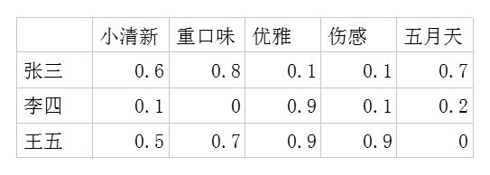

二，**潜在因子-音乐矩阵P**，表示==每种音乐含有各种元素的成分(权重)==，比如下表中，音乐A是一个偏小清新的音乐，含有小清新这个Latent Factor的成分是0.9，重口味的成分是0.1，优雅的成分是0.2……

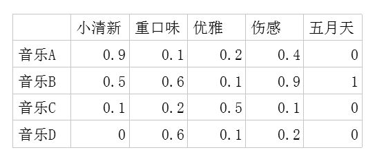

利用这两个矩阵，我们能得出张三对音乐A的喜欢程度是：张三对**小清新**的偏好*音乐A含有**小清新**的成分+对**重口味**的偏好*音乐A含有**重口味**的成分+对**优雅**的偏好*音乐A含有**优雅**的成分+……

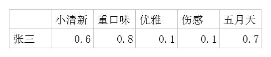

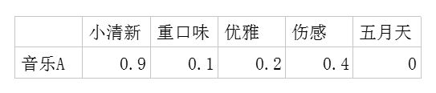

即：`0.6*0.9+0.8*0.1+0.1*0.2+0.1*0.4+0.7*0=0.69`

每个用户对每首歌都这样计算可以得到不同用户对不同歌曲的评分矩阵 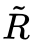。（注，这里的破浪线表示的是==估计的==评分，接下来我们还会用到不带波浪线的R表示实际的评分）：

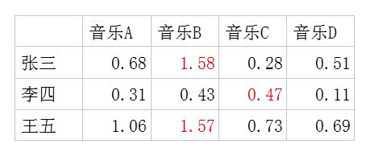

因此我们队张三推荐四首歌中得分最高的B，对李四推荐得分最高的C，王五推荐B。

如果用矩阵表示即为：

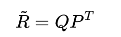

下面问题来了，**这个潜在因子（latent factor）**是怎么得到的呢？

由于面对海量的让用户自己给音乐分类并告诉我们自己的偏好系数显然是不现实的，事实上我们能获得的数据只有==用户行为数据==。我们沿用 [@邰原朗](http://www.zhihu.com/people/296727f65ac7121dce72e2424edbd552)

的量化标准：==单曲循环=5, 分享=4, 收藏=3, 主动播放=2 , 听完=1, 跳过=-2 , 拉黑=-5==，在分析时能获得的实际评分矩阵$R$，也就是输入矩阵大概是这个样子：

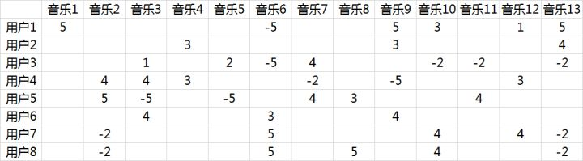

事实上这是个非常==非常稀疏的矩阵==，因为大部分用户只听过全部音乐中很少一部分。如何利用这个矩阵去找潜在因子呢？这里主要应用到的是==矩阵的UV分解==。也就是将上面的评分矩阵==分解为两个低维度的==矩阵，用Q和P两个矩阵的==乘积==去估计实际的评分矩阵，而且我们希望估计的评分矩阵

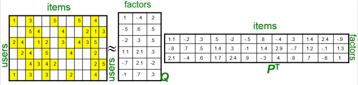

和实际的评分矩阵不要相差太多，也就是求解下面的目标函数：

$min_{P,Q}\sum{r_{ui} - q_{i}p^{T}_{u}}^2$

这里涉及到==最优化理论==，在实际应用中，往往==还要在后面加上2范数的罚项==，然后==利用梯度下降法==就可以求得这

$P,Q$ 两个矩阵的估计值。这里我们就不展开说了。例如我们上面给出的那个例子可以分解成为这样两个矩阵：

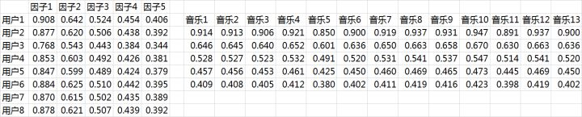

这==两个矩阵相乘==就可以得到估计的得分矩阵：

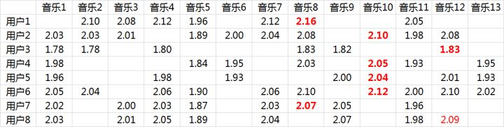

==将用户已经听过的音乐剔除后(得分为：5，-5， 1)，选择分数最高==音乐的推荐给用户即可（红体字）。

在这个例子里面用户7和用户8有强的相似性：

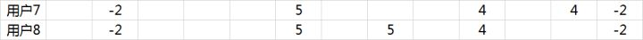

从推荐的结果来看，正好推荐的是对方评分较高的音乐：

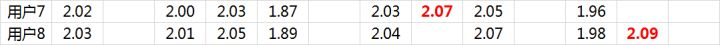

