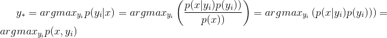
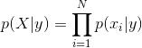
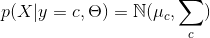

# 20180330_生成式模型 VS 判别式模型

```
1- 判别式模型： 只有一个模型，判别(数据输出量)的模型， 如SVM，决策树模型
    生成式模型： 有多个模型, 生成（数据分布）的模型，如朴素贝叶斯
    
2- 生成模型更一般更普适。不过判别模型更直接，更简单
   由生成式模型可以得到判别式模型，但由判别式模型得不到生成式模型


3- 生成式模型要对类条件密度(class conditional density)p(x|yi)进行建模, P(x|C) or p(x|yi)
    而判别式模型只需要对类后验密度(class-posterior density)进行建模, 前者通常会比后者要复杂, 更难以建模 P(Ci|x)
```


##1- 摘要

判别式模型，就是**只有一个模型**，你把测试用例往里面一丢，label就出来了，如SVM。生成式模型，有**多个模型**(一般有多少类就有多少个)，你得把测试用例分别丢到各个模型里面，最后比较其结果，**选择最优的**作为label，如**朴素贝叶斯**。本文将从生成式模型与判别式模型的概念，适用环境以及具体模型三个方面分析比较这两个模型，并在最后对列出模型范例，进行范例比较。

##2- 基本概念

- **生成模型，就是生成(数据的分布)的模型；**
- **判别模型，就是判别(数据输出量)的模型。**


##3- 适用环境

更进一步，从结果角度，两种模型都能给你 输出量(label 或 y etc.)。

- 但，**生成模型的处理过程会告诉你关于数据的一些统计信息(p(x|y) 分布 etc.)，更接近于统计学；**
- 而 判别模型则是通过一系列处理得到结果，这个结果可能是概率的或不是，这个并不改变他是不是判别的。
- 如，**决策树的 if then 说不是这个就是那个(而很多属性都是有分布的)，明显是一种 判别嘛；**
- 而朴素贝叶斯说，**p( cancer , fat ) = x% etc.，模型 生成 了一个分布给你了**，即使你没意识到/没用到，只用到 p( cancer | fat ) = y% 这个最终的判别。


##4- 模型分类

更进一步，可以再理解一下：
生成式模型

- 朴素贝叶斯
- K近邻(KNN)
- 混合高斯模型
- 隐马尔科夫模型(HMM)
- 贝叶斯网络
- Sigmoid Belief Networks
- 马尔科夫随机场(Markov Random Fields)
- 深度信念网络(DBN)

判别式模型

- 线性回归(Linear Regression)
- 逻辑斯蒂回归(Logistic Regression)
- 神经网络(NN)
- 支持向量机(SVM)
- 高斯过程(Gaussian Process)
- 条件随机场(CRF)
- CART(Classification and Regression Tree)

【模型范例】
假设你现在有一个分类问题，x是特征，y是类标记。用**生成模型学习一个联合概率分布P(x，y)，而用判别模型学习一个条件概率分布P(y|x)**。用一个简单的例子来说明这个这个问题。假设x就是两个(1或2)，y有两类(0或1)，有如下如下样本(1，0)、(1，0)、(1，1)、(2，1)
则 学习到的联合概率分布(生成模型)如下：

| x\y  | 0    | 1    |
| ---- | ---- | ---- |
| 1    | 1/2  | 1/4  |
| 2    | 0    | 1/4  |

而学习到的条件概率分布（判别模型）如下：

|      | 0    | 1    |
| ---- | ---- | ---- |
| 1    | 2/3  | 1/3  |
| 2    | 0    | 1    |

在实际分类问题中，**判别模型可以直接用来判断特征的类别情况，而生成模型，需要加上贝耶斯法则，然后应用到分类中**。但是，生成模型的概率分布可以还有其他应用，就是说**生成模型更一般更普适。不过判别模型更直接，更简单**。两种方法目前交叉较多。**由生成式模型可以得到判别式模型，但由判别式模型得不到生成式模型。**

关于生成式模型和判别式模型的优缺点的具体分析。


##5- 生成式模型的数学表达建模

生成式模型(generative model)会对x和y的联合分布`p(x,y)`进行建模,然后通过贝叶斯公式来求得`p(y|x)`, 最后选取使得`p(y|x)`最大的`yi`. 具体地, 

 

  判别式模型(discriminative model)则会直接对`p(y|x)`进行建模.

  关于二者之间的优劣有大量的讨论. SVM的发明者Vapnik声称"one should solve the (classification) problem directly and never solve a more general problem as an intermediate step [such as modeling p(x|y)]", 但是, 最近Deep Learning大行其道, 其代表性算法`DBN`就是生成式模型. 通常来说, 因为**生成式模型要对类条件密度(class conditional density)`p(x|yi)`进行建模, 而判别式模型只需要对类后验密度(class-posterior density)进行建模, 前者通常会比后者要复杂, 更难以建模**, 如下图所示.


## 6- 对比

下面简单比较下生成式模型和判别式模型的优缺点.

1. 一般来说, 生成式模型都会对数据的分布做一定的假设, 比如朴素贝叶斯会假设在给定yy的情况下各个特征之间是条件独立的:

   

   GDA会假设

   

    当数据满足这些假设时, 生成式模型通常需要**较少的数据就能取得不错的效果**, 但是当这些假设不成立时, 判别式模型会得到更好的效果.

  2. **生成式模型最终得到的错误率会比判别式模型高, 但是其需要更少的训练样本就可以使错误率收敛**[限于Genarative-Discriminative Pair, 详见[2]].

  3. **生成式模型更容易拟合,** 比如在朴素贝叶斯中只需要计下数就可以, 而**判别式模型通常都需要解决凸优化**问题.

4. **当添加新的类别时, 生成式模型不需要全部重新训练**, 只需要计算新的类别`ynew`和`x`的联合分布`p(ynew,x)`即可, 而判别式模型则需要全部重新训练.

  5. **生成式模型可以更好地利用无标签数据(比如DBN)**, 而判别式模型不可以.

5. 生成式模型可以生成`x`, 因为判别式模型是对`p(x,y)`进行建模, 这点在DBN的CD算法中中也有体现, 而判别式模型不可以生成`x`.

6. 判别式模型可以对输入数据`x`进行预处理, 使用`ϕ(x)`来代替`x`, 如下图所示, 而生成式模型不是很方便进行替换.

  

  左图中直接使用`x`进行逻辑斯蒂回归, 而右图则使用径向基核对`x`进行变换后再使用逻辑斯蒂回归.


##7- 参考文献:

  [1]. Kevin P. Murphy. Machine Learning: A Probabilistic Perspective, Chapter 8.6, Page267-271.

  [2]. Andrew Y. Ng, Micheal I. Jordan. On Discrimintive vs. Generative Classifiers: A comparison of logistic regression and naive Bayes.

  [3]. Stack Overflow: [What is the difference between a Generative and Discriminative Algorithm?](http://stackoverflow.com/questions/879432/what-is-the-difference-between-a-generative-and-discriminative-algorithm)