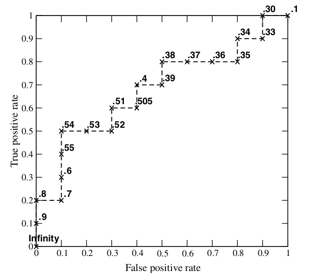

# 机器学习常见面试问题汇总

几个月前刚刚经历校招，投的多是机器学习和算法相关的岗位，特此分享面试中遇到及自己认为比较重要的内容：

## 1、**过拟合和欠拟合怎么判断，如何解决？**

答：主要可以通过==训练误差和测试误差入手判断==是否过拟合或欠拟合。

一般而言==训练误差很低，但是测试误差较高，过拟合的概率较大==；

如果训练误差和测试误差==都很高，一般是欠拟合==。

**过拟合**： 可以从==增加样本量，减少特征数==，降低模型复杂度等方面入手，实际的例子比如线性回归中，对于几十个样本的数据点就没必要用几十个变量去拟合。

CNN: 中的池化， （**压缩数据和参数的量，减少过拟合**）（max-polling 和average-polling）。

深度神经网络中： 采用Relu 激活函数替代sigmoid激活函数，解决梯度消失问题， 使更多的输出为0，造成了网络的稀疏性，并且减少了参数的相互依存关系，缓解了过拟合问题==

**欠拟合**： 则反之，需要考虑模型==是否收敛，特征是否过少，模型是否过于简单入手==。另外还有==L1，L2正则化用于限制权重以及dropout用在神经网络中使得每次训练的网络结构多样==。==L1正则化==其实就是讲权值的绝对值和加入损失函数，使得权值中==0值比重增大，因此得到的权值较为稀疏==。==L2正则化==则是将==权重的平方和加入损失函数，使得权值分布更加平均，所以权值较为平滑==。

 

## L1和L2正则为什么可以减弱overfitting

- 欠拟合**(underfitting)，或者叫作叫做**高偏差(bias). 

- 过拟合(overfitting)，也叫==高方差==(variance). 

**越简单的模型泛化能力越强。**

对**==高阶项进行一定的惩罚，避免模型在数据量不够的时候过于复杂==**。

Ps：防止过拟合的其他方法，early stopping、数据集扩增（Data augmentation），dropout

L1和L2正则有什么区别 

L1范数和L0范数可以==实现稀疏（使没用的特征为0）==，L1因具有比L0更好的优化求解特性而被广泛应用。

L1使==损失函数可导==。 L2范数==不但可以防止过拟合，还可以让我们的优化求解变得稳定和快速==。 

L1会趋向于产生少量的特征，而其他的特征都是0，而L2会==选择更多的特征，这些特征都会接近于0==。

Lasso在特征选择时候非常有用，而Ridge就只是一种规则化而已。 

为什么L1正则可以实现参数稀疏，而L2正则不可以？答了：==L1正则因为是绝对值形式，很多系数被压缩为0,。而L2正则是很多系数被压迫到接近于0，而不是0== 

为什么L1很多系数可以被压缩为0，L2是被压缩至接近于0？答了：图像上，==L1正则是正方形，L2正则是圆形。L1正则的往往取到正方形顶点，即有很多参数为0.L2正则往往去不到圆形和参数线的交点，即很多分量被压缩到接近于0==

 

## 2、**特征如何构造？**

答：其实==特征主要针对业务来构造==，==业务则对应数据==，举个例子，==时间特征可能在交通预测==方面有效，但是对于文本挖掘可能无效。因此可以考虑从数据统计分析入手，结合业务场景构造特征，后期可考虑细化特征或组合特征等。

 

## 3、**逻辑回归的含义和推导？逻辑回归和线性回归的区别？**

答：含义不多说，这个算法原理是最基本的。推导可以从==损失函数最小化或最大似然==方向入手。二者的区别曾经在面试阿里的时候被问到，当时脱口而出==一个是分类一个是回归==，但深层的含义或许是==一个是迭代求解，一个是直接求解==。望指教

线性回归：做回归预测，==拟合用的==；

逻辑回归：==二分类==，逻辑回归是对线性回归的一个压缩，将y的阈值从 $y \in (+\infin, - \infin)$ 压缩到(0,1);

线性回归的样本输出都是==连续值，$y \in (+\infin, - \infin)$,== 而==逻辑回归 $y  \in {0,1}$ , 只能取0 和1==；

拟合函数的区别如下：

线性回归： $f(x) = \theta^TX = \theta_1x_1 + \theta_2x_2 + ... + \theta_nx_n$ 

逻辑回归（LR）： $f(x) = p(y=1|x;\theta) = g(\theta^TX)$ , 其中， $g(z) = \frac{1}{1+e^{-z}}$ 

以上， 线性回归是$f(x)$ 对==输出变量y的拟合==； 逻辑回归的拟合函数是==对为1类样本的概率的拟合==；

**为什么要用 logstic 函数？**

通过回归的方法去预测二分类问题， y 到底是0类还是1类，最好的函数是单位阶跃函数。但是单位阶跃函数不连续（GLM（广义线性模型）的必要条件） ；

logistics 函数恰好==接近于单位阶跃函数，且单调可微==。

于是通过该复合函数去拟合分类问题：

$y = \frac{1}{1+e^{-\theta^TX}}$ 

于是有，

$ln\frac{y}{1-y} = \theta^T X$ 

发现如果我们假设$ y=p(y为1类∣x;θ) $ 作为我们的拟合函数，等号左边的表达式的数学意义就是1类和0类的对数几率（log odds）。这个表达式的意思就是：用==线性模型的预测结果去逼近1类和0类的几率比==。于是，$θ^TX=0$就相当于是1类和0类的决策边界：  　　

当 $\theta^T X > 0$  ，则 有y>0.5；若 $θ^TX→+∞$ ,则 $y→1$  ，即y 为1类;  　　

当 $\theta^T X < 0$，则有 y<0.5 ; 若 $ \theta^T X→−∞$，则y→0，即 y 为0类。  　　  　　

这个时候就能看出区别来了，在==线性回归中$\theta^T X$ 为预测值的拟合函数；而在逻辑回归中 $θ^TX=0$为决策边界==。

[参考](https://blog.csdn.net/u010692239/article/details/52345754) 

[线性回归、逻辑回归、各种回归的概念学习](https://blog.csdn.net/viewcode/article/details/8794401) 

 

## 4、**模型怎么优化？怎么评估模型好坏？**

答：模型==优化==主要==从数据和模型==两方面入手，根据具体问题来，比如==过拟合且数据量太少的话可以考虑增加数据量==。

模型评估指标包括==分类和回归==，分类比如==准确率，AUC==（越大越好，ROC（接受者操作特征曲线）曲线下方的面积）值，==召回率， 敏感度，特异度==， 或和==业务相关的加权计算公式==。这里强调下ROC曲线的AUC值是比较重要的内容，要能知道具体ROC曲线是怎么画出来的。

回归的话比如==MSE（均方误差），RMSE（均方根误差）或和业务相关的加权计算公式==等。

 

**ROC曲线**：接收者操作特征曲线([receiver operating characteristic curve](https://en.wikipedia.org/wiki/Receiver_operating_characteristic))，是反映敏感性和特异性连续变量的综合指标，roc曲线上每个点反映着对同一信号刺激的感受性。

阈值选取多少？

 

每个点，是每选取一个阈值，计算的一对（TPR， FPR）。 当threshold取值越多，ROC曲线越平滑。

 

## 5、**数据如何清洗，怎么处理缺失值？**

答：数据清洗主要还是通过==分析数据的统计信息、分布情况、缺失情况==等来定，在数据质量较好的前提下尽可能保留更多数据。

缺失值的处理方法较多，也是==根据具体特征和业务==来定，可以==随机填充、均值填充==、或采用==简单算法如KNN，聚类进行填==充。当然，如果某些特征或某些样本的==缺失率太大，可以考虑直接舍弃==，是具体情况而定。

 

## 6、**bagging，boosting的含义？**

答：bagging主要和==随机森林关联==，采用==有放回的抽样==，所以某个==样本可能出现在多棵树的训练集中也可能一次也没出现，可以并行==。另外每棵树用的特征集也是从原始特征集中==随机选择部分特征集==作为分裂集合。

Boosting主要和adaboosting关联，每棵树都是==根据前一棵树训练的残差作为输入的，所以一般是串行跑的，每棵树的训练集都是整个样本集，另外对特征也没做选择==。

## 什么是boosting tree

Boosting方法就是从弱学习算法出发，反复学习，得到一系列弱分类器，然后组合弱分类器，得到一个强分类器。Boosting方法在学习过程中通过改变训练数据的权值分布，针对不同的数据分布调用弱学习算法得到一系列弱分类器。

代表: adboost , xgbdt， gbdt

------

Boosting方法( ==加法模型+ 前向分布==)： Boosting这其实思想相当的简单，大概是，对一份数据，建立M个模型（比如分类），一般这种模型比较简单，称为==弱分类器==(weak learner)每次分类都将==上一次分错的数据权重提高==一点再进行分类，这样最终得到的分类器在测试数据与训练数据上都可以得到比较好的成绩。

 前向分布算法 实际上是一个贪心的算法，也就是在每一步求解弱分类器 $Φ(m)$和其参数 $w(m)$ 的时候==不去修改之前已经求好的分类器和参数。== 

用当前模型的残差，即 $r=y-fm(x)$ , 来计算下一颗树的参数。

 

## **Bagging 和 boosting 的区别**： 

bagging： 有放回采样

boosting： 无放回采样

 

## GBDT 是什么

不同于bagging方法，boosting方法通过分步迭代（stage-wise）的方式来构建模型，在迭代的每一步构建的弱学习器都是为了==弥补已有模型的不足==。

Boosting族算法的著名代表是AdaBoost，AdaBoost算法通过给已有模型预测==错误的样本更高的权重==，使得先前的学习器做错的训练样本在后续受到更多的关注的方式来弥补已有模型的不足。

与AdaBoost算法不同，梯度提升方法在迭代的每一步构建一个==能够沿着梯度最陡的方向降低损失（steepest-descent）的学习器==来弥补已有模型的不足。

经典的AdaBoost算法只能处理采用指数损失函数的==二分类==学习任务，而梯度提升方法通过设置不同的可微损失函数可以处理==各类学习任务（多分类、回归、Ranking等）==，应用范围大大扩展。另一方面，AdaBoost算法对异常点（outlier）比较敏感，而梯度提升算法通过==引入bagging思想、加入正则项==等方法能够有效地抵御训练数据中的噪音，具有更好的健壮性。这也是为什么梯度提升算法（尤其是采用决策树作为弱学习器的GBDT算法）如此流行的原因，有种观点认为GBDT是性能最好的机器学习算法，这当然有点过于激进又固步自封的味道，但通常各类机器学习算法比赛的赢家们都非常==青睐GBDT算法==，由此可见该算法的实力不可小觑。 

------

与普通boosting的区别是，利用的是==损失函数的负梯度==在当前函数的值来拟合回归树。 算法：

 

## XGBDT

传统GBDT在优化时只用到一阶导数信息，xgboost则对代价函数进行了==二阶泰勒展开==，同时用到了一阶和二阶导数。顺便提一下，xgboost工具支持==自定义代价函数，只要函数可一阶和二阶求导==。

 xgboost在==代价函数里加入了正则项==，用于控制模型的复杂度。正则项里包含了==树的叶子节点个数、每个叶子节点上输出的score的L2模的平方和==。从Bias-variance tradeoff角度来讲，正则项降低了模型的variance，使学习出来的模型更加简单，防止过拟合，这也是xgboost优于传统GBDT的一个特性。

 xgboost工具支持并行。xgboost的并行是在特征粒度上的。我们知道，决策树的学习==最耗时的一个步骤就是对特征的值进行排序（因为要确定最佳分割点）==，xgboost在训练之前，预先==对数据进行了排序，然后保存为block结构，后面的迭代中重复地使用这个结构，大大减小计算量==。这个block结构也使得==并行==成为了可能，在进行==节点的分裂时，需要计算每个特征的增益==，最终==选增益最大的那个特征去做分裂==，那么各个特征的增益计算就可以开多线程进行。

 

## 7、信息增益、信息增益率、基尼系数

| 函数                        | 方法 | 特点                                                |
| --------------------------- | ---- | --------------------------------------------------- |
| 信息增益(Info Gain)         | ID3  | 节点M的信息熵E1与其全部子节点信息熵之和E2的差。     |
| 信息增益率(Info Gain Ratio) | C4.5 | 节点信息增益与节点分裂信息度量的比值。              |
| 基尼系数(Gini)              | CART | 二叉树， 分类回归树（可以用来分类，也可以用来回归） |

C4.5继承了ID3的优点，并改进了：

（1）使用信息增益率来选择属性，克服了==用信息增益选择属性时偏向特征值多的不足==；

（2）在构树过程中进行剪枝；

（3）能够完成对连续属性的离散化处理；

   (4）能够对不完整数据进行处理；

公式：

**熵**： $$ Entropy(s) = -p_{+}log_2{p_{+}} -  p_{-}log_2{p_{-}} $$ 

描述了预测信息的位数。

**信息增益**：  $Gain(S, A) = E(S) - E(S|A)$

==前后信息的差值==

**信息增益率**： $$Gain_{ratio} = \frac{Gain(S, A)}{I(S, A)}$$

其中， $Gain(S, A)$ 为按A划分时的信息增益， $I(S, A)$ 为按A划分的==分裂信息度量==。

**Gini系数**： $$Gini(p) = \sum_{k=1}^{K} p_{k}(1- p_{k}) = 1- \sum_{k=1}^{K} (p_k)^2$$ 

条件基尼： $$Gini(D, A) = \frac{|D1|}{|D|}Gini(D1)  + \frac{|D2|}{|D|}Gini(D2)$$ 

$D1$ 是按照特征A的属性来划分， 如特征A表示天气的outlook， $D1$ 表示sunny， $D2$ 就是非sunny（overcast 和其它）

 

## 8、皮尔逊相关系数

作用： 计算相似度的，取值$[-1,1]$ , 0 表示无相关性， 1 表示正相关， -1 表示负相关。

公式： $\frac{x和y的协方差}{x的标准差 \times y的标准差}$ 

$\rho(X, Y) =  \frac{E[(X-\mu_{X})(Y - \mu_{Y})]}{\sigma_{X}\sigma_{Y} } =  \frac{E[(X-\mu_{X})(Y - \mu_{Y})]}{\sqrt{\sum^n_{i=1}(X_i - \mu_{X})^2} \sqrt{\sum^n_{i=1}(Y_i - \mu_{Y})^2} }$	    

其中，向量 $X = [X_1, X_2, ..., X_n]$ ,  $Y = [Y_1,  Y_2, ..., Y_n]$ , 长度为n。

 

## 9、 常见相似度：欧式举例、Pearson 相关系数和Cosine 相关系数的比较。

**欧式距离**： $d(X,Y)  = \sum^n_{i=1} (X_i - Y_i)^2$   

**皮尔逊**相关系数： $\rho(X, Y) =  \frac{E[(X-\mu_{X})(Y - \mu_{Y})]}{\sigma_{X}\sigma_{Y} } =  \frac{E[(X-\mu_{X})(Y - \mu_{Y})]}{\sqrt{\sum^n_{i=1}(X_i - \mu_{X})^2} \sqrt{\sum^n_{i=1}(Y_i - \mu_{Y})^2} }$	    

**Cosine**相似度： $c(X,Y) = \frac{X \cdot Y}{|X||Y|} = \frac{\sum^n_{i=1}X_iY_i }{\sqrt{\sum^n_{i=1}(X_i)^2} \sqrt{\sum^n_{i=1}(Y_i)^2}}$ 

相关性： Pearson 的相关性系数与 Cosine 的数据标准化后等价，[参考](https://www.zhihu.com/question/19734616)， 两个数据都进行中心化，然后计算cos余弦。【所以Pearson是==中心化后的余弦==】

 Pearson 的相关性系数与 Cosine 的数据标准化后等价，$d(X,Y) = 2n(1-\rho(X,Y))$ , [参考](https://www.zhihu.com/question/19734616)

所以，由以上两点， Cosine 相似度与欧式距离也等价。

 

## 10、神经网络的训练

## 11、神经网络的目标函数如何构建

## 12、SVM，adaboost，k-means，马尔可夫

## 13、涉及的学科

概率论、线性代数、问题建模、机器学习、数字信号处理里的滤波器

## 14、OLS

OLS就是普通最小二乘法（Ordinary least squres，OLS）：

**拟合值**： $\hat{y_t} = \hat{\alpha} + \hat{\beta}x_t $     

**残差值**： $\hat{u_t} = y_t - \hat{y_t}$ , 实际值-拟合值；

**目标**： 使直线与各散点的距离平方和最小， 实际上就是使残差平方和最小（residual sum of squares, RSS） $\sum^T_{t=1} \hat{u_t}^2$ 最小，即最小化：

$RSS = \sum^T_{t=1} (y_t-\hat{y_t})^2 = \sum^T_{t=1} (y_t-\hat{\alpha} - \hat{\beta}x_t)^2$  

再由最小化一阶条件，对$\hat{\alpha}$ 和 $\hat{\beta}$ 分别求导，并令导数为0 得：

$\hat{\beta} = \frac{\sum x_t y_t - T\overline{x}\overline{y}}{\sum x_t^2 - T \overline{x}^2}$ 

$\hat{\alpha} = \overline{y} - \hat{\beta}\overline{x}$ 

 

## 15、tfidf

给大家一个[链接](http://www.cnblogs.com/biyeymyhjob/archive/2012/07/17/2595249.html)去看TFIDF算法的具体原理，而此处只是简单地解释：TFIDF算法可以能够返回给我们一组属于某篇文本的”关键词-TFIDF值”的词数对，这些关键词最好地代表了这篇文本的核心内容，而这些关键词的相对于本篇文章的关键程度由它的TFIDF值量化。

>  在一份给定的文件里，**词频 (term frequency, TF)** 指的是某一个给定的词语在该文件中出现的次数。这个数字通常会被归一化（分子一般小于分母 区别于IDF），以防止它偏向长的文件。（同一个词语在长文件里可能会比短文件有更高的词频，而不管该词语重要与否。）
>
> 　　**逆向文件频率 (inverse document frequency, IDF)** 是一个词语普遍重要性的度量。某一特定词语的IDF，可以由总文件数目除以包含该词语之文件的数目，再将得到的商取对数得到。
>
> 　　某一特定文件内的高词语频率，以及该词语在整个文件集合中的低文件频率，可以产生出高权重的TF-IDF。因此，TF-IDF倾向于过滤掉常见的词语，保留重要的词语。

==去掉重复无用的词语，留下重要的词汇==。

 

## 随机森林算法RF

两次随机： 它是bagging 算法的提升版， 属于有放回采样（GBDT 是无放回采样）。 

 RF使用了CART决策树作为弱学习器，这让我们想到了梯度提示树GBDT。

一次是**随机选择样本，一次是随机选择样本特征**。 除此之外，RF 和 bagging 算法一样。

### 参数调整

有三种特征可以被调整： 

- 1）  max_features（允许单个决策树使用特征的最大数量）： 每个节点上特征越多，划分越细， 计算量越大；
- 2)    n_estimators:在利用最大投票数或平均值来预测之前，你想要建立子树的数量。越大结果越准， 但是计算量也越大；
- 3）min_sample_leaf： 最小叶子节点的数目， 叶子越小，更容易捕捉到噪声。

------

A. max_features：

 随机森林允许==单个决策树使用特征的最大数量==。 Python为最大特征数提供了多个可选项。 

下面是其中的几个：

 Auto/None ：简单地选取所有特征，每颗树都可以利用他们。这种情况下，每颗树都没有任何的限制。 

sqrt ：此选项是每颗子树可以利用总特征数的平方根个。 例如，如果变量（特征）的总数是100，所以每颗子树只能取其中的10个。“log2”是另一种相似类型的选项。

 0.2：此选项允许每个随机森林的子树可以利用变量（特征）数的20％。如果想考察的特征x％的作用， 我们可以使用“0.X”的格式。 

max_features如何影响性能和速度？ 增加max_features一般能提高模型的性能，因为在每个节点上，我们有更多的选择可以考虑。 然而，这未必完全是对的，因为它降低了单个树的多样性，而这正是随机森林独特的优点。 但是，可以肯定，你通过增加max_features会降低算法的速度。 因此，你需要适当的平衡和选择最佳max_features。 

B. n_estimators： 

在利用最大投票数或平均值来预测之前，你想要建立子树的数量。 较多的子树可以让模型有更好的性能，但同时让你的代码变慢。 你应该选择尽可能高的值，只要你的处理器能够承受的住，因为这使你的预测更好更稳定。

C. min_sample_leaf： 

如果您以前编写过一个决策树，你能体会到最小样本叶片大小的重要性。 叶是决策树的末端节点。 较小的叶子使模型更容易捕捉训练数据中的噪声。 一般来说，我更偏向于将最小叶子节点数目设置为大于50。在你自己的情况中，你应该尽量尝试多种叶子大小种类，以找到最优的那个

 

## 调参

目的：偏差和方差的协调！！！bias，variance 

原则：模型从简单到复杂，避免过拟合 

传统方法：

-  1）树类分类器

 n_estimators:子模型数量

 max_features:每个子树能用到的最大特征。一般去总特征数开方或者log或者全部 

max_depth:最大深度 

min_sample_split: 

min_sample_leaf: 

 

- 2） 神经网络： 

learning rate: 1 0.1 0.01 0.001, 一般从1开始尝试。很少见learning rate大于10的。学习率一般要随着训练进行衰减。衰减系数一般是0.5。 衰减时机，可以是验证集准确率不再上升时，或固定训练多少个周期以后。 

不过更建议使用**自适应梯度**的办法，例如adam,adadelta,rmsprop等，这些一般使用相关论文提供的默认值即可，可以避免再费劲调节学习率。对RNN来说，有个经验，如果RNN要处理的序列比较长，或者RNN层数比较多，那么learning rate一般小一些比较好，否则有可能出现结果不收敛，甚至Nan等问题。 

网络层数： 先从1层开始。 

每层结点数： 16 32 128，超过1000的情况比较少见。超过1W的从来没有见过。

 batch size: 128上下开始。batch size值增加，的确能提高训练速度。但是有可能收敛结果变差。如果显存大小允许，可以考虑从一个比较大的值开始尝试。因为batch size太大，一般不会对结果有太大的影响，而batch size太小的话，结果有可能很差。 

clip c(梯度裁剪): 限制最大梯度,其实是value = sqrt(w1^2+w2^2….),如果value超过了阈值，就算一个衰减系系数,让value的值等于阈值: 5,10,15 

dropout： 0.5 

L2正则：1.0，超过10的很少见。 

正负样本比例： 这个是非常忽视，但是在很多分类问题上，又非常重要的参数。很多人往往习惯使用训练数据中默认的正负类别比例，当训练数据非常不平衡的时候，模型很有可能会偏向数目较大的类别，从而影响最终训练结果。除了尝试训练数据默认的正负类别比例之外，建议对**数目较小的样本做过采样**，例如进行==复制==。提高他们的比例，看看效果如何，这个对多分类问题同样适用。 在使用mini-batch方法进行训练的时候，尽量==让一个batch内，各类别的比例平衡，这个在图像识别等多分类任务上非常重要==。 

 

## KNN 和LR的区别

LR： 概率分类算法

KNN： 欧几里得几何距离计算相邻点的标签；聚类算法，有可能刚开始根本就不知道有多少类；

------

LR属于线性模型。 因为 logistic 回归的==决策边界（decision boundary）是线性的==。

 KNN属于非线性模型

 

## LR 和 SVM的异同

LR : lavel 是分类算法

SVM： 可以分类也可以回归。

原始的都是线性分类器、都是监督学习算法

都是判别模型

常见的判别模型有：KNN、SVM、LR，常见的生成模型有：朴素贝叶斯，隐马尔可夫模型。

**不同：**

- 1） **不同的loss function**代表了不同的假设前提，也就代表了不同的分类原理，也就代表了一切！！！简单来说，逻辑回归方法基于概率理论，假设样本为1的概率可以用sigmoid函数来表示，然后通过**极大似然估计的方法**估计出参数的值，具体细节参考<http://blog.csdn.net/pakko/article/details/37878837>。**支持向量机基于几何间隔最大化**原理，认为存在最大几何间隔的分类面为**最优分类面**，具体细节参考<http://blog.csdn.net/macyang/article/details/38782399>

- 2） **支持向量机只考虑局部的边界线附近的点，而逻辑回归考虑全局（远离的点对边界线的确定也起作用）。** 线性SVM不直接依赖于数据分布，分类平面不受一类点影响；LR则受所有数据点的影响，如果数据不同类别strongly unbalance，一般需要先对数据做balancing。（引自<http://www.zhihu.com/question/26768865/answer/34078149>） 

- 3） **在解决非线性问题时，支持向量机采用核函数的机制（只有和决策面相关的点参与计算），而LR通常不采用核函数的方法（所有点都参与运算，计算量是相当大的）。**
- 4) **线性SVM依赖数据表达的距离测度，所以需要对数据先做normalization(正则化)，LR不受其影响。**（引自<http://www.zhihu.com/question/26768865/answer/34078149>）
- 5） **SVM的损失函数就自带正则！！！（损失函数中的1/2||w||^2项），这就是为什么SVM是结构风险最小化算法的原因！！！而LR必须另外在损失函数上添加正则项！！！**

 

## 怎么理解Dropout

1- 训练一个大型的网络，如果训练数据很少， 那么就容易引起过拟合（测试集上的精度很低）。可能我们会想到用==L2正则==化、或者==减小网络规模==。然而深度学习领域大神Hinton，在2012年文献：《Improving neural networks by preventing co-adaptation of feature detectors》提出了，在每次训练的时候，==让一半的特征检测器停过工作==，这样可以==提高网络的泛化能力==，Hinton又把它称之为dropout。

2- Hinton认为过拟合，可以通过阻止某些特征的协同作用来缓解。在每次训练的时候，==每个神经元有百分之50的几率被移==除，这样可以让一个神经元的出现不应该依赖于另外一个神经元。

3- 另外，我们可以把dropout理解为 模型平均。 假设我们要实现一个图片分类任务，我们设计出了100000个网络，这100000个网络，我们可以设计得各不相同，然后我们对这100000个网络进行训练，训练完后我们采用平均的方法，进行预测，这样肯定可以提高网络的泛化能力，或者说可以防止过拟合，因为这100000个网络，它们各不相同，可以提高网络的稳定性。而所谓的dropout我们可以这么理解，这==n个网络，它们权值共享，并且具有相同的网络层数(这样可以大大减小计算量)。我们每次dropout后，网络模型都可以看成是整个网络的子网络。==(需要注意的是如果采用dropout，训练时间大大延长，但是对测试阶段没影响)。

夕注： 每次随机的选取一些神经元进行工作，就得到了很多个子网络，最后将这些子网络进行平均， 自然可以提高泛化能力。

------

在每次训练的时候使用dropout，每个神经元==有一定的概率被移除==，这样可以使得一个神经元的训练不依赖于另外一个神经元，同样也就使得特征之间的协同作用被减弱。Hinton认为，过拟合可以通过阻止某些特征的协同作用来缓解。增加鲁棒性。 

也可以理解为相当于在==训练不同的网络==，最后投票来决定结果。

 

4- 每个神经元工作的概率是 $p$, $p$  服从 Bernoulli 分布。

 

## 为什么random forest具有特征选择的功能

1- 简单的看，特征选择基于样本的随机选取。 选择了一些样本，那么就有一些样本在包外（包外数据，OOB），每次迭代会随机的选取 $m$ 个最好的特征。 然后按照如下步骤:

- 1) 利用随机森林评估特征的重要性，并降序排列。 
- 2) 每次剔除一定比例的特征，得到新的特征集 
- 3)  重复上述过程，直到剩下m个特征（m为提前设定的值）

另外，在特征重要性的基础上，也可以结合==Wrapper==方法进行特征选择。

经过若干次迭代，就只剩下重要的特征了。

 

2-随机森林提供了两种特征选择的方法：mean decrease impurity和mean decrease accuracy。

- 1) 平均==不纯度==减少----mean decrease impurity: 随机森林由多个决策树构成。决策树中的每一个节点都是关于某个特征的条件，为的是将数据集按照不同的响应变量一分为二。利用不纯度可以确定节点（最优条件），对于分类问题，通常采用[基尼不纯度](http://en.wikipedia.org/wiki/Decision_tree_learning#Gini_impurity)或者[信息增益](http://en.wikipedia.org/wiki/Information_gain_in_decision_trees)，对于回归问题，通常采用的是[方差](http://en.wikipedia.org/wiki/Variance)或者最小二乘拟合。当训练决策树的时候，可以计算出每个特征减少了多少树的不纯度。对于一个决策树森林来说，可以算出每个特征平均减少了多少不纯度，并把它==平均减少的不纯度==作为特征选择的值。

- 2) 平均==精确率==减少----Mean decrease accuracy: 直接==度量每个特征对模型精确率的影==响。主要思路是==打乱==每个特征的==特征值顺序==，并且度量顺序变动对模型的精确率的影响。很明显，对于不重要的变量来说，打乱顺序对模型的精确率影响不会太大，但是对于重要的变量来说，打乱顺序就会降低模型的精确率。

------

==树类分类器==其实都可以, 因为可以==判断每个特征对应的信息增益, 信息增益越大的特征分类效果理论上来说就越好==。在==非结构话数据的项目中常常会用这种方法来选取有用的特征==, 从而降低特征维度。在特特征维度高的时候还是特别好用的。 

 

## DNN为什么功能强大，说说你的理解

1- 首先，DNN 是深度神经网络， 它相比于DBN（深度置信神经网络）， 它是全连接的。

2- 深度学习的深度一方面增加了==大量的参数==，增加的参数意味着这个网络的表达能力更强大了。可以学习和区分的特征更多了。而一旦学习到的特征变多的话，我们在分类和识别的能力也就变好了。 从简单特征到抽象特征。随着==网络深度增加，提取的特征不断复杂化。更能理解复杂概念==。

 

## 学习率如何影响训练？

- 如果学习率很低，训练会变得更加可靠，但是==优化会耗费较长的时间==，因为朝向损失函数最小值的每个步长很小。 
- 如果==学习率很高==，训练可能根本==不会收敛==，甚至会发散。权重的改变量可能非常大，使得优化越过最小值，使得损失函数变得更糟。

 

## 如何解决样本不均衡的问题?

从==数据集外补充==, 我的项目里直接从网上爬图片, 加上==SMOTE等过采样的算法==(有好多种, 各有优劣, SMOTE应该是最好的), 以及==对图片进行一些几何上的处理==。

 

## 线性分类器和非线性分类器

线性分类器：模型是==参数的线性函数==，分类平面是==（超）平面==；
非线性分类器：模型分界面可以是==曲面或者超平面的组合==。
典型的线性分类器有: 感知机，LDA（三层贝叶斯模型），逻辑斯特回归LR，SVM（线性核）；
典型的非线性分类器有朴素贝叶斯（有文章说这个本质是线性的，[http://dataunion.org/12344.html），kNN，决策树，SVM（非线性核）](http://dataunion.org/12344.html%EF%BC%89%EF%BC%8CkNN%EF%BC%8C%E5%86%B3%E7%AD%96%E6%A0%91%EF%BC%8CSVM%EF%BC%88%E9%9D%9E%E7%BA%BF%E6%80%A7%E6%A0%B8%EF%BC%89)

 

## 为什么梯度反方向是函数值局部下降最快的方向？

$$D_uf(x, y) = A \cdot I = |A| * |I| cos(a)$$ 

那么此时如果要取得最大值，也就是当为0度的时候，也就是向量(这个方向是一直在变，在寻找一个函数变化最快的方向）与向量（这个方向当点固定下来的时候，它就是固定的）平行的时候，==方向导数最大==.方向导数最大，也就是==单位步伐，函数值朝这个反向变化最==快.

 

## SVM的损失函数是什么？怎么理解

2分类SVM等于Hinge损失 + L2正则化。SVM最大化分类间距的==目标函数等价于最小化Hinge损失（合页损失函数） + L2正则化==。推导并不复杂, 详见《统计学习方法》。

 

## 介绍下Maxout

maxout激活函数，它具有如下性质：
1、maxout激活函数==并不是一个固定的函数==，不像Sigmod、Relu、Tanh等函数，是一个固定的函数方程
2、它是一个==可学习的激活函数，因为我们W参数是学习变化的==。
3、它是一个==分段==线性函数：

maxout的==拟合能力是非常强的，它可以拟合任意的的凸函数==。最直观的解释就是任意的凸函数都可以由分段线性函数以任意精度拟合（学过高等数学应该能明白），而maxout又是==取k个隐隐含层节点的最大值，这些”隐隐含层”节点也是线性的==，所以在不同的取值范围下，最大值也可以看做是分段线性的（**分段的个数与k值有关**）

 

## 根据混淆矩阵可以得到评价分类模型的指标有以下几种。

分类准确度，就是正负样本分别被正确分类的概率，计算公式为： $Accuracy = \frac{TP + TN}{P+N}$ 

召回率，就是==正样本被识别出的概率==，计算公式为： $Recall = \frac{TP}{P}$ 

虚警率，就是==负样本被错误分为正样本的概率==，计算公式为：$FP_{Rate} = \frac{FP}{N} $ 

精确度，就是分类结果为正样本的情况真实性程度，计算公式为：$Precision = \frac{TP}{TP + FP}$ 

 

## 优化器类型

1- Batch gradient descent
梯度更新规则:
BGD 采用整个训练集的数据来计算 cost function 对参数的梯度：

$\theta = \theta - \eta \cdot \nabla_{\theta} J(\theta) $  

Batch gradient descent 对于==凸函数可以收敛到全局极小值==，对于非凸函数可以收敛到局部极小值。

 

2- Stochastic gradient descent
随机梯度下降更新规则:

$\theta = \theta - \eta \cdot \nabla_{\theta} J(\theta ; x^{(i)}; y^{(i)} ) $   

和 BGD 的==一次用所有数据==计算梯度相比，SGD 每次更新时对每个样本进行梯度更新，
对于很大的数据集来说，可能会有相似的样本，这样 BGD 在计算梯度时会出现冗余，
而 SGD 一次==只进行一次更新，就没有冗余，而且比较快，并且可以新增样本==。
缺点:
但是 SGD 因为==更新比较频繁，会造成 cost function 有严重的震荡==。
==BGD 可以收敛到局部极小值，当然 SGD 的震荡可能会跳到更好的局部极小值处。==

 

3-  Adam 

自适应优化器，能够==自发地改变学习率==。效果最好。 存储了过去梯度的平方 vt 的指数衰减平均值 ，也像 momentum 一样保持了过去梯度 mt 的指数衰减平均值：

梯度更新规则:

超参数设定值: 建议 β1 ＝ 0.9，β2 ＝ 0.999，ϵ ＝ 10e−8 

实践表明，==Adam 比其他适应性学习方法效果要好==

 

## 什么是梯度消失？怎么解决

梯度消失问题发生时，接近于输出层的hidden layer 3等的权值更新相对正常，但前面的hidden layer 1的权值更新会变得很慢，导致前面的层权值几乎不变，仍接近于初始化的权值，这就导致hidden layer 1相当于只是一个映射层，==对所有的输入做了一个同一映射==，这是此深层网络的学习就等价于只有后几层的浅层网络的学习了。

其实梯度爆炸和梯度消失问题都是因为==网络太深==，链式求导，网络权值更新不稳定造成的，本质上是因为梯度反向传播中的连乘效应。对于更普遍的梯度消失问题，可以考虑==用ReLU激活函数取代sigmoid激活函数==。

 

另外说一些几个相关岗位侧重点：

**1、算法工程师**

这个岗位的工作内容根据不同公司而定，不过一般都离不开模型算法，但是这个算法可能是图像、语音、文本或者其他业务产品的建模。所以具体准备方向也看具体的岗位要求，以图像算法为例，如今深度学习的火热不用我说，所以基本的卷积神经网络算法，图像分类，图像检测等最近几年比较有名的paper都应该读一读。有条件的话像Caffe，TensorFlow框架都要用用。

**2、机器学习工程师**

这个岗位基本上是和算法差不多的，而且主要服务于公司内部的一些交易数据或流量数据的建模。所以基本的机器学习算法，优化方法等理论你要清楚，再搭配一些项目或比赛的实战经验就更好了。另外有Spark的使用经验会有加分。

**3、大数据平台工程师**

这个岗位侧重平台开发，比如你的公司要开发这样的一个平台，以后公司的机器学习工程师跑模型都在这个平台上跑，涉及分布式系统会更多一点，算法方面不多。

**4、数据挖掘工程师**

这个岗位主要还是看公司，有些公司里面可能做建模工作，有些公司做数据分析或者ETL工作，所以面试的时候一定要问清楚。

**5、数据分析工程师**

从title也看出来主要是做数据统计分析的一些工作，老实说建模前很重要的一个工作就是需要你对自己的数据有充分的理解，不过一般机器学习岗位可以做数据分析的工作，要不处理一个问题分太多步着实麻烦。准备的话可以从比如R语言还有一些数据分析统计和可视化角度入手。算法方面的东西应该涉及不多。

**6、ETL工程师**

这个岗位很多公司都需要，主要是做数据的前期处理，包括数据清洗，整理，校验等等，很繁琐，但是很重要。可以从SQL等语言入手。

 

## 参考

[1] 本子上的机器学习笔记来源  https://posts.careerengine.us/p/5ae73f63cb23cd4814db4870

好像和上面的重复了：https://blog.csdn.net/woaidapaopao/article/details/77806273

[2] 机器学习面试总结 https://zhuanlan.zhihu.com/c_129612503

[3] 机器学习之路， https://segmentfault.com/a/1190000008024543

[4] 2018 机器学习实习面试知识点整理 http://czx.im/2018/03/06/2018intern_interview/

[5] 机器学习实习生面试总结(阿里 腾讯等) https://cloud.tencent.com/developer/article/1010840

[6] 机器学习岗位面试内容总结  https://ask.julyedu.com/article/411

[7] 关于机器学习Bat 的面试三百道题： https://www.julyedu.com/question/index

