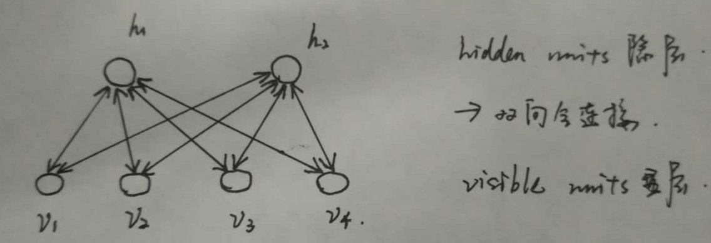

# 神经网络深度学习面试总结

**1、误差反向传播思想：**

计算出输出与标签间的损失函数值，然后计算其相对于每个神经元的梯度，==根据梯度方向更新权值==。

（1）将训练集数据输入到ANN（人工*神经网络*（Artificial Neural Network，简称 ANN ）的输入层，经过隐藏层，最后达到输出层并输出结果，这是ANN的 ==数据前向传播==过程；

（2）由于ANN的输出结果与实际结果有误差，则计算估计值与实际值之间的误差，并将该==误差从输出层向隐藏层反向传播，直至传播到输入层==；

（3）在反向传播的过程中，==根据误差调整各种参数的值；不断迭代上述过程==，直至收敛。

**2、无监督逐层训练：**预训练：每次训练一层隐结点。训练时 ==将上一层隐结点的输出作为输入，而本层隐结点的输出作为 下一层隐结点的输入==。在预训练结束后，再对整个网络进行微调训练。

**3、DNN**：指==深度神经网络==(Deep Neural Networks, 以下简称*DNN*) ，与==RNN循环神经网络、CNN卷积神经网络==的区别就是，==DNN特指全连接的神经元结构，并不包含卷积单元 或时间上的关联==。

**一、DBN：（预训练+微调）**

概念： ==深度信念网络==,*DBN*,Deep Belief Nets,*神经网络*的一种。既可以用于无监督学习,类似于一个自编码机;也可以用于监督学习,作为分类器来使用。

RBM： ==受限玻尔兹曼机==

由一个显层和一个隐层构成，显层与隐层的神经元之间为双向全连接。如下图所示： 

 

思想：整个网络看成是多个RBM的堆叠（由==RBM串联==起来就可以），在使用无监督逐层训练时，首先训练第一层，然后==将第一层预训练好的隐结点视为第二层的输入节点，对第二层进行预训练==，各层预训练完成后，再用BP算法对整个网络进行训练。

整体解释：预训练+微调 的做法可视为==将大量参数分组，对每组先找到局部看起来比较好的位置，然后再基于这些局部较优的结果联合起来进行全局寻优==。好处：利用了模型大量参数所提供的自由度，有效的节省了训练开销。

（补充：是一个概率生成模型，与传统的判别神经网络不同的是，生成模型==建立了观察数据和标签之间的联合分布==，而==判别模型只评估了条件概率==。

DBN遇到的问题：需要为训练提供一个==有标签的样本集；学习过程较慢；不适当的参数选择导致学习收敛于局部最优解。==

 

**二、CNN：（局部感知+权共享机制：让一组神经元使用相同的连接权）**

提出：==全连接的结构下会引起参数数量的膨胀，容易过拟合且局部最优==。图像中有固有的局部模式可以利用，所以，提出了CNN，并不是所有上下层神经元都能直接相连，而是通过“卷积核”作为中介。同一个卷积核在所有图像内都是共享的，图像通过==卷积操作后仍然保留原来的位置关系==。

复合多个“卷积层”和“采样层”对输入信号进行加工，然后再连接层实现与输出目标之间的映射。多层的目的：一层卷积学到的特征往往是局部的，==层数越高，学到的特征就越全局化==。

**CNN两大神器：**

1、**局部感知**：一般认为图像的空间联系是==局部的像素联系比较密切==，而距离较远的像素相关性较弱，因此，每个神经元没必要对全局图像进行感知，只要对局部进行感知，然后在更高层将局部的信息综合起来得到全局信息。利用卷积层实现：（特征映射，每个特征映射是一个神经元阵列）：从上一层通过局部卷积滤波器提取局部特征。卷积层紧跟着一个用来==求局部平均与二次提取的计算层==，这种二次特征提取结构==减少了特征分辨率==。

2、**参数共享**：在==局部连接中，每个神经元的参数都是一样==的，即：同一个卷积核在图像中都是共享的。（理解：卷积操作实际是在提取一个个局部信息，而局部信息的一些统计特性和其他部分是一样的，也就意味着这部分学到的特征也可以用到另一部分上。所以对图像上的所有位置，都能使用同样的学习特征。）卷积核共享有个问题：提取特征不充分，可以通过增加多个卷积核来弥补，可以学习多种特征。

3、**采样(池化)层**：在通过卷积得到特征后，希望利用这些特征进行分类。基于局部相关性原理进行亚采样，在**减少数据量的同时保留有用信息**。（**压缩数据和参数的量，减少过拟合**）（max-polling 和average-polling）

可用==BP算法==训练，训练中，无论是卷积层还是采样层，==每一组神经元都是用相同的连接权==。

优点：==限制了参数的个数并挖掘了局部结构的这个特点，减少了复杂度==。

（CNN主要用来识别位移、缩放及其他形式扭曲不变性的二维图形。由于CNN的特征检测层通过训练数据进行学习，所以在使用CNN时，避免了显示的特征抽取，而隐式地从训练数据中进行学习；再者由于==同一特征映射面上的神经元权值相同，所以网络可以并行学习==，这也是卷积网络相对于神经元彼此相连网络的一大优势。卷积神经网络以其==局部权值共享的==特殊结构在**语音识别**和**图像处理**方面有着独特的优越性，其布局更接近于实际的生物神经网络，权值共享降低了网络的复杂性，特别是==多维输入向量的图像可以**直接输入网**络这一特点避免了特征提取和分类过程中数据重建的复杂度==）

 

**三、DBN与CNN两者异同：**

异：

- DBN：**全连接，有pre-train过程**；

- CNN：局部连接，没有预训练过程，但加了卷积。

同：

无论是DBN还是CNN，这种**多隐层堆叠**，每层对上一层的输出进行处理的机制，可看作是在对输入信号进行逐层加工，从而把初始的、与输出目标之间联系不大的输入表示，转化成**与输出目标联系密切的表示**。即：通过多层处理，逐渐将初始的低层特征表示转化成高层的特征表示后，用**“简单模型”就可以完成复杂的分类等学习任务**。

**四、RNN：**

提出：DNN存在一个缺陷：==无法对时间序列上的变化进行建模==，然而，样本出现的时间顺序对于自然语言处理、语音识别等应用很重要；RNN解决了样本的处理在各个时刻独立的问题，可以对时间序列上的变化进行建模，==深度是时间上的长度==。神经元的输出可以在下一个时间戳直接作用到自身。即，某一层某一时刻神经元的输入，除了上一层神经元在该时刻的输出外，还有本身在上一时刻的输出。

缺点：==时间轴上的“梯度消失”==，为解决这个问题——>**长短时记忆单元LSTM**：通过 **门的开关实现时间上记忆功能，防止梯度消失**。

 

**五、LSTM：**

核心：模仿一种细胞状态，类似传送带思想，直接在整个链上运行，只有一些少量的线性交互，信息在上面保持不变。利用一种**“门”的结构来去除或增加信息到细胞状态的能力**，有三个门**。门：让信息选择通过的方法**，包括sigmoid神经网络层和一个点乘操作。

第一步：**忘记门层**：决定从细胞状态中丢弃什么信息。读取本层的输入和上一层的输出，输出一个0到1之间的数值给每个细胞状态。

第二步：确定什么样的信息被存放在细胞状态中，包含两个部分：1）**sigmoid“输入门层”**，决定什么值将要更新。2）**tanh层**，创建一个新的候选值向量。会被加到状态中。

第三步：更新**细胞状态**。基于细胞状态确定输出什么值

**面试篇：**

理解它们各自的参数代表什么，比较好的初始参数，BP的计算，以及常见超参数的调整策略。

**如何优化模型 : 加速收敛， 避免overfit, 提升精度 ..**

\- batch size effect；- learning rate effect；- weight initialization effect；- batch normalization

\- drop-out；- model average；- fine-tuning；- data augmentation

- **CNN最成功的应用是在CV，那为什么NLP和Speech的很多问题也可以用CNN解出来？为什么AlphaGo里也用了CNN？这几个不相关的问题的相似性在哪里？CNN通过什么手段抓住了这个共性？**

几个不相关的问题的相关性在于，都存在==局部与整体的关系，由低层次的特征经过组合，组成高层次的特征==，并且得到不同特征之间的空间相关性。

CNN通过：局部感知、权值共享、池化操作、多层次结构抓住了这个共性。局部感知使网络可以提取数据的局部特征；权值共享大大降低了网络的训练难度；池化操作和多层次结构一起，实现了数据的降维，将低层次的特征组合成高层次的特征。

什么时候用local-conv？什么时候用全卷积（每一个点用同一个filter）？

当数据集具有全局的局部特征分布时，也就是说局部特征之间有较强的相关性，适合用全卷积。在不同的区域有不同的特征分布时，适合用local-Conv。

什么样的资料==不适合用深度学习==？

1）==数据集太小==，因为神经网络有效的关键就是大量的数据，有大量的参数需要训练，少量的数据不能充分训练参数。

2）数据集==没有局部相关性。==目前深度学习应用的领域主要是图像、语音、自然语言处理，这些领域的共性就是局部相关性。例如：图像中的像素组成物体，语音中的音位组成单词，文本数据中的单词组成句子，而深度学习的本质就是学习局部低层次的特征，然后组合低层次的特征成高层次的特征，得到不同特征之间的空间相关性。

**何为共线性, 跟过拟合有啥关联?**

- 共线性：多变量线性回归中，变量之间由于存在==高度相关关系==而使回归估计不准确。
- 共线性会==造成冗余，导致过拟合==。
- 解决方法：==排除变量的相关性／加入权重正则==。

**为什么引入非线性激励函数？**

因为如果不用非线性激励函数，每一层都是上一层的线性函数，无论神经网络多少层，==输出都是输入的线性组合，与只有一个隐藏层效果一样。相当于多层感知机了==。所以引入==非线性激励函数==，深层网络就变得有意义了，可以==逼近任意函数==。

**什么造成梯度消失？推导？**

许多激活函数将输出值==挤压在很小的区间==内，在==激活函数两端较大范围的定义域内梯度为0==，导致==权重更新的缓慢训练难度增加，造成学习停止==。（前面层上的梯度是来自后面的层上项的乘积，当==层数过多时，随着乘积的累积，将越来越小==。）

**CNN常见的问题**

1、梯度消失问题：==过多的层数会导致梯度消失，解决手段：减少层数；增大学习率；用Relu代替sigmoid==。

2、权重衰减：CNN的==权重共享相当于自带某种正则项==，所以代价函数里可不加正则

3、随机梯度下降的参数选择：

参考：<http://blog.csdn.net/fuwenyan/article/details/53914371>

1）batch的选择决定了下降的方向：

如果数据集比较小，可以采用全数据集的形式，好处：全数据集确定的方向能够更好的代表样本总体；不同权重的梯度值差别巨大，因此选一个全局的学习率很困难，使用==全数据集可以只基于梯度符号==并且针对性单独更新各权值。

如果数据集比较大，全数据集不可行，内存限制；由于各个batch采样的差异性，各次梯度修正值相互抵消，无法修正。另一个极端每次只训练一个样本，batch=1，每次修正方向以各自样本的梯度方向修正，难以达到收敛。

选择适中的batch？ 批梯度下降法，

**常用的激励函数：**[**http://blog.csdn.net/u013146742/article/details/51986575**](http://blog.csdn.net/u013146742/article/details/51986575)

1）**sigmoid**：将输出实值压缩到0-1之间。 缺点：（输入非常大或非常小的时候）容易梯度消失；sigmoid函数是非0均值的，下一层的神经元将从上一层神经元得到的非0 均值的信号作为输入，再结合w计算梯度，始终都是正的。（可根据batch调节）

2）**Tanh**：是0均值的。

3）**Relu**（修正线性单元）：好处：收敛快，求梯度简单。具有稀疏特性。

（相比于sigmoid：sigmoid==反向传播求误差梯度时，求导计算量很大，而relu求导简单==；对于深层网络，sigmoid反向传播时，在sigmoid接近饱和区时，变换太缓慢，导数趋0，从而无法完成深层网络的训练；==Relu会使一部分神经元的输出为0，造成了网络的稀疏性，并且减少了参数的相互依存关系，缓解了过拟合问题==。）

缺点：训练的时候很脆弱，一个非常大的梯度流过一个Relu神经元后，不会对其他数据有激活现象了，设置较小的学习率，这种情况会不那么频繁。

**卷积计算层：**

参数共享机制、一组固定的权重和不同窗口内数据做内积：卷积

CNN优缺点：

优点：共享卷积核、减少了网络自由参数的个数，==对高维数据处理无压力；无需手动选取特征==，训练好权重，即得特征。降低神经网络的复杂性。这种网络结构在有监督的方式下学习到了一些良好的性能：对平移、比例缩放、倾斜或其他形式的变形具有高度不变性。

缺点：==需要调参，需要大量样本==；

**神经网络优势:**

可以利用神经网络中==某一层的输出当做是数据的另一种表达==，从而可以将其认为是经过神经网络学习到的特征，基于这一特征，可以进行进一步的相似度比较等操作。

有效的关键是大规模的数据，==每个DL都有众多的参数==，少量数据无法将参数训练充分。

**发展缺陷：**

随着网络层数的加深，优化函数越来越容易==陷入局部最优解==，并且这个“陷阱”越来越偏离真正的全局最优，利用有限数据训练的深层网络，性能还不如浅层网络。

随着网络层数增加，==梯度消失现象越来越严重==，（一般指sigmoid函数，反向传播时，每传递一层，梯度衰减为原来的1/4。层数一多，梯度指数衰减后，==底层基本接收不到有效的训练信号==。）

深度学习整体解释：

**1）自下而上的非监督学习**

**2）自顶向下的监督学习**

 

## 对称失效

后向传播是在求解损失函数L对参数w求导时候用到的方法，目的是通过链式法则对参数进行一层一层的求导。这里重点强调：要==将参数进行随机初始化而不是全部置0==，否则所有隐层的数值都会与输入相关，这称为**对称失效**。 

 

## 梯度消失

梯度消失：这本质上是由于激活函数的选择导致的， 最简单的sigmoid函数为例，在函数的两端==梯度求导结果非常小（饱和区）==，导致后向传播过程中由于多次用到激活函数的导数值使得整体的乘积梯度结果变得越来越小，也就出现了梯度消失的现象。

 

## 梯度爆炸

同理，出现在激活函数处在激活区，而且==权重W过大的情况下==。但是梯度爆炸不如梯度消失出现的机会多。  

 

## 激活函数

Sigmoid、Tanh、 Relu 、Leaky ReLU、 Maxout

 

## 解决overfitting

dropout， regularization， batch normalizatin，但是要注意==dropout只在训练的时候用==，让一部分神经元随机失活。  　　

Batch normalization（批处理归一化）是为了**让输出都是单位高斯激活**，方法是在**连接和激活函数之间加入BatchNorm层，计算每个特征的均值和方差进行规则化**。 

 

## CNN

（1） 思想  　　改变全连接为局部连接，这是由于图片的特殊性造成的（图像的一部分的统计特性与其他部分是一样的），通过局部连接和参数共享大范围的减少参数值。可以通过使用多个filter来提取图片的不同特征（多卷积核）。  　　  

（2）filter尺寸的选择  　　通常尺寸多为奇数（1，3，5，7）  　　  

（3）输出尺寸计算公式  　　输出尺寸=(N - F +padding*2)/stride + 1  　　

步长可以自由选择通过补零的方式来实现连接。  　　 

 （4）pooling池化的作用  　　虽然通过.卷积的方式可以大范围的减少输出尺寸（特征数），但是依然很难计算而且很容易过拟合，所以依然利用图片的静态特性通过池化的方式进一步减少尺寸。  　

（5）常用的几个模型，这个最好能记住模型大致的尺寸参数。

| 名称                                            | 特点                                                         |
| ----------------------------------------------- | ------------------------------------------------------------ |
| LeNet5                                          | –没啥特点-不过是第一个CNN应该要知道                          |
| AlexNet                                         | 引入了ReLU和dropout，引入数据增强、池化相互之间有覆盖，三个卷积一个最大池化+三个全连接层 |
| VGGNet                                          | 采用1*1和3*3的卷积核以及2*2的最大池化使得层数变得更深。常用VGGNet-16和VGGNet19 |
| Google Inception Net 我称为盗梦空间网络         | 这个在控制了计算量和参数量的同时，获得了比较好的分类性能，和上面相比有几个大的改进：  　　1、去除了最后的全连接层，而是用一个**全局**的平均池化来取代它；  　　2、引入Inception Module，这是一个4个分支结合的结构。所有的分支都用到了1*1的卷积，这是因为1*1性价比很高，可以用很少的参数达到非线性和特征变换。 　 　     3、Inception V2第二版将所有的5*5变成2个3*3，而且提出来著名的Batch Normalization； 　          4、Inception V3第三版就更变态了，把较大的二维卷积拆成了两个较小的一维卷积，加速运算、减少过拟合，同时还更改了Inception Module的结构。 |
| 微软ResNet残差神经网络(Residual Neural Network) | 1、引入高速公路结构，可以让神经网络变得非常深 2、ResNet第二个版本将ReLU激活函数变成y=x的线性函数 |

 

## RNN

在普通的全连接网络或CNN中，每层神经元的信号只能向上一层传播，样本的处理在各个时刻独立，因此又被成为前向神经网络(Feed-forward+Neural+Networks)。而在RNN中，神经元的输出可以在下一个时间戳直接作用到自身，即第i层神经元在m时刻的输入，除了（i-1）层神经元在该时刻的输出外，还包括其自身在（m-1）时刻的输出。所以叫循环神经网络 

 

RNN、LSTM、GRU区别

- RNN引入了循环的概念，但是在实际过程中却出现了初始信息随时间消失的问题，即长期依赖（Long-Term Dependencies）问题，所以引入了LSTM。
- LSTM：因为LSTM有进有出且当前的cell informaton是通过input gate控制之后叠加的，RNN是叠乘，因此LSTM可以防止梯度消失或者爆炸。推导forget gate，input gate，cell state， hidden information等因为LSTM有进有出且当前的cell informaton是通过input gate控制之后叠加的，RNN是叠乘，因此LSTM可以防止梯度消失或者爆炸的变化是关键，下图非常明确适合记忆：
- GRU是==LSTM的变体，将忘记门和输入们合成了一个单一的更新门==。 

 

## GAN

GAN结合了==生成模型和判别模型==，相当于矛与盾的撞击。生成模型负责生成最好的数据==骗过判别模型，而判别模型负责识别==出哪些是真的哪些是生成模型生成的。但是这些只是在了解了GAN之后才体会到的，但是为什么这样会有效呢？  　　

假设我们有分布Pdata(x)，我们希望能建立一个生成模型来模拟真实的数据分布，假设生成模型为Pg(x;θ)，我们的目的是求解θ的值，通常我们都是用最大似然估计。但是现在的问题是由于我们相用N来模拟Pdata(x)，但是我们==很难求解似然函数==，因为我们没办法写出生成模型的具体表达形式，**于是才有了GAN**，也就是用==判别模型来代替求解最大似然的过程。==  　　

在最理想的状态下，G可以生成足以“以假乱真”的图片G(z)。对于D来说，它难以判定G生成的图片究竟是不是真实的，因此D(G(z)) = 0.5。这样我们的目的就达成了：我们得到了一个==生成式的模型G，它可以用来生成图片==。

## 参考

[1] https://blog.csdn.net/qq_34896915/article/details/73565045

[2] https://blog.csdn.net/woaidapaopao/article/details/77806273

[3] 深度学习面试笔记, http://lindongding.com/2018/05/28/%E6%B7%B1%E5%BA%A6%E5%AD%A6%E4%B9%A0%E9%9D%A2%E8%AF%95%E7%AC%94%E8%AE%B0/

[4]网易云社招Java面试记录  https://www.jianshu.com/p/0db8f0be05ed

