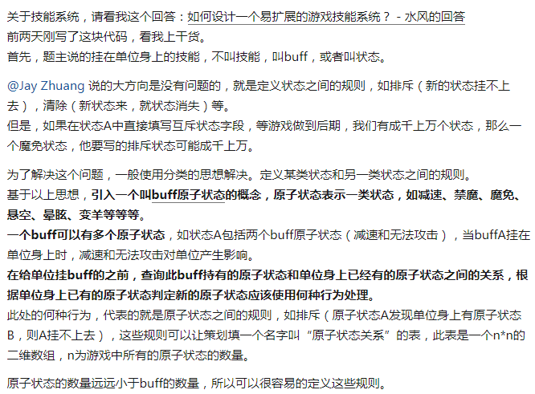
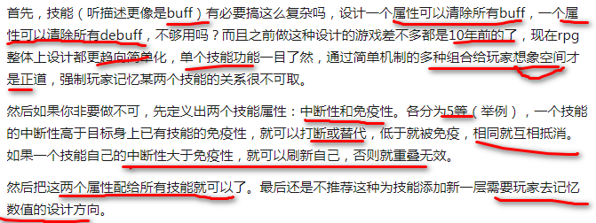

# 20180409 游戏开发过程中_技能与技能之间的关系如何设计比较好

```
判断顺序是：
1. 互斥， 还有一个排斥
2. 叠加
3. 替换
4. 共存

技能是什么？ 改变角色属性的过程
一系列角色属性是，直接属性（直接反映在角色强度和角色行为上的属性，如生命值，魔法值，攻击力，防御力，攻击速度，移动速度，当前位置等）+间接属性（各种各样的人物属性，通常一个间接属性的改变对应着几个不同的直接属性的改变）。技能就是去改变自己或者对方的属性的过程。

buf 和 debuf, 具体的就定义两种技能：中断性和免疫性，各分为5 个等级，然后比较。现在更倾向于组合技能，而非单一技能。

抽象型的概念进行技能克制设计： 眩晕，减速，减甲，降攻等被免疫（眩晕，减速，及其他）所克制;加防被无视防御比例类技能克制;加血（如果存在打断机制）被dot克制;加攻被虚弱（降低攻速）类技能克制;
通过一类技能对另一类技能进行克制，而非一个特定技能对另一个特定技能进行克制【以技能 类为单位】

互斥、替换、叠加、共存 四大关系

技能系统间的克制关系【将技能 系统 间的克制，，而非技能间的】：
控制技。又分为物理/位移控制技和非物理控制技。前者就是减速，锁足（但可释放技能），眩晕中的不可移动部分。后者就是部分沉默，全沉默，和眩晕中的不可施法部分。

伤害技。分为一次性伤害和持续性伤害。

BUFF技。添加有益/无益BUFF。

解除/驱散技。分为自身解除控制，解除BUFF和为他人解除BUFF。

免疫技。免疫控制，免疫伤害，免疫DEBUFF等。

其他。治疗技，防御技等等。


9- 游戏中的平衡，强的有克星，弱的能克强。 dps 表示 秒伤害
```


原话题链接：https://www.zhihu.com/question/35087902

## 1.  问题

比如有A、B、C、D四种不同功能的技能
当角色身上有A的时候
添加B，可以中断A
添加C，被A免疫，C添加不上
添加D，与A发生抵消，既A中断，D也加不上
添加新的A1，可能替换A，也可能与A叠加
......
第一次涉及，望大家指点迷津


## 2- 引入buff 原子状态的概念




## 3- 互斥，排斥，抵消 

> 比如有A、B、C、D四种不同功能的技能
> 当角色身上有A的时候
> 添加B，可以中断A

状态表增加字段“互斥状态”，string，填入状态id

> 添加C，被A免疫，C添加不上

状态表增加字段“排斥状态”，string，填入状态id

> 添加D，与A发生抵消，既A中断，D也加不上

状态表增加字段“抵消状态”，string，填入状态id

> 添加新的A1，可能替换A，也可能与A叠加


## 4- 技能的概念和技能之间的互动，抵消

我认为，技能体系的设计是一个由浅入深，循序渐进的过程。一上来就直接切入技能之间的相互关系来回答，可能无法抓住关键点，所以，从最基础的部分开始分析可能要更好一些。
技能的本质是什么，我认为，**本质上技能是一系列改变角色/其他技能属性的方法。**
要想设计一套完整的技能，首先必须了解你的角色都有哪些属性。
比如，最常见的也是目前最流行的一**系列角色属性是，直接属性（直接反映在角色强度和角色行为上的属性，如生命值，魔法值，攻击力，防御力，攻击速度，移动速度，当前位置等）+间接属性（各种各样的人物属性，通常一个间接属性的改变对应着几个不同的直接属性的改变）。技能就是去改变自己或者对方的属性的过程。**

我们可以把“普通攻击”也看成一个最基本的技能（实际上在有些游戏里它确实是一个技能，比如三国杀）。这个技能，本质上就是：**减少敌人的生命值，减少量等于你的攻击力和目标防御力的差值。**
当然，还有各种各样不同的属性结构，在这里就不展开讨论了，直接切入重点。
技能之间的关系，可以分为两种：

- 一种是，通过属性之间的互动来形成**相生相克关系**。

比如，你的技能能增加X点攻击力，我的技能增加X点防御力，你用了技能后攻击我和普通攻击我没什么两样，那你这个技能相当于就被我的技能废了，当然，我的这个技能也被你这个技能废了，这是互克的。【攻击和防御】

- 第二种关系则是，直接通过技能之间的**互动来产生相互关系。**

前面说了，角色有各种属性，一些基本技能就是去改变这些属性，而对每种属性的改变，我们可以认为是这个技能的属性，而与技能直接互动的技能，就是在改变指定技能的属性，某种意义上来说，有点类似于位移-速度-加速度之间的关系。
假如我们把普通攻击看成一个技能，根据之前的分析，这个技能有如下属性：
1.改变角色行为（进行攻击动作）
2.改变角色属性（减少对手的生命值）
3.减少量正相关值（你的攻击力）
4.减少量负相关值（对手的防御力）
根据这四点，我们就可以制作一系列和【普通攻击】这个技能互动的技能，比如说：
禁止改变角色行为 --> 禁止攻击
禁止改变角色属性 --> 闪避，格挡
使正相关值增加（但不改变角色攻击力这一属性） --> 攻击造成额外伤害。
去掉负相关值的关联 --> 无视防御
甚至，我们还可以再做出与这些互动的技能进行互动的技能，比如【闪避】--> 【无视闪避】

```
A {
  属性1 ：添加一个buff，在buff持续期间 {
    属性1-1 ： 每隔X秒执行XXX（比如造成伤害）
    关系1-1 ： 不允许 C 执行
    关系1-2 ： 如果buff被 D 取消 禁止 D 的 属性1 执行
  }
  ...
  ...
}

B {
  关系1 ：立即取消 A 的 属性1 添加的buff
  ...
  ...
}

C {
  属性1 : 执行XXX
  ...
  ...
}

D {
  关系1 ： 立即取消 A 的 属性1 添加的buff
  属性1 ： 添加一个buff，在buff持续期间 {
    属性1-1 ： 每隔X秒执行XX
  }
}
 

```

设计技能和技能之间的联系，并不是一开始就强行地去规定，我这个技能要和那个技能有什么联系，而是**根据每个技能的技能属性，设计相关技能针对性的属性。**只要你把你的游戏中角色属性和已有技能的技能属性理清了，设计相关技能是一件自然而然，水到渠成的事情。


## 5- buf

buf 和 debuf, 具体的就定义两种技能：中断性和免疫性，各分为5 个等级，然后比较。现在更倾向于组合技能，而非单一技能。




## 6- 抽象型概念设计


关于这个问题，策划界一般使用**抽象型的概念进行技能克制设计**，如:
**眩晕，减速，减甲，降攻等被免疫（眩晕，减速，及其他）所克制;加防被无视防御比例类技能克制;加血（如果存在打断机制）被dot克制;加攻被虚弱（降低攻速）类技能克制;**
诸如此类(･ิϖ･ิ)っ

也就是说要**通过一类技能对另一类技能进行克制，而非一个特定技能对另一个特定技能进行克制**【以技能 类为单位】，否则:
1.很容易出bug（技能一多，eff互相排斥什么的），而且还不好测试出来
2.平衡性难以掌握和调节
3.工作量巨大


## 7- 互斥、替换、叠加、共存 四大关系

有**互斥、替换、叠加、共存**，4种关系

- buffID
- tag列表
- 互斥ID列表
- 替换tag
- 是否可以替换
- 优先级（填数值，可以替换时，优先级数值高的替换优先级低的）
- 最大叠加数（填1代表不可叠加，大于1时表示最大叠加数）

要给host加上buffset B，

foreach A in host.buffsets 
​    先判断互斥，如果A.id in B.互斥ID列表，丢弃B。 
​     然后判断叠加，如果A.id == B.id 且A.最大叠加数>1 ，则生效时间重置到最新，如果叠加数没满，则++。

​    然后判断替换，如果替换tag存在，如果 A.tag列表包含B.替换tag，且A.可替换=true, 且 A.优先级 < B.优先级，B替换A。

如果都不成立，则共存。host.buffsets.add(B)


##8- 技能系统间的克制 

玩过无数游戏，所有的游戏基本**不存在单个技能间的克制与反克制，基本都是技能系统间的克制**，这样方便职业平衡和职业扩展。

目前看来游戏的技能设置系统性的就几类：

**控制技**。又分为物理/位移控制技和非物理控制技。前者就是减速，锁足（但可释放技能），眩晕中的不可移动部分。后者就是部分沉默，全沉默，和眩晕中的不可施法部分。

**伤害技**。分为一次性伤害和持续性伤害。

**BUFF技**。添加有益/无益BUFF。

**解除/驱散技。**分为自身解除控制，解除BUFF和为他人解除BUFF。

**免疫技。**免疫控制，免疫伤害，免疫DEBUFF等。

其他。**治疗技，防御技**等等。


## 9- 生命值，伤害，护甲 和 DPS

问题太空泛
游戏中战斗的本质，就是在有限的生命值阀域内，通过输出伤害将对方的生命值降至一个阀域外的过程
最基本的便是自己和敌人的阀域也就是生命值，和双方对对方生命值的伤害能力，这个给个标准的指标就是DPS
而其他的一切可以说就是为了这两者其一或者其二服务的
你所看到的护甲抗性回复治疗的本质就是提高生命值，**伤害技能的本质就是增加DPS，控制技能的本质便是降低对方的DPS，而所谓法力值之类的最终也不过就是治疗和伤害**。

```
Damage Per Second，秒伤害的意思。同时也指能够高输出高攻的单位。
一般情况下DPS后边应是数字，代表平均每秒对目标造成的伤害是多少。比如DPS 3000 就表示在一段时间内某人对某目标平均每秒造成3000点的伤害。
而在很多在线游戏中玩家组队召唤队友时所说的“来T 来DPS”中的DPS，实际是DPSer 可以理解成伤害输出者。
如果别人询问DPS多少，回答方式为DPS+每秒造成的伤害；若是召唤队友“来DPS”，如果职业是坦克、奶妈就不要去了，这里DPS是高伤害者的意思。
```

而这些附加的游戏特色这些都有实际的满足条件和对应的浮动属性值，而这些满足条件就是需要对抗双方的操作者去发挥的点
假如对方拥有每秒回1血，那么你可以认为如果你10秒内干掉他那么这个属性相当于增加了对方10点生命上限，而你可以通过更快的输出降低这个收益，对方对应可以走位逃跑提高效应
假如对方拥有1护甲，每次减少你攻击的1点伤害，那么你10秒内10次攻击打死他这个属性收益等于上面的回血等于10点额外生命上限，如果你被一次直接打死，好吧这个属性完全等于1点生命上限……
而具体设计一个技能（属性），如何考虑强度就是，测试大多数玩家的操作中这个属性的平均价值，大多数拥有每秒回1玩家，实际都能活10秒，那么我们认为这个单位的生命值其实是现有的+10点，然后取下这个技能(属性），最后你会看到一个只有生命值和输出能力的无附加属性单位，将生命值乘输出就是这个单位的价值，也可以说能够作为直接评价强弱标准当然技能（属性）间可以配合，玩家的操作可以开发，挖掘
这个游戏现在**平衡**，但是几个月后就会因玩家的开发不平衡，接着就是官方的BUFF平衡性调整之类的东西最后，适用性（泛用性）和操作性本身也是一种价值，最典型的就是**移动速度，射程，甩尾**这种非属性，其实这种非属性最典型的可以说是万智的飞行延势吧总的来说平衡的具体体现就是

**强的有克星，弱的能克强**，实用的很平庸，易用的不厉害


## 10 buf 共存

其实就是一个简单的buff共存机制。

B能覆盖A,C不能覆盖B,D覆盖C后会被清空（可以看作D被空buff覆盖）

这个需求可以从设计层面简化，某一系列的buff无法共存，然后他们之间的覆盖规则你就自己设计好了。


##11 事件集合，排斥列表 

技能可以抽象为timeline 上的事件集合。附加buff 则是其中的一种事件。buff抽象出排斥列表，剔除列表。
题主讲的其实是buff 。


## 12 魔兽70 年代的buff 和 debuff 

感觉不就是魔兽七十年代的一些buff和debuff技能的规则吗…