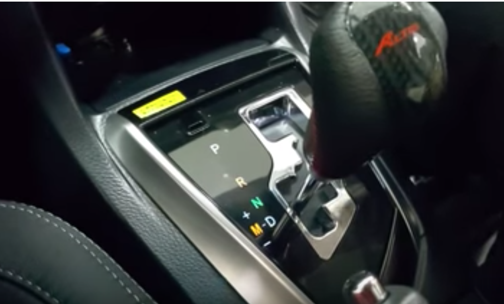
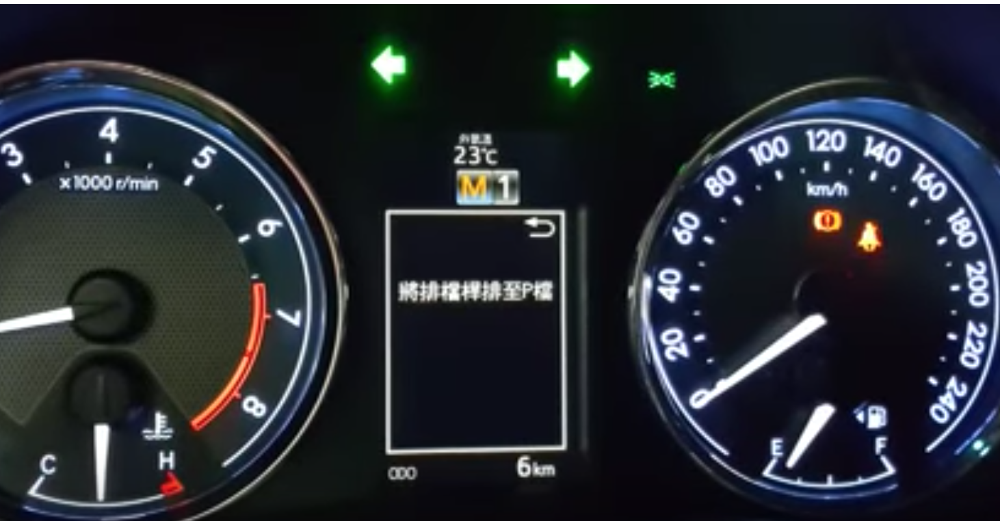

# 20180809 汽车档位说明

1- 当爬坡不够力的时候，搬到M挡，并同时往后减一档（减一档就对了）；踩油门会有力出来，

看转速表，如果到达40（4千） 多~ 50（5千）转的话，把M挡往上加，就是没有换挡的意思。

也就是当车子一直很慢，不动，就把M档往前加一档，速度会变快，转速降低；

------

对于急下坡，看是用二档档刹（M2） 还是一档档刹（M1）， M3 是三挡档刹。

如果搬到M档时， 时速是0 ： 就显示M1 档；

​				如果时速是4-50： 就显示 M3档；

把M档往下减，就会把速度降下来。

------

**总结：**

M档的时候： 急上坡： M档往后， 速度慢， 转速高；

​					       往前， 速度快， 转速低；

​			急下坡（同上）： M当往后， 速度慢，转速高； 会把速度降下来。

​			

