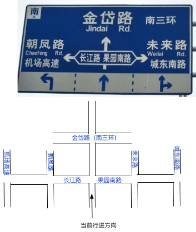
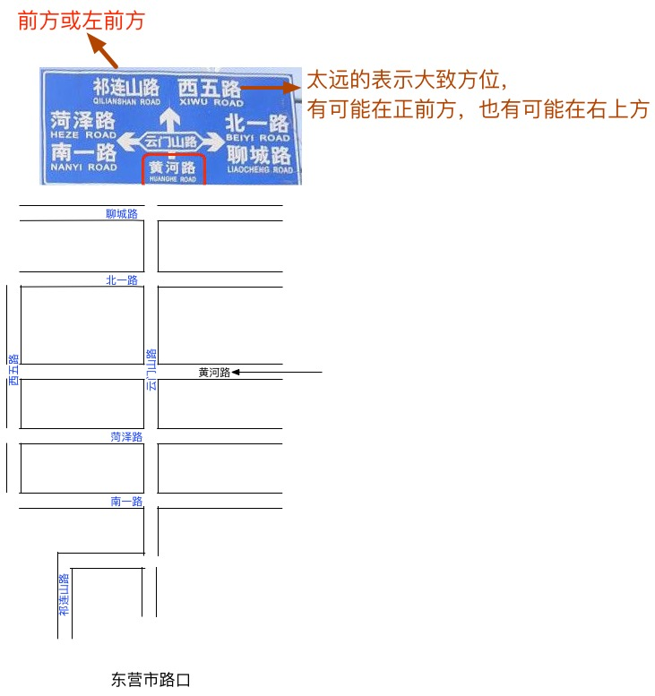

# 20180809 识别路牌

给一个例子如下： 

- 前方路口左右分别是：长江路和果园南路
- 前方直行去向：金岱路（南三环）
- 左转去向：朝凤路、机场高速
- 右转去向：未来路、城东南路
- 这路牌没标注当前行驶道路

**注：所谓去向指的有可能不是下一路口或下一站，甚至可能会比较远，是相对熟悉的目的地或较主要的道路（干路）、地点。**

**另外有些城市路牌还会在正下方标注当前行驶道路名。**比如下图的“黄河路”是当前所在的道路：

