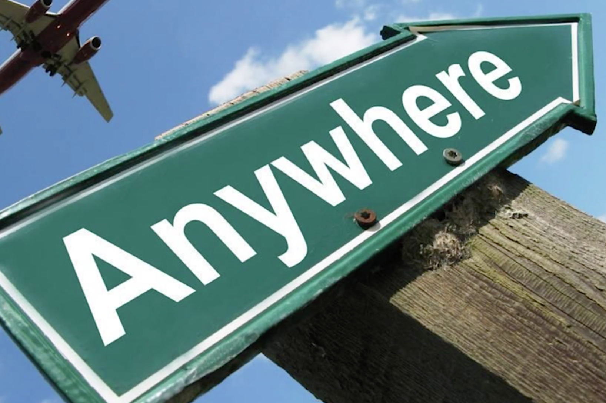
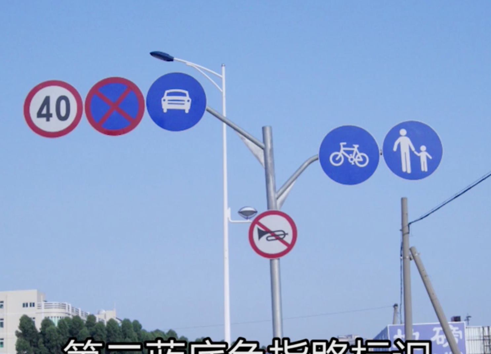
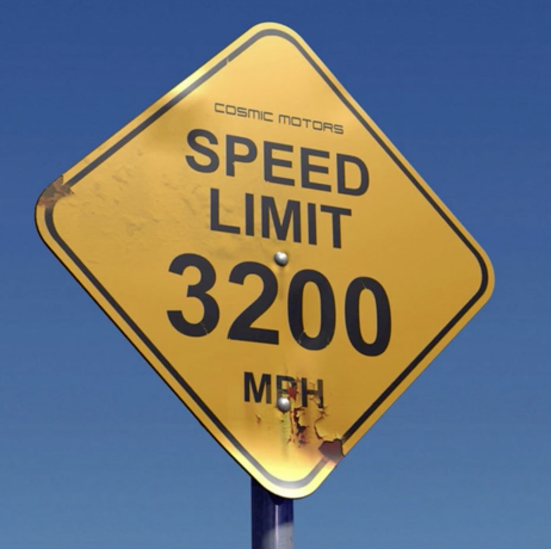
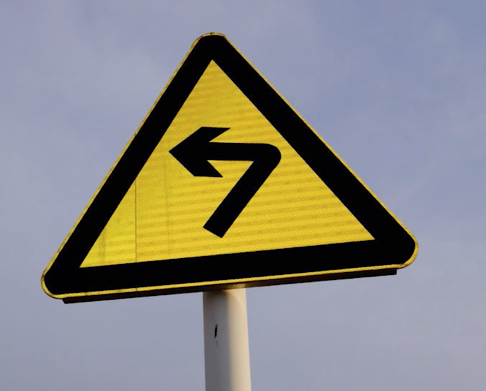
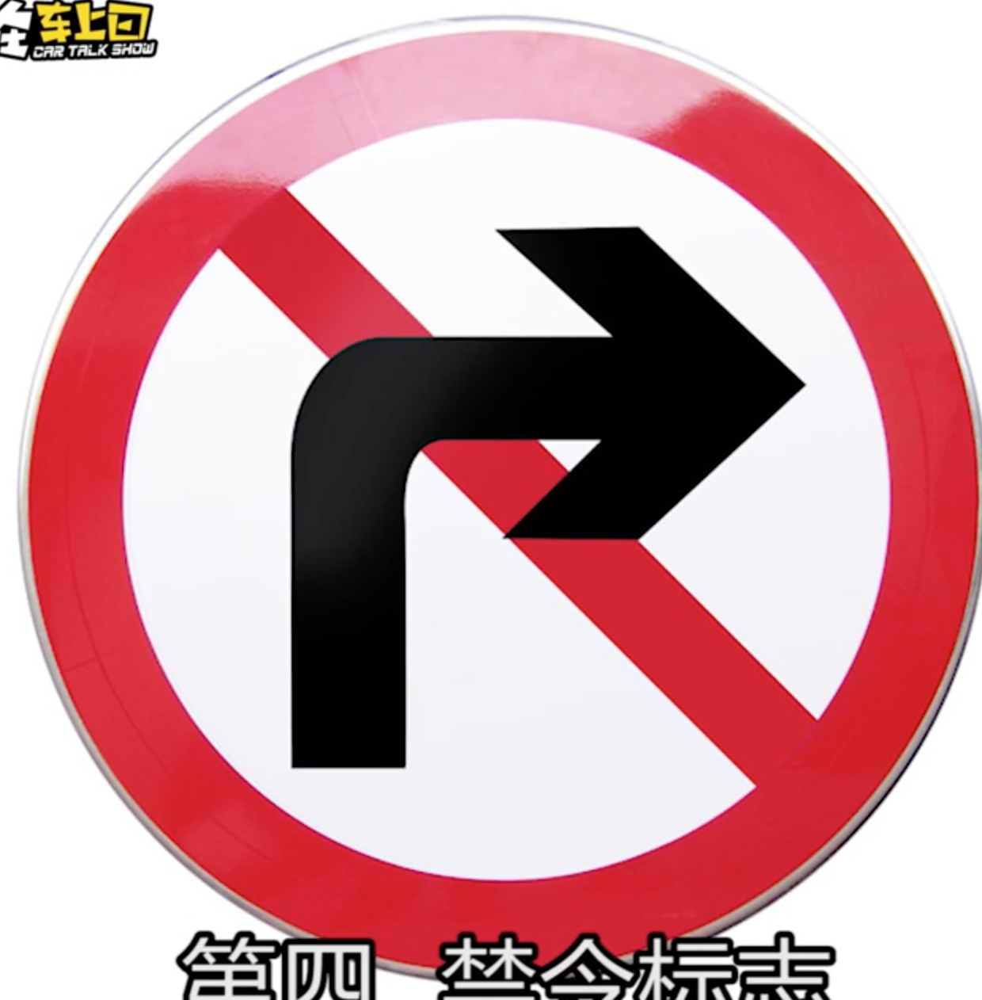
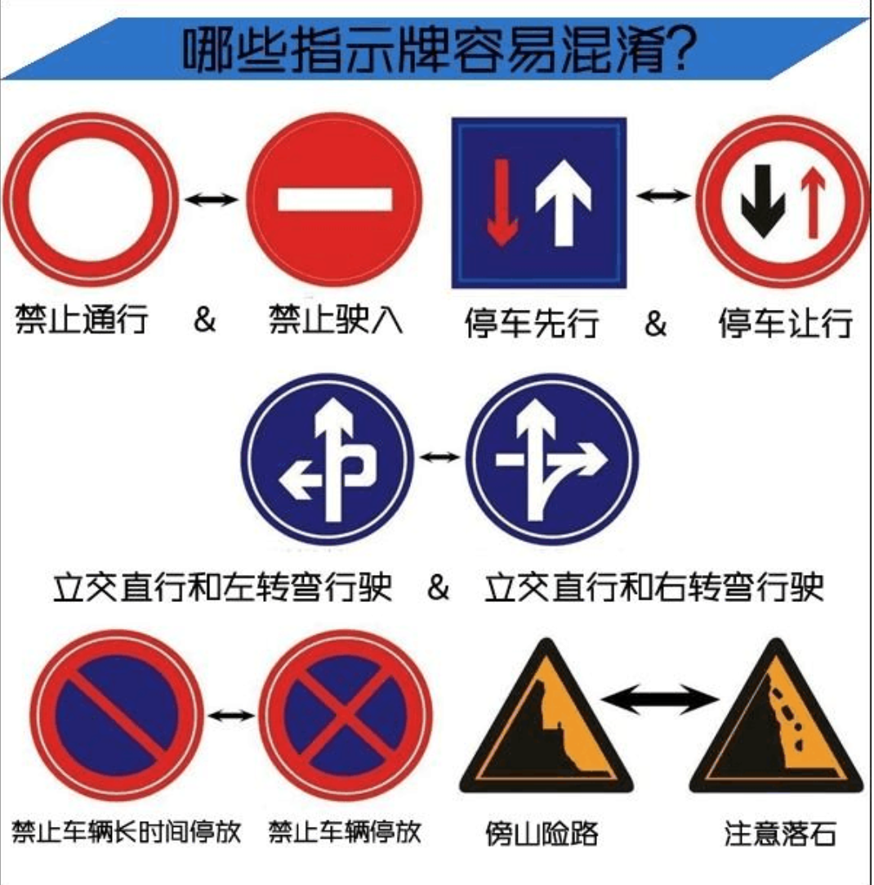
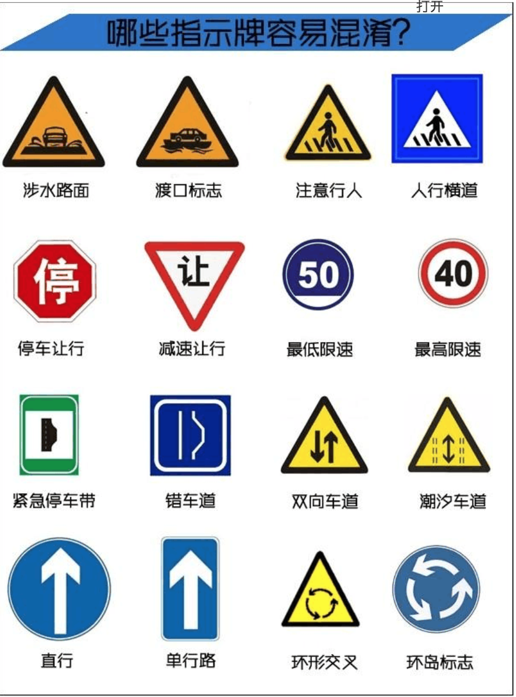

# 20180809 识别道路交通指示牌

## 指路标志

常见如下：

作用： 一边就是指示目的地， 方向和距离； 以及高速公路的出入口，著名地点等所在地信息。

颜色： 蓝底 或是 绿色底 + 白图案；

在陌生地段，能帮助驾驶者定位及辨别方向；

 

## 蓝底色指路标识

通常与城市道路有关，

 

## 绿色指路标识

常与城市快速路及高速公路有关；

由于这两种路的通行距离**更远**， 路面车速较快，因此绿底色指路标志会更多的出现**距离**信息。并且比蓝底色路标指示牌提前更多的距离设置。

 

## 警告标志

警告车辆行人注意危险地点的标志， 

颜色： 黄底 + 黑边 + 黑图案；

形状： 等边三角形；  颜色很显眼，通常设置在交通较为复杂的地点或市郊地区；

 

## 禁令标志

对车辆加以禁止或限制的标志， 除了个别标志外， 

大部分为： 白底 + 红圈 + 图案；

 压红框 + 黑图案等；

禁止标志通常**与电子摄像头相结合**， 不想破财的话，只能按照标志指示行车；

 

## 容易混淆的双胞胎指示牌

 

认清这些能搞定 90% 的交通标志了。

