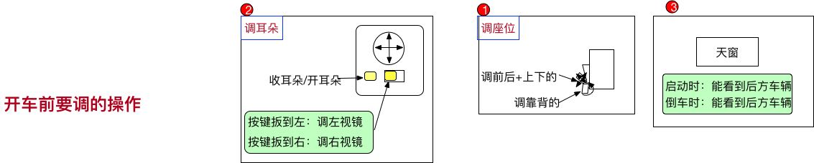

# 20180922 开车小知识

## 开车前调整事项

1- 上车后，需要调整一下事项：

按照次序来，先座位， 再耳朵，后天窗；

2- 座位， 自己调的合适踩刹车和油门即可（左刹右油，不能搞错了）；

3- 然后根据现在坐姿，调整左右两个耳朵，那么调耳朵，

**先左边**：

镜子的正中间与后远方的横向水平线齐平； 车身占镜子横向比例的1/4 较好；

再右边：

镜子的镜子的正中间与后远方的横向水平线齐平； 车身占镜子横向比例的1/4 ~ 1/2  较好 【方便看清后方来车】；

4- 调天窗

天窗一般不用调， 能看到正后方的车即可，一般有时需要看看后方来车；

 

## 启动和停止

### 停止

1- 先说停车

首先， 肯定要先踩住刹车；

然后，把档位挂到底（挂挡看表盘即可，切记不要看档位）， 挂P挡；

拉手刹， 刹车；

最后按熄火；

【一定要记住，**先档位， 后手刹**， 特别重要。 手刹是保护作用，所以不管是停还是启动，都是最后一步】

 

2- 停车的地方要注意：

- 1） 红绿灯前后50米，不能停；
- 2） 路崖子涂黄的不能停；
- 3） 看着别人能停再停吧。

 

### 启动

1- 按刹车，不多说了；

2- 启动；

3- 挂挡D或者R， 可能要倒一下呢；

4- 按手刹， 然后送刹车就能跑了。

无论是停止还是启动，都是  **==刹档轧==**（手札）

 

## 红绿灯停

1- 有时候等红绿灯的左转向，要等很长时间，就需要空挡刹车；

2- 这个比较简单： 

先刹车；

再挂空挡；

然后拉手札；

这样**停住了，脚就可以松了**。

 

 

## 红绿灯启动

1- 及时看到绿灯后，

踩刹车，

要快速挂D挡，要不然后面要滴滴了。

最后往下按手刹，

可以跑了。

 

## 红绿灯路口注意事项

1- 在红绿灯路口，特别注意，一不小心就被拍到了；

2- 首先， 需要提前看准车道，有的最左侧，只能左转，如果不小心转到了这里，就只能将错就错了。否则，红绿灯路口的线都是白色实线， 强行转到扣分；

3- 在进入车道时，要看准，左右没有压实线，否则，拍到扣分；【参考后面，车辆在路口中间】

4- 红绿灯路口可以**掉头**的两种情形：

首先，对面**没有禁止掉头**的标志

- 1） 无左转向的， 等到**绿灯**，提前打【长左，往**下按重点**，第二档，就是长转向】左转向。 一定要注意： **车头出了斑马线**才能打方向盘左转【人行道是实线，它是不能掉头的】；
- 2） 有**左转向**的， 不能等到绿灯， 如果有预左转车道， 你不用转那么远， 出了斑马线， 就可以打转向往回转；

5- 红绿灯路口，岔路口，一定要礼让行人。 左右两边，及时摆头；

6- 脚不离刹车和油门，不要踩错了。

7- 变道要迅速，提前打灯，然后摆头看， 如果可以，再打方向盘。 一定是==先灯后看，再操作==。

8- 红绿灯路口， 带拐弯的， 尽量不要踩油门， 脚放刹车上。

9- 过红绿灯路口， 一定要==多摆头==， 脚在刹车上。

10- 对面是**绿灯**，可以进入**预左转**车道：

11- 预左转， 待到对面是**绿灯**， 可以提前**开进预转**车道，提高转弯效率

12- 一般自己这边过红绿灯是实线， 对面不是， 所以可以变道。

x

 

## 掉头

1- 掉头算是比较复杂的， 提前==打左转向灯==， 在移动的过程中， 快速往某个方向打死。

要预估能不能转过去；

2- 是移动的时候， 才能转动方向盘；

3- 快速回方向盘， 进入对面车道， 尽量==不压线==；

4-掉头， 车头要出斑马线。

 

## 转弯

1- 左转转大弯，  不要打太快了。 右转转小弯； 【==右转还要特别看右侧行人==，因为这时候右转打方向盘的幅度比较大】

2-  

 

## 不压线

1- 要想在红绿灯路口不压线， 必须找准哪个点对应调整车身的位置。

2- 找到手握方向盘， 左手正前方和车子的交点， 那里有个鼓轮的痕迹。

那么这点到左侧的距离为d的话， 路边双实线的距离为D时， d 的可调范围保证在【0~D】 之间， 能保证车在路的正中间。

0： 好像是左轮刚好压线。

3- 能找准车身的位置了， 其它就不慌了。

4- 车辆的宽度: 1.8m x 4.5m

高速公路收费站的宽度：**2.5m**;

5- 各种距离参数

车身的各种距离参数：左脚外有40cm。

 

## 正门

1- 学校， 酒店这种， 要找到哪边是入口，哪边是出口呢， 一般面对你的， 靠右走即可。

 

## 导航转向-换道

1- 导航篇:  

市内红绿灯100米，200米转好比较好。**100内就要转向**换道了

50米大概要到路口了

因为包括20米的路宽。

【红绿灯**200米内基本只有一个**， 200~400米， 一般是有两个十字路口】

高架或者高速  **200米要换道**， 准备变道

**服务区**导航**2公里**报，**1公里**有路上**路标指示牌**， **100米内进入**岔路口， 进入服务区。

 

2- 高架或高速换道， **60码以内** 都得**快速变道**【先**打灯再变道**】， 因为整体速度都很快

3- 看到别人**近距离变道， 要减速**

如下图， 看到右侧车辆**打转向灯**/或**突然加速**， 说明要加速转过来，需要踩点刹车，

4- 当右侧有卡车打转向，想变道的时候，可以打双闪，禁止别人换道：

5- 高速最低限速：**80**码

匝道的入口、出口都在**右侧**边

