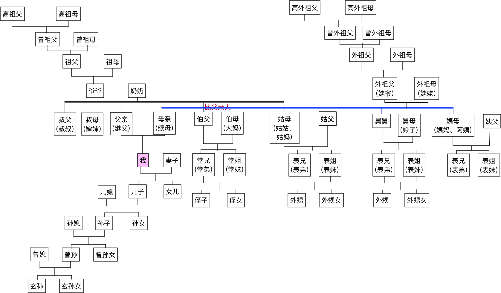
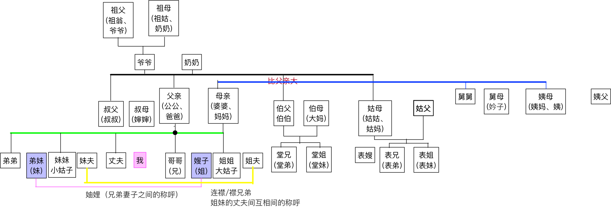
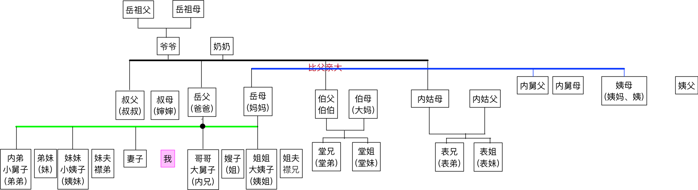
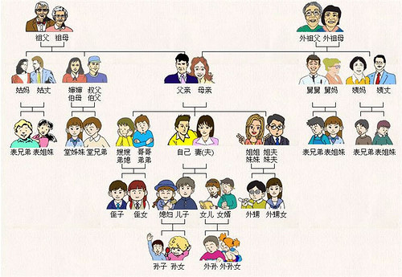

# 亲戚之间的称谓

亲属称谓是家属和亲戚之间称呼的名称，从中可以反映出其相互关系。了解亲属称谓，准确称呼亲属，是交际活动的需要，也是懂礼节的表现。
中国是一个多民族的国家，其中汉族人口占绝大多数。这里仅简要介绍汉族亲属称谓的三个特点：
① 在称谓上标明了父系和母系；
② 在称谓上标明了性别；
③ 在称谓上标明了父系男方亲属的长幼。
家庭亲友之间在交往中彼此尊重，在称谓上经常使用敬称和谦称。

==敬称==是用敬语称呼==对方或对方==的亲属，常用字有==“令”、“尊”、“贤”、“仁”==等；

==谦称==是用谦语称==自己或自己的==亲属，常用字有==“家”、“舍”、“小”、“愚”==等。

 

## 称呼分类

现将当代常用的亲属称谓分类列表如下。

1.对父系亲属的称谓：

称呼对象                                  称  呼                                        自　　称
父亲的祖父、祖母                   曾祖父、曾祖母                          曾孙（曾孙女）
父亲的父亲、母亲                   祖父（爷爷）祖母（奶奶）            孙子（孙女）
父亲                                    爸爸（爹）                               儿子（女儿）
父亲的后妻                            续母（妈妈）                            续子（续女）
父亲的哥哥、嫂子                   伯父、伯母（大妈）                    侄儿（侄女）
父亲的弟弟、弟媳                   叔父（叔叔）叔母（婶婶）            侄儿（侄女）
父亲的姐妹、姐夫妹夫              姑母（姑姑、姑妈） 姑父             内侄（内侄女）
伯，叔父的儿子、女儿              堂兄或堂弟、堂姐或堂妹              堂弟堂兄或堂妹堂姐
姑母的儿子、女儿                    表兄或表弟表姐或表妹                表弟表兄或表妹表姐

 
2.对母系亲属的称谓

称呼对象                                  称　　呼                                       自　　称
母亲的祖父、祖母                      外曾祖父、外曾祖母                外曾孙（外曾孙女
母亲的父亲、母亲                      外祖父（姥爷）外祖母（姥姥）  外孙（外孙女）
母亲、母亲的后夫                      母亲（妈妈、娘）继父（爸爸）  儿子女儿继子继女
母亲的兄弟、兄弟媳妇                舅舅、舅母（妗子）                 外甥（外甥女）
母亲的姐妹、姐夫、妹夫             姨母（姨妈）姨                       姨甥（姨甥女）
舅、姨的儿子、女儿                   表兄或表弟表姐或表妹              表弟表兄或表妹表姐

 

3.对丈夫亲属的称谓

称呼对象                                     称　　呼                                自　　称
丈夫的祖父、祖母                祖翁（祖父、爷爷）祖姑（祖母、奶奶） 孙媳妇
丈夫的父亲、母亲                公公（父亲、爸爸）婆婆（母亲、妈妈） 儿　媳
丈夫的伯父、伯母                伯父（伯伯）伯母（大妈）                   侄　媳
丈夫的叔父、叔母                叔父（叔叔）叔母（婶婶）                   侄　媳
丈夫的姑父、姑母                姑父姑母（姑姑）                               内侄媳
丈夫的舅舅、舅母               舅舅、舅母（妗子）                             甥　媳
丈夫的姨父、姨母                姨父姨母（姨妈）                                姨甥媳
丈夫的哥哥、嫂子                哥哥（兄）嫂子（姐）                         弟媳（弟妹、妹）
丈夫的弟弟、弟媳                弟弟弟妹（妹）                                   嫂　子
丈夫的姐姐、姐夫                姐姐姐夫                                              弟　媳
丈夫的妹妹、妹夫                妹妹妹夫                                               嫂　子

 

4.对妻子亲属的称谓

称呼对象                                 称　　呼                                    自　　称
妻子的祖父、祖母                岳祖父岳祖母                                     孙婿
妻子的父亲、母亲                岳父（爸爸）岳母（妈妈）                   女婿（婿）
妻子的伯父、伯母                伯父伯母                                          侄女婿（侄婿）
妻子的叔父、叔母                叔父叔母                                          侄女婿（侄婿）
妻子的姑父、姑母                内姑父内姑母                                     内侄婿
妻子的舅父、舅母                内舅父内舅母                                     内甥婿
妻子的哥哥、弟弟                内兄（哥哥）内弟（弟弟）                    妹夫姐夫
妻子的姐姐、妹妹                姐姐（姨姐）妹妹（姨妹）                    妹夫姐夫
妻子的姐夫、妹夫                襟兄襟弟                                          襟弟襟兄

 

5.对同辈亲属的称谓
父亲的兄或弟的儿女 （堂哥、堂姐）
父亲的姐或妹的儿女  （表哥、表姐）
母亲的兄或弟的儿女  （表哥、表姐）
母亲的姐或妹的儿女  （表哥、表姐）
堂哥、堂姐的儿女    （侄子、侄女）
表哥、表姐的儿女    （外甥、外甥女）

 

6.亲属合称称谓
祖孙（祖父与孙子女）、
父母、父子、父女、母子、母女、叔侄（叔父与侄儿侄女）、
公婆、翁媳（公公与媳妇）、
婆媳（婆婆与媳妇）、翁婿（岳父与女婿）、舅甥（舅舅、舅妈与外甥）、
兄弟、妯娌（兄妻与弟媳）、连襟（姐妹的丈夫）等等。

 

## 总结

简单的说就是：：：
爸爸的爸爸:爷爷; 爸爸的妈妈:奶奶;
爸爸/妈妈的爷爷:姥爷; 爸爸/妈妈的奶奶:姥姥;
爸爸的弟弟:叔叔; 爸爸的哥哥:伯父; 爸爸的姐姐/妹妹：姑妈；
伯父/叔叔的老婆：婶娘或婶婶； 姑妈的老公：姑父；
伯父/叔叔的儿子/女儿：堂哥或堂弟/堂姐或堂妹；
姑妈的儿子/女儿 ：表哥/表妹；
妈妈的爸爸：外公； 妈妈的妈妈：外婆；
妈妈的哥哥/弟弟：舅舅；
妈妈的姐姐/妹妹：姨娘或按排行大小称大姨、小姨；
舅舅的老婆：舅妈； 姨娘（大姨/小姨）的老公：姨父；

舅舅和姨娘的儿子/女儿：表哥/表妹；
哥哥/妹妹的孩子：侄子或侄女； 表哥/表妹的孩子：外侄子或外侄女（外甥、外甥女）；
另外：爸爸/妈妈的舅舅、舅妈：舅姥爷、舅姥姥；

以上的称呼，为了区别明细，可以加入姓来称呼或根据你所在地的通用称谓、习俗、习惯来称呼皆可！

直系血亲
●父系
◢高祖父–曾祖父–祖父–父亲
◢高祖母–曾祖母–祖母–父亲

●.母系

◢高外祖父–曾外祖父–外祖父–母亲
◢高外祖母–曾外祖母–外祖母–母亲
◢儿子：夫妻间男性的第一子代。
◢女儿：夫妻间女性的第一子代。
◢孙：夫妻间的第二子代，依性别又分孙子、孙女。有时孙子是一种不分性别的称呼。
◢曾孙：夫妻间的第三子代。
◢玄孙：夫妻间的第四子代。
■
旁系血亲
●父系
◢伯：父亲的兄长，也称伯父、伯伯、大爷
◢伯母：伯父的妻子

◢叔：父亲的弟，也称叔父、叔叔
◢婶：叔叔的妻子
◢姑：父亲的姊妹，也称姑姑、姑母
◢姑父：姑姑的丈夫
●母系
◢舅：母亲的兄弟，也称舅舅
◢舅母：舅舅的妻子
◢姨：母亲的姐妹，也称阿姨、姨妈
◢姨父：阿姨的丈夫
■
姻亲
◢丈夫：结婚的女人对自己伴侣的称呼
◢妻：或媳妇，结婚的男人对自己伴侣的称呼
◢公公：丈夫的父亲，也直称爸爸
◢婆婆：丈夫的母亲，也直称妈妈
◢岳父：丈人，妻子的父亲，也直称爸爸
◢岳母：丈母娘，妻子的母亲，也直称妈妈
◢儿媳：对儿子的妻子的称呼
◢女婿：对女儿的丈夫的称呼
◢嫂：对兄长妻子的称呼
◢弟妹、弟媳：对弟弟妻子的称呼
◢姐夫：对姐姐丈夫的称呼
◢妹夫：对妹妹丈夫的称呼
◢妯娌：兄弟的妻子间互相间的称呼或合称
◢连襟：姐妹的丈夫间互相间的称呼或合称，也称襟兄弟
◢大姑子：对丈夫的姐姐的称呼
◢小姑子：对丈夫妹妹的称呼
◢大舅子：对妻子哥哥的称呼
◢小舅子：对妻子弟弟的称呼
◢大姨子：对妻子姐姐的称呼
◢小姨子：对妻子妹妹的称呼

 

## 参考

http://blog.renren.com/share/267320341/2847721341/2

http://www.360doc.com/content/12/1019/22/1241083_242512350.shtml

