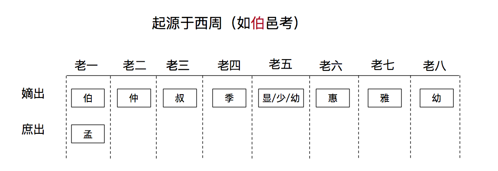

# 伯仲叔季

司马八达，伯仲叔季，显惠雅幼，
不过按照马氏五常来看，直接就是伯仲叔季幼，
所以我感觉应该是前四个固定，最后一个是幼，中间不固定。

其实三国里很多人都是类似的：

马孟起，曹孟德（孟与伯类似，都是长子，妻生妾生的不同）孙伯符，孙仲谋，孙叔弼，孙季佐

一般为此三种：==少、幼、五==。

西周最早是叫**孟仲叔季**，后来出现了庶长子这个东西，而大贵族嫡长子往往有机会担任王畿十几个宫伯之一，于是春秋就改为**伯仲叔季**，**庶长子才用孟**。伯邑考是因为他真的是伯爵，姬昌升官去商首都做官，他的伯也就要有个替代者

武王同母兄弟只有周公旦和卫康叔

没有，伯仲叔季，伯最长，季最小，中间不管多少人，都可称仲叔。
武王同母兄弟十人，……其长子曰[伯邑考](https://link.zhihu.com/?target=http%3A//baike.baidu.com/view/594689.htm)，次曰武王发，次曰[管叔鲜](https://link.zhihu.com/?target=http%3A//baike.baidu.com/view/1062109.htm)，次曰周公旦，次曰[蔡叔度](https://link.zhihu.com/?target=http%3A//baike.baidu.com/view/763834.htm)，次曰曹叔振铎，次曰成叔武，次曰霍叔处，次曰[康叔](https://link.zhihu.com/?target=http%3A//baike.baidu.com/view/823565.htm)封，次曰冉[季载](https://link.zhihu.com/?target=http%3A//baike.baidu.com/view/1522415.htm)。冉季载最少。叔旦就是周公旦。

首先这是字， 是在成年之后给的，说前面排完了的后面又冒出来的一个少。

一般情况是：

兄弟一个： 随便了，

兄弟两个： 伯、叔

兄弟三个： 伯、仲、叔

兄弟四个：伯仲叔季

超出四个： 伯、仲、叔、叔、叔、。。。。、季， 老大为伯， 老小为季， 其它可称叔， 仲可有可无。

如果长子是嫡出： 伯， 长子是庶出： 孟；

没有硬性规定，先秦成活率不怎么高，有四兄弟都不得了了，通常不怎么考虑第五个。
实在需要用第五个的情况下，就只好自己往里面塞字，常见的有==“少”==（ 《春秋命历序》：“皇伯、皇仲、皇叔、皇季、皇==少==，五姓同期，俱驾龙，号曰五龙”。 ）==“幼”==（马谡是老五，字==幼常==）等。

没听说过，不过碰巧见过三国司马防八个儿子‘’司马八达“的字是这样的：
1.司马朗，字伯达；
2.司马懿，字仲达，大家都知道；
3.司马孚，字叔达；
4.司马馗，字季达；
5.司马恂，字显达；
6.司马进，字惠达；
7.司马通，字雅达；
8.司马敏，字幼达。
后面的就看不出规矩了。

