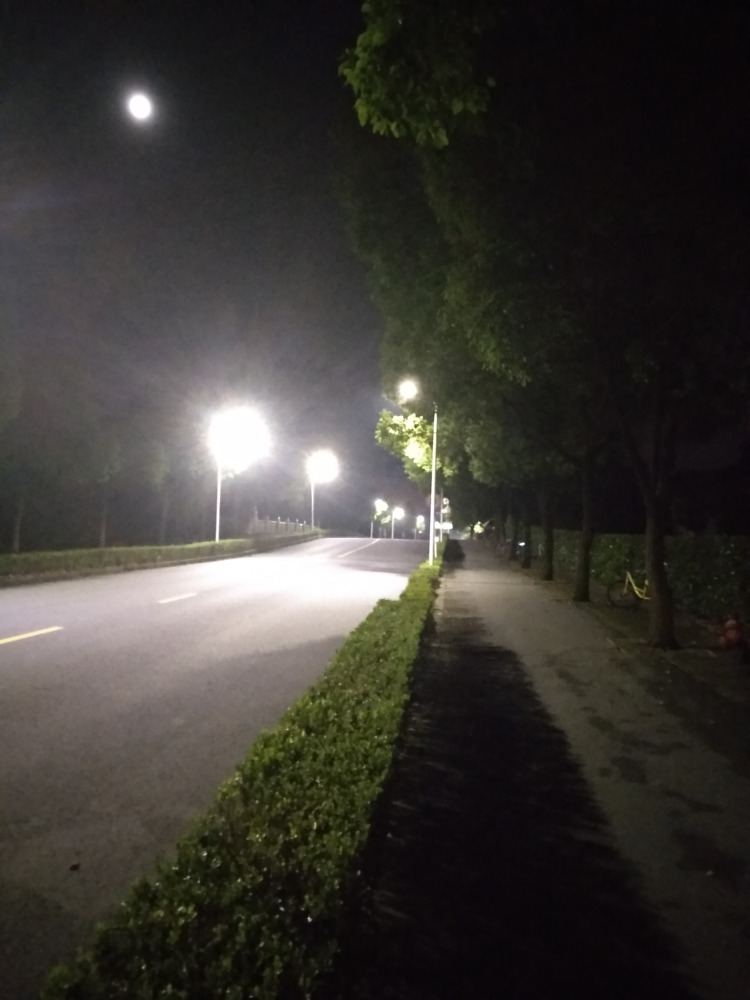

# 20180615 diary

小夕啊， 时间过的真快呢。 你想想， 是否还有那么多心愿未了呢。 还在纠结与徘徊中的爱情患得患失， 还是在渴望归宿的无由里左左右右。

喘一口气， 叶的不悲不喜， 落在脚尖， 滴答有闻， 当我在夏天的虫鸣声中热泪盈眶， 那是想， 要是秋天来了， 该多好呢？ 泛黄的叶子点在发丝， 一阵风又撩起了我对少女的遐想。 夜无瑕， 月如玉。 身边的人愈渐优秀， 而我也在思忖过往得失。 人生的每个阶段， 都有欲知而不得的忧伤和坎坷， 小学如是， 中学如是， 高中如是， 大学如是， 现在如是...... 在你看的见的地方， 还有看不见的地方， 都有无数的差距， 而差距之间， 是你应收的不平等。 这一切， 可能， 而又理所当然。 可笑的是， 我们总在自己的世界里怡然自得并沾沾自喜。 夕啊， 何时能解脱， 乃至超脱， 这其中有多么一个大的回环啊。   如果有一天， 你真的只剩一个人了， 不要害怕孤单或者黑夜。 选好一个方向， 择爱前行。

2018.09.22   小雨

夕若幽兰   

