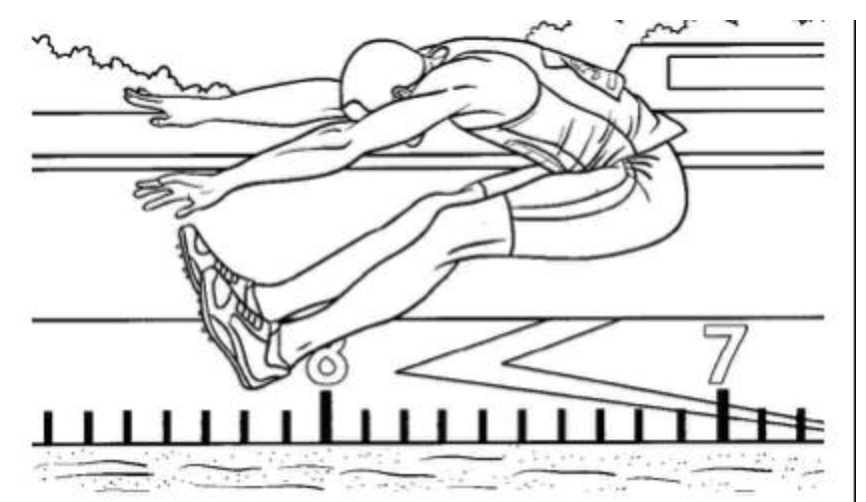
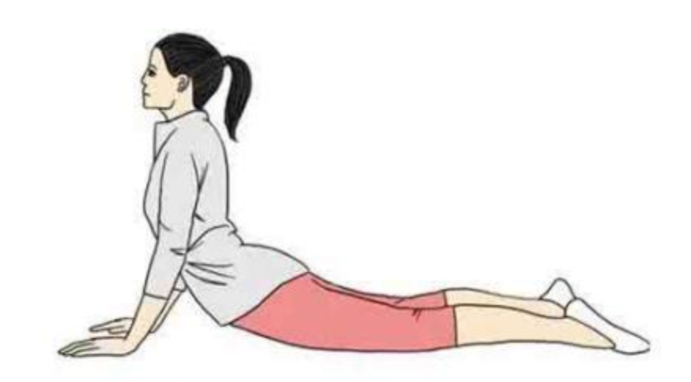
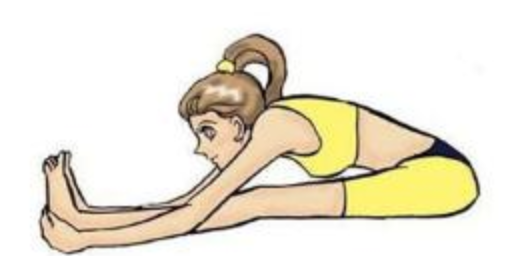
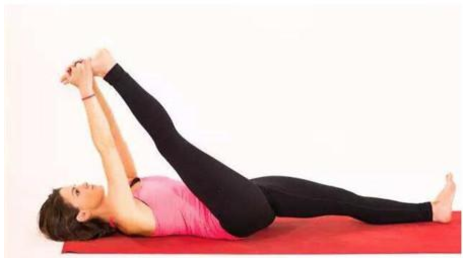
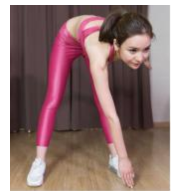
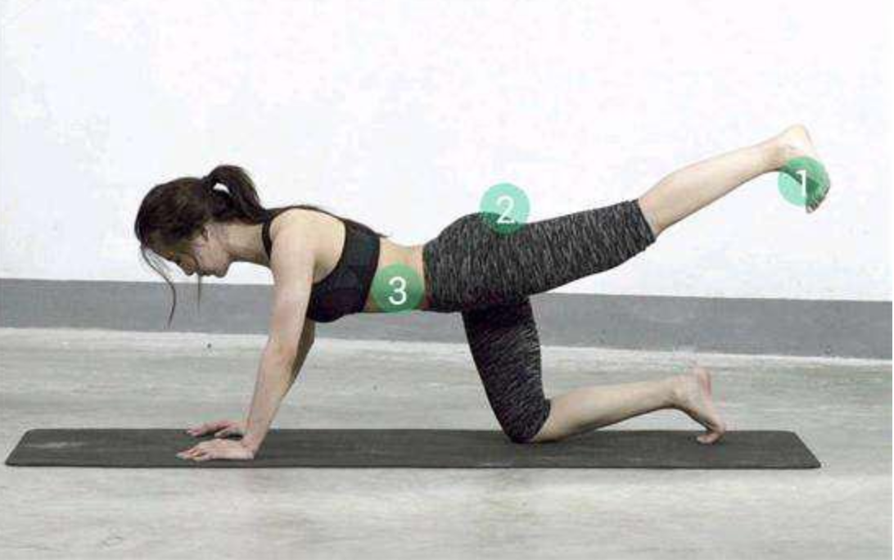
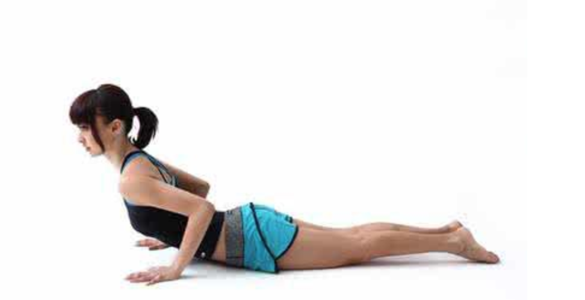

# 长高常见的几种运动

细则：

- **多运动，多喝水**

- **坚持**是能否长高的前提

- 午睡不要超过30分钟
- 营养：每天要喝牛奶

最后一句忠言： **贵有恒，何必三更起五更眠； 最无益， 只怕一日曝十日寒；**

 

## 注意事项

- 1） 保证充足是睡眠， 每天晚上8小时；
- 2） 最好是好的牛奶， 还要足够的日照，获取维生素D。 可以喝国外的全脂奶粉， 在新西兰或者欧洲，澳洲奶源；
- 3） 运动，打球和摸高；

 

## 悬垂、悬挂：拉伸骨骼

悬挂：拉伸骨骼

小区健身器材和学校运动场都会有双杠。练习的时候，==双手紧握单杠，使身体自然悬空下垂==，然后做==引体向上动作==。==男孩每天可做10次左右==。女孩每天可做5次左右。

需要注意的是，引体==向上时记得呼气，慢慢下降时吸气==。练习==做完后，要多走动走动，手臂多甩动甩动==，让肌肉得到放松。儿童做此项运动时，最好在父母的帮助下进行。

全身放松，==双手正握杠，脚离地面，双腿自然下垂，吊悬20~30秒后，休息30秒再做，如此坚持20分钟。==

**忌：举重、举哑铃等压迫性的运动**，不但达不到长高效果，反而会伤害你。

 

## 跳跃运动：牵伸韧带、刺激骨骺软骨

跳跃：拉伸四肢

跳跃是最有利于长高的方法，其中==原地跳跃、摸高（摸高：可以在家练习，最好是在墙上的高处画定一个标准，让自己尽量跳起的时候，手尽量达到最高点，这样来回做10次，期间可以休息几分钟。）、打篮球（扣篮、扣球、上下跳的动作）、排球、羽毛球==等动作都是相通的。做好跳跃运动，注意适度的量以及科学的方法很关键。

这些运动都是有助于拉伸脊柱，使人体脊柱骨的生长、能够牵伸肌肉、韧带，有刺激骨骺软骨生长的作用。

方法：双脚跳跃摸篮球架、天花板等时。要==尽量让身体处于最大程度的拉伸伸展状态==，如果参加篮球、排球和游泳运动，一定要==奋力跳跃==，让身体做到充分的舒展。

 

## 牵引法：物理拉伸四肢骨骼

提到牵引，很多人都比较害怕，这种方法比较的残酷，很多人都不能坚持下来。生活中，最常见的牵引法就是脊柱牵引。

方法1：平躺在床上，固定好身体，让==双腿在床边自由下垂，同时在双脚上绑上一斤的物体==，静躺在床上，==坚持20分钟==，这样的物理牵引==可以拉骨骼==，同时能缓解腰、颈肌肉的疲劳。

方法2：就是借助==牵引器材，固定好头部、身体、四肢，来矫正脊柱，同时拉伸四肢==，达到使骨骼最大限度的生长。但是这种方法比较痛苦，很多人无法坚持。

 

## 躺着拉伸

拉伸运动从物理角度来说，就是使人体脊柱、四肢骨骼都得到充分的舒展，目的是让骨骼间隙和骨间组织能最大限度的得到发挥。通过后天坚持练习拉伸运动后，骨间组织厚度变宽，骨骼间有更多的空隙，身高自然也就长高2-5厘米。

拉伸运动有很多，比如：==瑜伽、拉伸操==等，其中最方便的拉伸运动就==拉伸四肢==，例如==摸脚趾==**(躺下，让双手最大限度的去摸脚)，**这样的运动，每天早晚在家就可以做，如果你的柔软性不是很好，前期最好不要用力过猛，做到最大限度就好，循序渐进，以免拉伸自己。

 

## 游泳

游泳：也是一种比较有效的拉伸运动，游泳可以拉伸全身，关键是可以拉伸四肢和后背，尤其是==蛙泳（充分地伸手、蹬腿）和自由泳==。如果动作标准的话，长期坚持可以达到理想的效果。夏天到了，游泳不仅可以帮助长高，还能消暑。

 

## 立定或助跑跳远

起跳前，做好准备工作，尽量先放松四肢，跳时==踏跳要有力，在空中两臂上伸==，充分展体，落下时前脚撑先着地，屈膝缓冲，一定要在地面软的地方训练，以免着陆后山伤到自己。

 

## 5 个简单方法

### 静坐拉伸之拉腰背

在拉伸前，建议最好先做2分钟的热身运动，避免在拉伸的过程中伤害到韧带。此方法是：静坐床或垫子上，双腿打直，身体前倾包住双脚，用手去抓脚后跟，头看前方。如果韧带不好的，最好先慢慢做，不要用力过猛。拉伸过程中渐渐加大力度，==一旦觉得到拉力，就停顿10至15秒==，不要超越20至30秒或者更长时间。

 

### 拉伸腿部

此方法需要躺在垫子上，抬起一条腿，手尽量去握住脚趾，同时抬起的==腿务必打直==，另一条腿也要==与地面平行==，此动作==坚持20秒，然后换另一条腿，如此进行10次为一组==。此方法主要是通过拉伸腿部的肌肉及韧带来帮助塑形，拉伸下肢骨骼，如果正处于青春期发育阶段的朋友，还能==帮助增长2-4厘米==。

 

### 摆臂伸展

此项运动跟我们平时做的摆臂运动有相似之处，其主要的目的是==运动上肢，让上肢及脊柱==得到很好的舒展，增加柔韧性。方法是：==两脚分开，两腿伸直==，然后==右手触左脚，左手触右脚==的形式交替摆臂转体，操作的时候需要注意的是==腿、手务必到位，不能弯曲==。

 

### 后伸踢腿

后踢腿的动作，主要是借助踢腿的锻炼让腿部的肌肉跟骨骼得到刺激，方法是：两手撑地，一个脚跪撑，保持90度的姿势，再用另一只脚向后方做伸腿动作，==踢的过程中务必是要用力，且速度要快==，然后左、右脚进行交换后踢完成动作，==每边做5次，坚持10分钟==。

 

### 卧床伸腰：伸直四肢

此项运动在==睡前==或==早上醒来==时，在床上就可以进行，主要是将四肢最大限度的伸展，已达到拉伸骨骼的目的，也就是我们常说的==伸懒腰==。操作过程中，要==使手和脚尽量向最远的地方引伸==，最大限度的达到拉伸效果。

长高的方法有很多，同时也不是所有的运动都能帮助长高，因此选择好的运动方法是长高的第一步，同时运动务必要有持之以恒的心态，这样才能保证运动的效果。

 

## 8大推荐

1.晨起慢跑5～7分钟后，做柔韧性和放松练习20分钟，包括做==劈腿、前后弯腰、摇动抖动身体==等动作。

2.在单杠上悬垂(每次20～30秒)。可做无负荷悬垂，再做有负荷悬垂;做==正向手握悬垂==，也做倒挂悬垂(双脚用绷带固定)。

3.跳起摸高。==双脚跳起、单脚跳起==轮流做。每次练习应当尽力去做，争取==每次跳得尽可能更高些==。

4.登==20～30米高小坡或楼梯，上时放松，下时加足速度下，重复2～4次==。

5.请两人协助，一人握住双手，另一人抓住双脚，同时==向相反方向轻轻牵拉身体==，每次20秒。

6.游泳。父母扶着孩子，在水中运动。

7.打篮球，打排球。

8.跳跃。==每天跳跃，自我练习，由少到多，可早晚均做，每天跳跃200次以上==。

