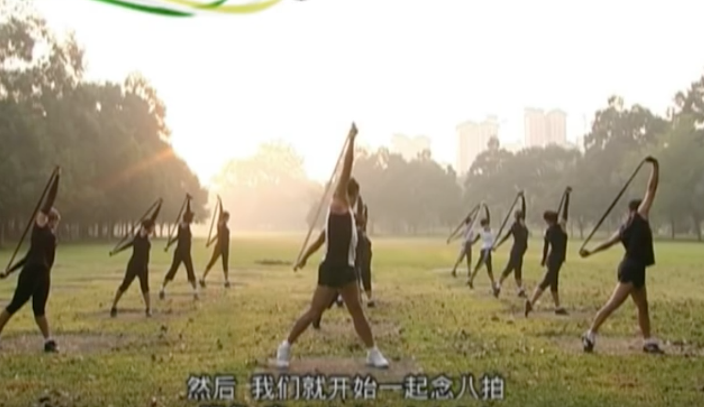
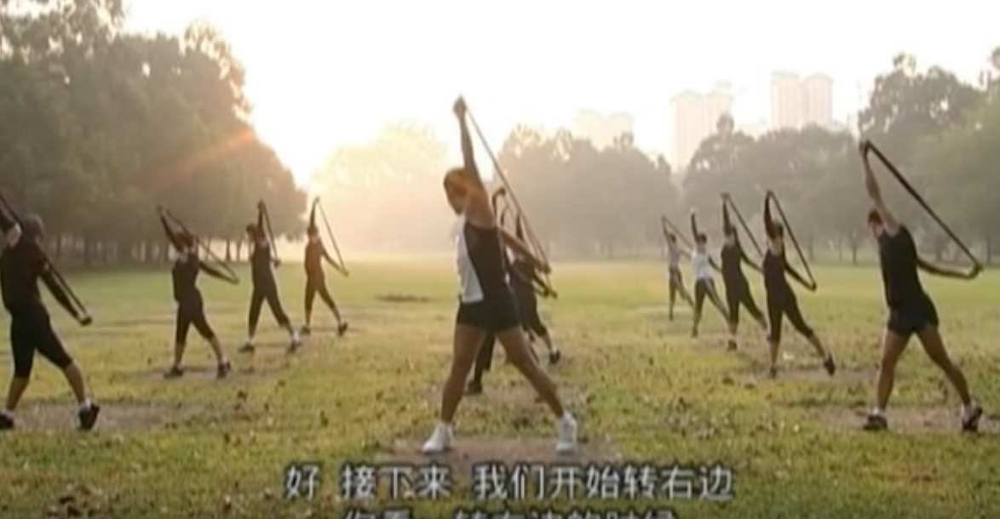
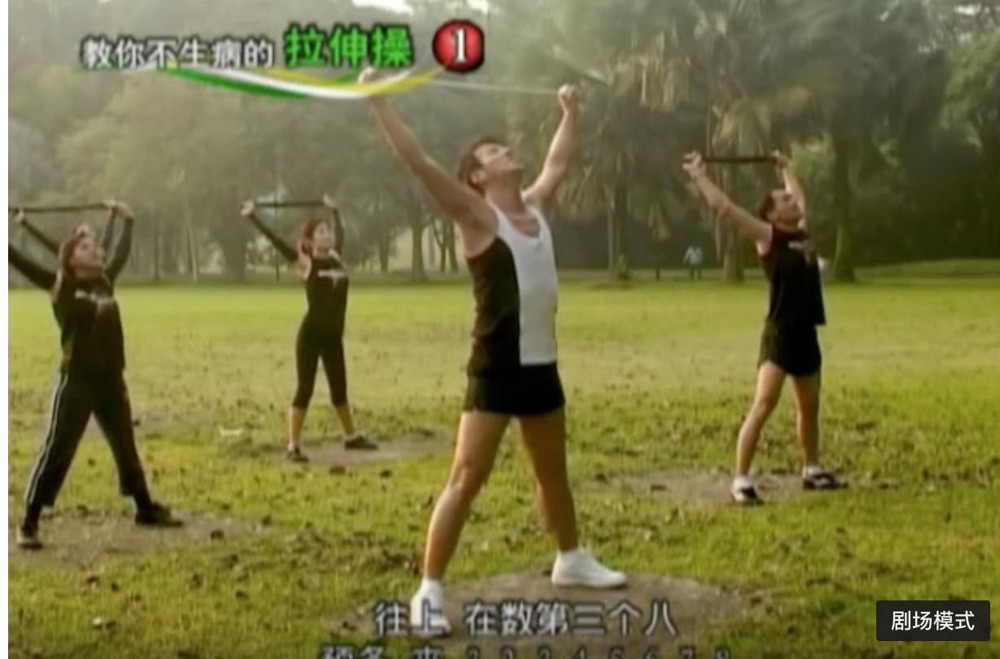
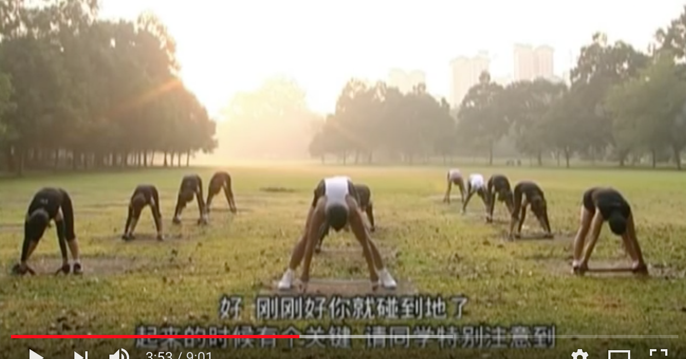
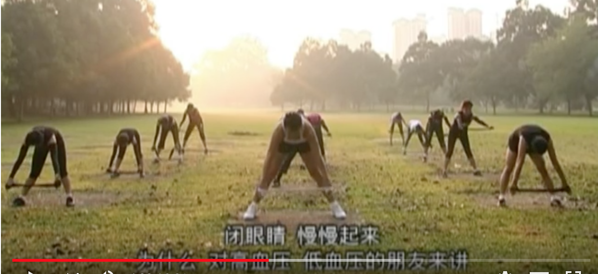
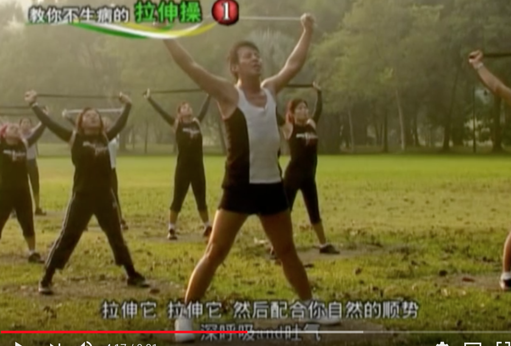
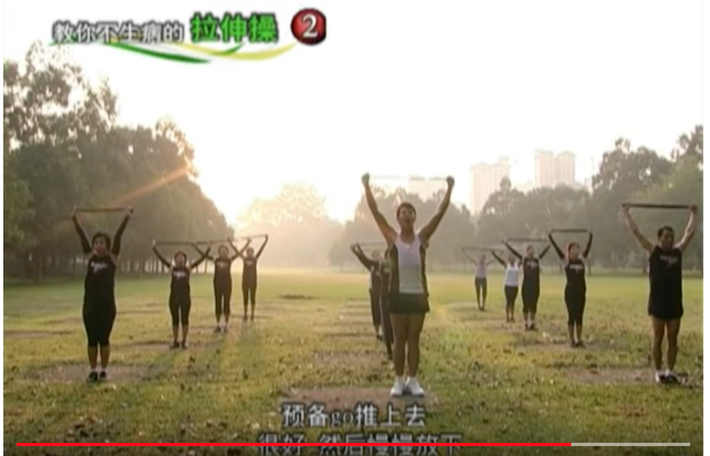
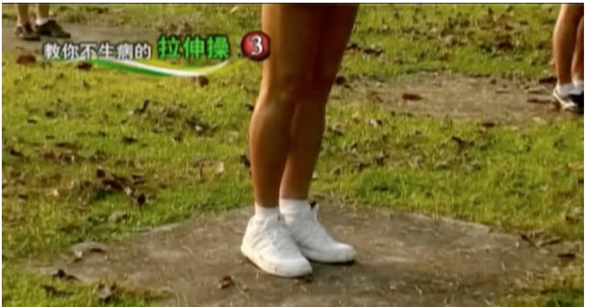

# 拉伸操

- 1） 第一步，找一块破布， 然后左旋转拉伸；念8拍

- 2） 同样8拍转右边

- 3） 向上，尽可能往后仰， 第三个八拍；

- 4） 身体从后往前倾，先握拳，待身体与水平线持平时， 虎口张开（先握拳再虎口张开，对老年人特别有用）， 最后双手碰到地。

- 5） 闭眼睛，慢慢起来， 手的顺序和下来时相反， 先是手掌张开， 慢慢身体到水平线， 握拳，起来。

- 6） 闭上眼， 慢慢起来， 向上拉伸它，深呼吸，吐气。

拉的时候，是多么的舒服，多么的快乐呀。

然后连续的快速做一遍： 先左，转右； 再转上，然后转下； 再转上；

5） 6） 需要重复做4遍；

- 7） 右腿往左腿并拢

- 8） 为了锻炼小腿和膝盖， 腿是踮起脚尖的，然后慢慢下蹲（踮起脚后跟不变）， 蹲下的时候，手往后， 保持重心， 收小腹；

- 9） 再慢慢起来，完成一个回合（手往后，保持重心）；

8）和9） 重复3遍；

- 10） 最后手放下的时候， 一定要注意是先握拳，待到双手与水平线持平， 张开虎口。

