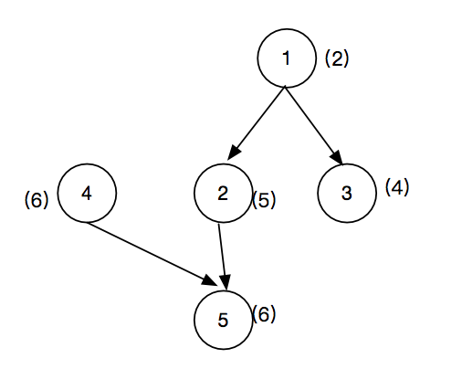

# 001 系统中依赖最长的一条路径

## 链接和考点

| 阿里编程测试 |                      |
| ------------ | -------------------- |
| 考点         | 多叉树，路径数，遍历 |
| 难度         | Medium               |

<br>

## 题意

已知一些系统， 每个系统有各自的运行时间， 各个系统之间可能存在依赖关系。 求系统间的路径数，和最长的一条路径是多少。

**示例：**

```
5 4	// 输入5 个系统， 4 个依赖边
2	// 系统 1 的运行时间
5	// 系统 2 的运行时间
4	// 系统 3 的运行时间
6	// 系统 4 的运行时间
6	// 系统 5 的运行时间
1 2	// 1->2 有一条边
1 3	// 1->3 有一条边
2 5	// 2->5 有一条边
4 5	// 4->5 有一条边
```

输出：

```
13 3 // 最长的一条边是13， 路径数是3
```

有三条路径: `1->2->5` , 值是13； 第二条路径是 `1->3`, 值是6； 第三条路径是 `4->5`, 值是12；

<br>

## 分析

这是一个多叉数的问题：



建立好多叉树以后， 找到根节点（在添加依赖的时候，如果该节点被添加到另一个节点的分支上时，那么该节点肯定不是根节点）。

找到根节点后， 开始向下遍历。记录路径数和最长的路径。

注意回溯法的使用。

<br>

## 参考答案

时间复杂度： O(n)

空间复杂度：O(n)

```cpp
#include "GlobalHead.h"
#include <map>
using namespace std;

struct  TreeNode{
    int val;
    int time;
    vector<TreeNode *> next;
    TreeNode(int val, int time ): val(val), time(time){}
};


void traverse(TreeNode *root, int& res, int& curLen, int& paths ){
    if(root -> next.size() == 0){
        paths++;
        res  = (res < curLen) ? curLen:res;
        return;
    }

    for(int i=0; i < root -> next.size(); i++){
        curLen += root->next[i] -> time;
        traverse(root->next[i],  res, curLen, paths );
        curLen -= root->next[i] -> time;
    }
}

int main() {
    int systems, yilai;
    cin >> systems;
    cin >> yilai;

    vector<TreeNode> time;
    for(int i = 0; i< systems; i ++){
        int ti;
        cin >> ti;
        TreeNode nn(i, ti);
        time.push_back(nn);
    }


    for(int i=0; i< yilai; i++){
        int one, two;
        cin >> one;
        cin >> two;
        time[one-1].next.push_back(&time[two-1]);
    }

    vector<bool> vec(systems, false);
    for(int i=0; i < systems; i++){
          for(int j=0; j < time[i].next.size(); j++){
              vec[time[i].next[j]->val] = true;
          }
    }

    vector<int> only;
    for( int i=0; i< vec.size(); i++ ){
        if (vec[i] == false)
            only.push_back(i);
    }

    int res = 0;
    int paths = 0;
    for (int i = 0; i < only.size(); i++){

        TreeNode& head = time[only[i]];
        int curLen = head.time;
        traverse(&head, res, curLen, paths );
    }

    cout << res << "\t" << paths << endl;

    return 0;
}


/* input
5 4
2
5
4
6
6
1 2
1 3
2 5
4 5
 */

/* output
5 4
2
5
4
6
6
1 2
1 3
2 5
4 5
13	3

*/
```

更新版通过率只有66% 我就郁闷了。。。