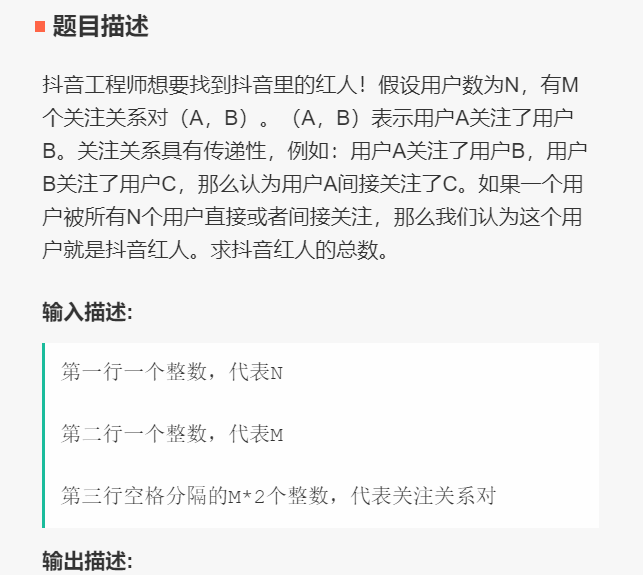
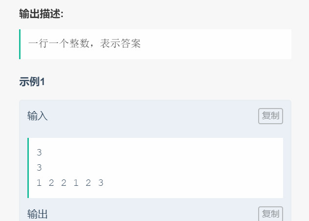
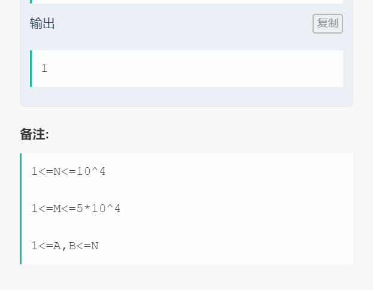

# 006 障碍物棋盘游戏

## 链接和考点

| 栏目             | 详细              |
| ---------------- | ----------------- |
| 今日头条编程测试 | 2018.09.09        |
| 考点             | 矩阵，字符串，map |
| 难度             | Hard              |

<br>

## 题意







<br>

## 分析

1- N 表示有N个人， 要被所有用户关注，也就是除了自己之外， 最长边的节点有N-1个；

2- N 和M值都比较大， 用 dfs  肯定是不够的。所以用栈实现dfs；


<br>

## 测试

这个A了？。 事后补充的。

<br>

## 参考答案

<br>

```cpp
#include <iostream>
#include <vector>
#include <map>
using namespace std;

// 处理带障碍物 x 的列
void process( vector<vector<char>> & mat, int col, int start, int end){
    int circle = 0;
    for( int i = start; i < end; i ++){
        if( mat[i][col] == 'o' )
            circle++;
    }

    for( int i = start; i < end; i ++){
        if(i < end-circle)
            mat[i][col] = '.';
        else
            mat[i][col] = 'o';
    }

}

// 处理没有障碍物的列
void processNoX( vector<vector<char>> & mat, int col, int start, int end){
    for( int i = start; i < end; i ++){
        mat[i][col] = '.';
    }
}

int main() {
    int row, col;
    cin >> row;
    cin >> col;
    map<int, vector<int>> zhangai;
    vector<vector<char>> mat(row, vector<char>(col));//这里，两个“>”间的空格是不可少的;

    for( int i = 0; i < row; i ++ )
        for( int j=0; j < col; j++ ){
            char tmp;
            cin >> tmp;
            mat[i][j] = tmp;
            if( tmp == 'x' ){
                if( zhangai.find(j) == zhangai.end() ){
                    vector<int> tmp;
                    tmp.push_back(i);
                    zhangai[j] = tmp;
                }
                else{
                    zhangai[j].push_back(i);
                }
            }
        }

    int startCol = 0;
    int curCol = 0;
    for(auto it = zhangai.begin(); it!=zhangai.end(); it++){
        vector<int>& currColx = it->second;
        curCol = it -> first;
        
        // 处理刚开始非障碍物的列
        for(int i=startCol; i < curCol; i ++){
            processNoX( mat, i, 0, row);
        }
        startCol = curCol+1;        // 更新下一次开始的列
        
        // 处理带障碍物的列，假设该列有多个障碍物 x
        int start = 0;
        for( int t = 0; t < currColx.size(); t++ ){
            process(mat, curCol, start, currColx[t]);
            start = currColx[t] + 1;
        }
        
        // 处理该列剩下可能不带障碍物的
        if( currColx[currColx.size()-1] != (row-1)){
            processNoX( mat, curCol, start, row);
        }
    }
    
    // 处理障碍物后面可能还有不带障碍物的列
    for(int i=startCol; i < col; i ++){
        processNoX( mat, i, 0, row);
    }

    // 输出结果
    for(int i=0; i < row; i++){
        for(int j=0; j< col; j++)
            cout << mat[i][j];
        cout<<endl;
    }


    return 0;
}
```

