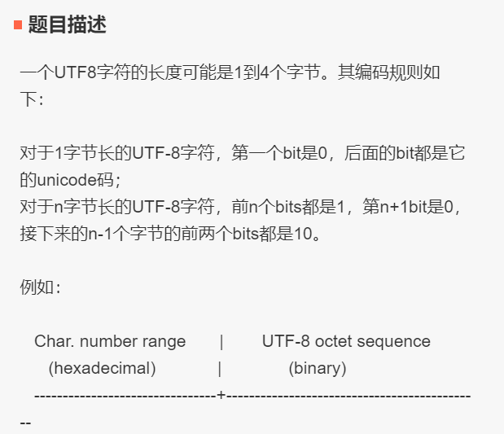
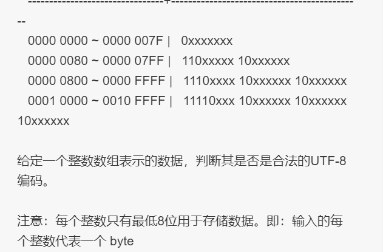
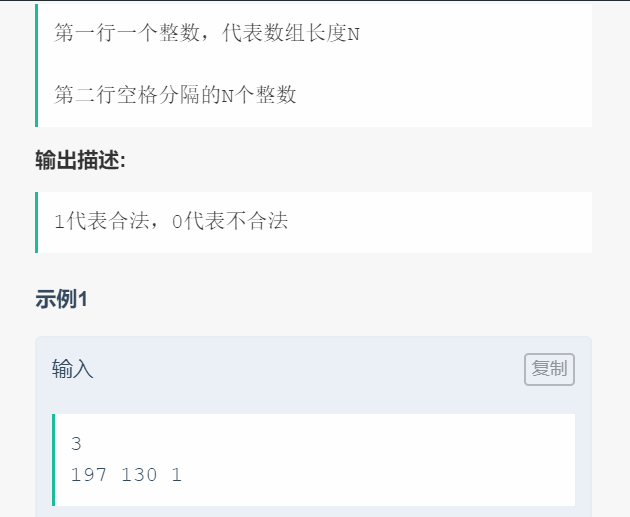
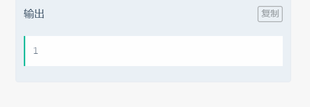

# 008 判断是否是utf8编码

## 链接和考点

| 栏目             | 详细         |
| ---------------- | ------------ |
| 今日头条编程测试 | 2018.09.09   |
| 考点             | char, binary |
| 难度             | Medi         |

<br>

## 题意









上面的示例有错误， 后来更正如下：

**示例1**

```cpp
2
197 130
```

输出：

```cpp
1
```

**示例2**

```cpp
3
235 140 44
```

输出：

```cpp
0
```

<br>

## 分析

1- 这个题目不太完整， utf-8 可能是1~6字节的， [参考](https://www.cnblogs.com/jiu0821/p/6371544.html)

>UTF8是以8bits即1Bytes为编码的最基本单位，当然也可以有基于16bits和32bits的形式，分别称为UTF16和UTF32，但目前用得不多，而UTF8则被广泛应用在文件储存和网络传输中。
>　　编码原理
>　　先看这个模板：
>　　UCS-4 range (hex.) UTF-8 octet sequence (binary)
>　　0000 0000-0000 007F 0xxxxxxx
>　　0000 0080-0000 07FF 110xxxxx 10xxxxxx
>　　0000 0800-0000 FFFF 1110xxxx 10xxxxxx 10xxxxxx
>　　0001 0000-001F FFFF 11110xxx 10xxxxxx 10xxxxxx 10xxxxxx
>　　0020 0000-03FF FFFF 111110xx 10xxxxxx 10xxxxxx 10xxxxxx 10xxxxxx
>　　0400 0000-7FFF FFFF 1111110x 10xxxxxx ... 10xxxxxx
>　　编码步骤：
>　　1) 首先确定需要多少个8bits(octets)
>　　2) 按照上述模板填充每个octets的高位bits
>　　3) 把字符的bits填充至x中，字符顺序：低位→高位，UTF8顺序：最后一个octet的最末位x→第一个octet最高位x
>
>　　根据UTF8编码,最多可由6个字节组成,所以UTF8是1-6字节编码组成

2- 所以，找到规律，最高字节如果第一位不是0 个1， 就是ASCII 码， 只含有一个字节；

最高字节是2个1的， 表示有 2 个字节， 剩下的字节都是10 开头， 然后依次把数据填入 xxx;

…..

最高字节是6个1的， 表示有 6 个字节;


<br>

## 测试

这个A了？。 事后补充的。

<br>

## 参考答案

<br>

```cpp
#include <iostream>
#include <unordered_map>
#include <vector>
//#include "GlobalHead.h"
#include <vector>
#include <string>
//#include <lcms.h>
typedef unsigned long DWORD;

using namespace std;


int IsTextUTF8(unsigned char * str,long length)
{
    int i;
    DWORD nBytes=0;             // UFT8可用1-6个字节编码,ASCII用一个字节
    unsigned char chr;
    bool bAllAscii= true;       // 如果全部都是ASCII, 说明不是UTF-8
    for(i=0;i<length;i++)
    {
        chr= *(str+i);
        if( (chr&0x80) != 0 )   // 判断是否ASCII编码,如果不是,说明有可能是UTF-8,ASCII用7位编码,但用一个字节存,最高位标记为0,o0xxxxxxx
            bAllAscii= false;
        if(nBytes==0){          // 如果不是ASCII码,应该是多字节符,计算字节数
            if(chr>=0x80){
                if(chr>=0xFC&&chr<=0xFD)
                    nBytes=6;
                else if(chr>=0xF8)
                    nBytes=5;
                else if(chr>=0xF0)
                    nBytes=4;
                else if(chr>=0xE0)
                    nBytes=3;
                else if(chr>=0xC0)
                    nBytes=2;
                else{
                    return false;
                }
                nBytes--;
            }
        }
        else{                   //多字节符的非首字节,应为 10xxxxxx
            if( (chr&0xC0) != 0x80 )
                return false;

            nBytes--;
        }
    }

    if( nBytes > 0 )            //违返规则
        return false;

    if( bAllAscii )             //如果全部都是ASCII, 说明不是UTF-8
        return false;

    return true;
}


int main() {
    int M;
    cin >> M;
    unsigned char str[M];
    for( int i=0; i< M ; i++ ){
        int tmp;
        cin >> tmp;
        str[i] = (unsigned char)tmp;
    }

    cout << IsTextUTF8(str, M) << endl;

    return 0;
}
/*output:
3
235 140 44
 
0
*/
```

