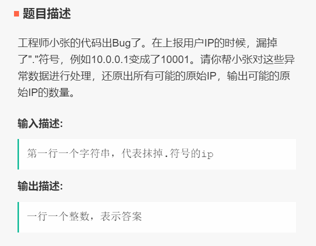

# 009 可能ip的数量

## 链接和考点

| 栏目             | 详细        |
| ---------------- | ----------- |
| 今日头条编程测试 | 2018.09.09  |
| 考点             | dfs, string |
| 难度             | Medi        |

<br>

## 题意




<br>

## 分析 

1- 先简答的认为， ip 有4个字段，每个字段最少一个字符， 最多三个字符。 而且要判断三个字符的数是否在0~255 之间。

这种复杂度不会太高，因为每个字段可以选`{1, 2, 3}` 位等情形	， 每个字段3种选择， 遍历数最多是 $ 3 * 3 * 3 * 3 = 81$ 次，可以接受。

<br>

## 测试

这个A了 70%， 暂时不知道为什么， 猜测可能和ip的格式有关。

<br>

## 参考答案

<br>

```cpp
#include <iostream>
#include <unordered_map>
#include <vector>
//#include "GlobalHead.h"
#include <vector>
#include <string>
using namespace std;


void process(string str, int & cnt, int start, int & stage){
    if(!(start < str.size() ))		// 如果因为字符串太短， 直接导致后面字段上的值不够， 那么直接返回
        return;

    if( stage == 4 ){				// 已经到了第四个字段， 检验剩下的是否合格
        string cur = str.substr(start, str.size() - start);
        int num = stoi(cur);
        if( ( num >=0 && num <= 255 )){
            cnt ++;
            return;
        }else{
            return;
        }

    }

    for( int i =  start; i < start+3 && i < str.size() ; i++ ){
        string cur = str.substr(start, i - start + 1);
        int num = stoi(cur);
        if( !( num >=0 && num <= 255 ))		// 如果当前不满足，直接中断， 剪枝
            continue;
        else{
            stage++;
            process(str, cnt, i+1, stage);
            stage--;
        }

    }
}


int main() {
    string M;
    cin >> M;

    int stage = 1;				// 刚开始处理第一个字段
    int cnt  = 0;				// 记录可行的ip数
    process(M, cnt, 0, stage);
    cout << cnt << endl;
    return 0;
}
/*output:
18888

4
*/
```

