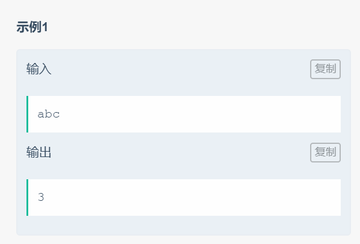

# 010 无重复字符的最长子串

## 链接和考点

| 栏目             | 详细             |
| ---------------- | ---------------- |
| 今日头条编程测试 | 2018.09.09       |
| 考点             | string， hashmap |
| 难度             | Medi             |

<br>

## 题意





<br>

## 分析 

1- 见LeetCode第三题。

<br>

## 测试

无

<br>

## 参考答案

<br>

```cpp
#include <iostream>
#include <unordered_map>
//#include <vector>
using namespace std;

/*
 reference: https://leetcode.com/problems/longest-substring-without-repeating-characters/discuss/1729/11-line-simple-Java-solution-O(n)-with-explanation
 */

template <typename T, typename  U>
void print_hash(unordered_map<T, U> hashmap){
    for( auto it = hashmap.begin(); it != hashmap.end(); it ++){
        std::cout << it->first << " : " << it -> second << std::endl;
    }
}

class Solution {
public:
    int lengthOfLongestSubstring(string s) {
        if(s.size() == 0)
            return 0;
        unordered_map<char, int> hashmap;
        int maxLen = 0;
        for( int i=0, j=0; i<s.size(); i++ ){
            if( hashmap.count(s[i]) > 0 ){
                j = max(j, hashmap[s[i]] + 1);           // 2- 出现第一个重复的字母，就将左指针往右移1
                hashmap.erase(s[i]);                     // 3- 要向插入重复的，必选先删除之前的，否则插不进去
            }

            hashmap.insert(std::make_pair(s[i],i) );     // 1- 将不重复的元素存到hashmap
//            hashmap[s[i]] = i;
            maxLen = max(maxLen, i - j + 1);
//            print_hash(hashmap);
        }
        return maxLen;
    }
};


int main() {
    string s1;
    cin >> s1;


//    cout << Solution().lengthOfLongestSubstring(s1) << std::endl;
//    cout << Solution().lengthOfLongestSubstring(s2) << std::endl;
//    cout << Solution().lengthOfLongestSubstring(s3) << std::endl;
    cout << Solution().lengthOfLongestSubstring(s1) << std::endl;

//    std::cout<<"Hello, World!"<<std::endl;
    return 0;
}
/*output:
a : 0

a : 0
b : 1

a : 0
b : 2

b : 2
a : 3

3
*/
```

