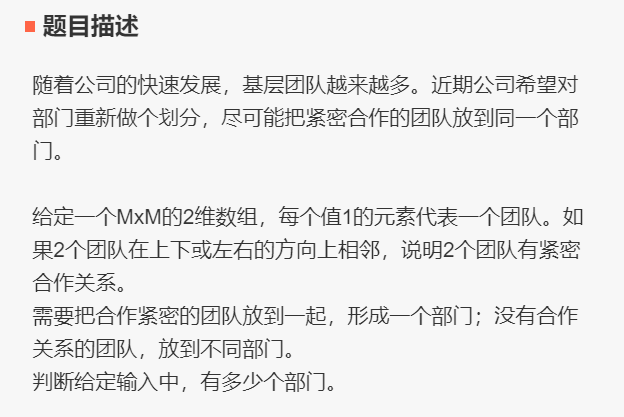

# 011 矩阵连续1的个数

## 链接和考点

| 栏目             | 详细          |
| ---------------- | ------------- |
| 今日头条编程测试 | 2018.09.09    |
| 考点             | vector2D, dfs |
| 难度             | Medi          |

<br>

## 题意




<br>

## 分析 

1- 这个就是找到1后，然后用dfs将周围的1都置0；

2- 在dfs 函数中必须置0， 要不然会上下左右 来回跳；

很经典， 上次郜佳俊依图现场写代码就是这个题；

<br>

## 测试

A了80%， 不知是什么原因。

<br>

## 参考答案

<br>

```cpp
#include <iostream>
#include <unordered_map>
#include <vector>
//#include "GlobalHead.h"
#include <vector>
using namespace std;

void dfs(vector<vector<int>>& in, int row, int col){
    if( in[row][col] ){
        in[row][col] = 0;
        if( row - 1 >=0 && in[row-1][col] ) // up
            dfs(in,  row-1, col);

        if( row + 1 < in.size() && in[row+1][col] ) // down
            dfs(in,  row + 1, col);

        if( col - 1 >=0  && in[row][col-1] ) // left
            dfs(in,  row , col-1);

        if( col + 1 < in[0].size()  && in[row][col+1] ) // right
            dfs(in,  row , col+1);
    }
}


void process( vector<vector<int>>& in, int & count){
    for( int i = 0; i < in.size(); i++ )
        for( int j=0; j< in[0].size() ; j++ ){
            if(in[i][j]){
                count++;
                dfs(in, i, j);
            }

        }
}


int main() {
    int M;
    cin >> M;

    vector<vector<int>> in;

    for(int i=0; i< M; i++){
        vector<int> tmp;
        for( int j=0; j < M; j++ ){
            int ttt;
            cin >> ttt;
            tmp.push_back(ttt);
        }
        in.push_back(tmp);
    }

//    general::print_Vec2D(in);

    int count = 0;
    process(in, count);
    cout << count << endl;

    return 0;
}
/*output:
4
1 0 0 0
0 0 0 0
0 0 0 1
0 0 0 0

5
1 0 0 1 1
1 0 0 1 1
0 0 1 0 0 
0 0 1 0 0 
0 0 1 0 0 
*/
```

