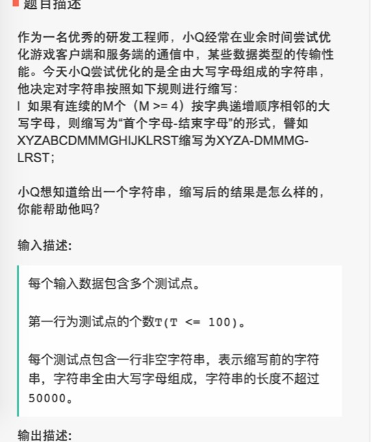
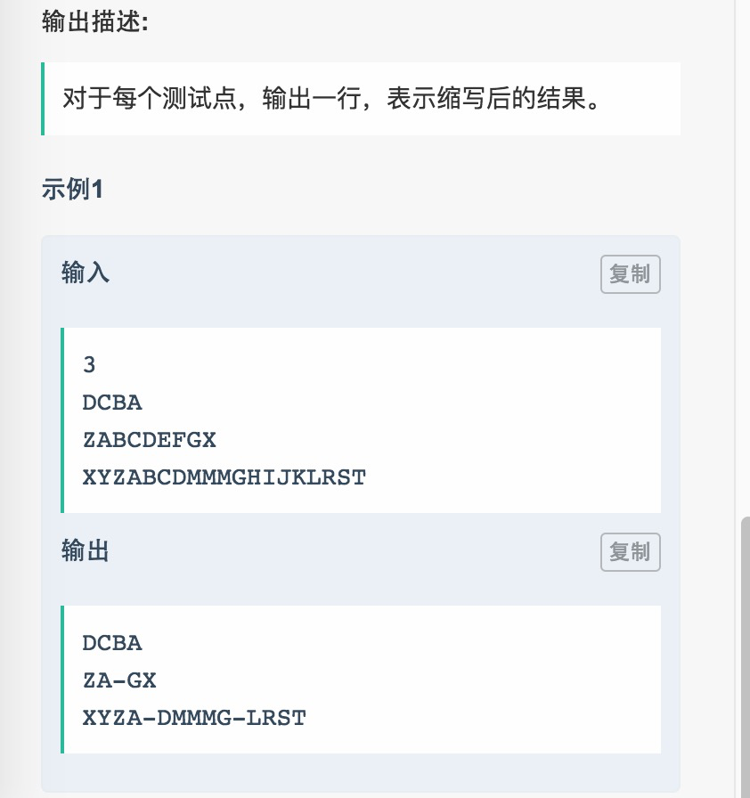

# 012 字符串缩写

## 链接和考点

| 栏目             | 详细       |
| ---------------- | ---------- |
| 网易互娱编程测试 | 2018.09.08 |
| 考点             | string     |
| 难度             | Easy       |

<br>

## 题意






<br>

## 分析 

1- 找连续>=4 个字符的串，用缩写；

<br>

## 测试

A了100%。

<br>

## 参考答案

<br>

```cpp
#include <iostream>
#include <vector>
#include <map>
#include <stack>
#include <algorithm>
using namespace std;

string process(string in){
    int i=0;
    int start = 0;
    string res;
    int ff;
    while(i < in.size()){
        ff = i;
        while( ((i+1) < in.size()) && in[i+1] == (in[i]+1) ){
            i++;
        }
        if( i - ff + 1 >= 4){
            res+= in.substr(start, ff - start + 1) + "-";
            start = i;
        }

        i++;
    }
    res+= in.substr(start, i - start);
    cout << res << endl;
    return res;
}

int main() {
    int N;
    cin >> N;
    vector<string> in;
    for( int i=0; i< N; i++ ){
        string tmp;
        cin>>tmp;
        in.push_back(tmp);
        process(tmp);
    }
     return 0;
}
```

