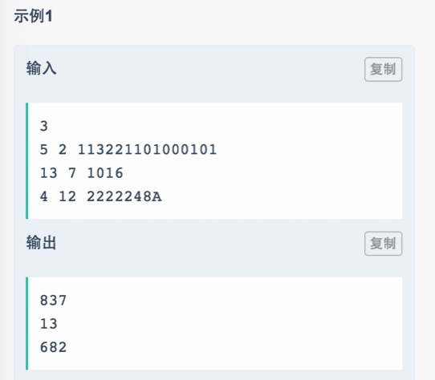

# 013 多进制数混在一起还原

## 链接和考点

| 栏目             | 详细          |
| ---------------- | ------------- |
| 网易互娱编程测试 | 2018.09.08    |
| 考点             | string， 进制 |
| 难度             | Easy          |

<br>

## 题意





<br>

## 分析 

1- 暴力， 依次从第一位开始划分，将字符串划分成左半部分和右半部分。 

然后，按照给定进制进行求值， 如果值相等， 就能输出了。

<br>

## 测试

A了100%。

<br>

## 参考答案

<br>

```cpp
//哈希函数 H(k)=3*k MOD length
#pragma warning(disable:4996)
#include<stdio.h>  
#include<string.h>  
#include<iostream>
#include<functional>
#include<queue>
#include<set>
#include<string>
#include<unordered_map>
#include<map>
#include<array>
#include<algorithm>
#include<stack>
using namespace std;
int table[] = { 0,1,2,3,4,5,6,7,8,9,10,11,12,13,14,15 };
long long int GetNum(const char* dt, int l,int r, int jz)
{
 long long int ans = 0;
 for(int i = l; i <= r; ++i)
 {
  int temp = 0;
  if(dt[i] >='A' && dt[i] <= 'F')
  {
    temp = table[dt[i] - 'A' + 10];
  }
  else
  {
   temp = table[dt[i] - '0'];
  }
  if (temp >= jz) return -1;
  ans *= jz;
  ans += temp;
 }
 return ans;
}
char dt[1000];
int main()
{
 int t, x, y;
 cin >> t;
 while(t--)
 {
  cin >> x >> y >> dt;
  int len = strlen(dt);
  for(int i = 0; i < len-1; ++i)
  {
   long long a = GetNum(dt, 0, i, x);
   long long b = GetNum(dt, i + 1, len - 1, y);
   if(a == b)
   {
    cout << a << endl;
    break;
   }
  }
 }
}
```

