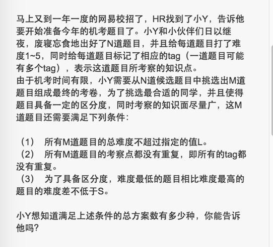
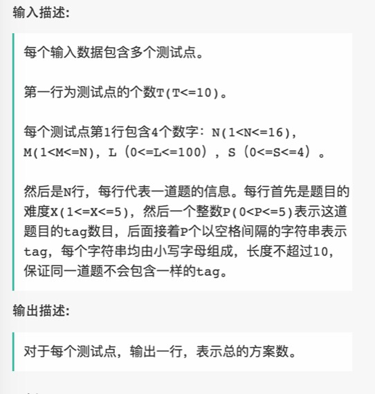

# 014 找出满足一定条件的机考题目

## 链接和考点

| 栏目             | 详细        |
| ---------------- | ----------- |
| 网易互娱编程测试 | 2018.09.08  |
| 考点             | dfs, struct |
| 难度             | Hard        |

<br>

## 题意






<br>

## 分析 

1- 会让选M道题目，那就先选，然后按照条件剪枝， 和阿里的那道题目很像。

<br>

## 测试

A了100%。

<br>

## 参考答案

<br>

```cpp
//#include "GlobalHead.h"
#include <iostream>
#include <vector>
#include <map>
#include <stack>
#include <algorithm>
#include <unordered_map>

#include <sstream>

using namespace std;
struct Node{
    int nandu;
    int tags_num;
    unordered_map<string, string> tags;
};

bool Cmp(const Node &a, const Node &b)            //const必须加，不然会错，目前不懂为啥。当return的是ture时，a先输出，所以示例中是升序
{
    return a.nandu < b.nandu;
}

bool check_tags_andNandu(vector<Node> path, int L){
    bool flag = true;
    bool flag_nandusum = true;
    unordered_map<string, string> tmp;
    int cnt = 0;

    int sum_nandu = 0;
    for( int i=0; i< path.size(); i++ ){
        Node& me = path[i];
        sum_nandu += me.nandu;
        if( sum_nandu >L ){
            flag_nandusum = false;
            return false;
        }

        for( auto it = me.tags.begin(); it != me.tags.end(); it++ ){
            tmp[it->first] = it->second;	// 将所有标签添加进来
            cnt++;
        }
    }

    if( cnt != tmp.size() )
        flag = false;

    return  flag;
}


bool check_abs(vector<Node> path, int S){
    sort(path.begin(), path.end(), Cmp);
    if( path.size() == 0 )
        return  true;
    int tt =  abs(path[0].nandu-path[path.size()-1].nandu);
    return tt>= S;

}

void process(vector<Node>& timu, int start, vector<Node>& path, int& count, int  M, int L, int S){


    if( path.size() == M ){
        if(! check_tags_andNandu(path, L))
            return;

        if(! check_abs(path, S))
            return;
        count++;        // 种类数
        return;
    }


    for( int i = start; i < timu.size(); i++){
        path.push_back(timu[i]);
        process(timu, i+1, path,  count,  M,  L,  S);
        path.pop_back();
    }
}

int main() {
    int test;
    cin >> test;
    vector<int> res;

    //
    for( int kk=0; kk < test; kk++ ){
        int N, M, L, S;
        cin >> N;
        cin >> M;
        cin >> L;
        cin >> S;

        vector<Node> timu;
        for( int i=0; i< N; i++ ){
            Node tmp;
            cin >> tmp.nandu;
            cin >> tmp.tags_num;
            for( int j=0; j< tmp.tags_num; j++ ){
                string tt;
                cin >> tt;
                tmp.tags[tt] = tt;
            }
            timu.push_back(tmp);
        }

        vector<Node> path;
        int count = 0;
        int start = 0;
        process(timu,  start, path, count,   M,  L,  S);
//        res.push_back(count);
        cout << count << endl;
    }


     return 0;
}
```


吴登鹏写的python答案，据说通过了样例，未测试：

```python
import sys
def dfs(h, m, l, s, d, res, out, pos, zong_nandu, max_nandu, min_nandu):
    if len(out) == m and zong_nandu <= l and max_nandu - min_nandu >= s:
        res[0] += 1
        return
    for i in range(pos, len(h)):
        if len(out) < m and zong_nandu < l:
            for tag in h[i][1]:
                if tag in d:
                    return
                else:
                    d.add(tag)
            out.append(h[i])
            max_nandu = max(max_nandu, h[i][0])
            min_nandu = min(min_nandu, h[i][0])
            dfs(h, m, l, s, d, res, out, pos + 1, zong_nandu, max_nandu, min_nandu)
            for k in out[-1][-1]:
                d.remove(k)
            out.pop()
        else:
            return

if __name__ == '__main__':
    t = int(sys.stdin.readline().strip())
    for i in range(t):
        n,m,l,s = map(int, sys.stdin.readline().strip().split())
        h = []
        for j in range(n):
            tmp = sys.stdin.readline().strip().split()
            h.append((int(tmp[0]), tmp[2:]))
        d = set()
        res = [0]
        out = []
        dfs(h, m, l, s, d, res, out, 0, 0, 0, 6)
        print res[0]
```

