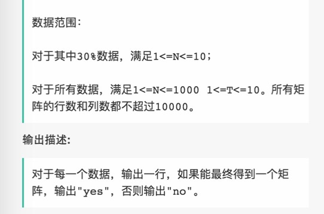
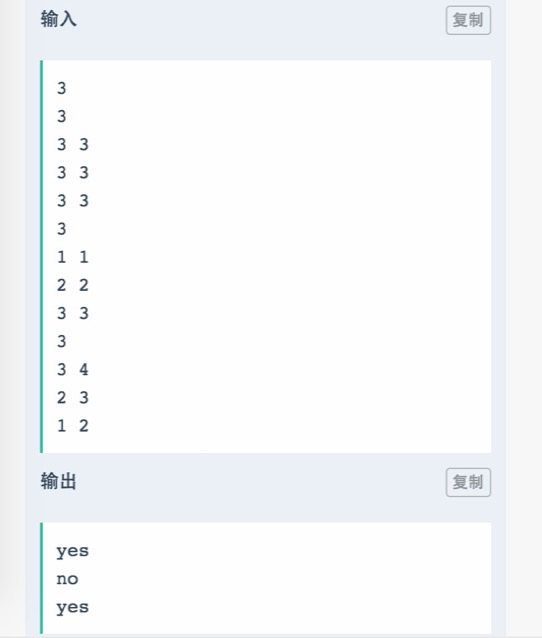
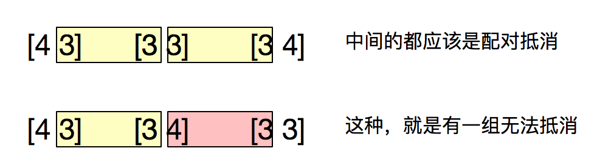

# 015 判断很多小矩阵能否相乘

## 链接和考点

| 栏目             | 详细          |
| ---------------- | ------------- |
| 网易互娱编程测试 | 2018.09.08    |
| 考点             | vector2D, dfs |
| 难度             | Easy          |

<br>

## 题意






<br>

## 分析 

1-  这个题我说一下我朋友的思路（陈星辰）， 

用两个multimap, 分别按照 row-col 和 col-row （最后一个没有存它的转置矩阵）来存， 然后，以multimap 是否为空进行while 循环， 从 row-col 中取出最后一个矩阵， 在col-row multimap  中找，看能否有与之相乘的矩阵， **找到第一个就擦除它**， 并在row-col 将最后一个矩阵擦除， 直到最后，如果全能找到配对的， 那么row-col 就为空，否则， 无法相乘。

提出两个问题：

- 1） 在两个multimap 中， 他在row-col 中存了矩阵A， 那么在col-row 中同时也存了矩阵 $A^T$, 除了最后一个，这里好像缺少数学证明他的可行性； 因为在找能与之相乘的矩阵时，$AA^T$  自己乘自己总是可行的。
- 2）在 “**找到第一个就擦除它**”， 这个好像忽略了顺序的差别， 如下 `[4 3] [3 4] [3 3 ]`, 这样就不能相乘。

```cpp
4X3

3X3
3X4
```

<br>

2- 首先， 将每个矩阵的信息按照 row-col 存到一个multimap 里面， 

我发现了一个规律， 即，能够影响结果的是第一个和最后一个矩阵， 而中间的矩阵，都应该按照一定条件抵消。



所以我们应该选 $A^2_2$ 选两组， 他们是有序的，即 一种是一个在前（另一个在后），一种是另一个在前（它在后）， 因为这样省略掉两个不配对的数（你可以认为，首尾两端的数和任意数配对）

<br>

## 测试

A了x

<br>

## 参考答案

同学写了一个排序算法，没什么道理：

```cpp
//哈希函数 H(k)=3*k MOD length
#pragma warning(disable:4996)	// 关闭vs的一些警告
#include<stdio.h>
#include<string.h>
#include<iostream>
#include<functional>
#include<queue>
#include<set>
#include<string>
#include<unordered_map>
#include<map>
#include<array>
#include<algorithm>
#include<stack>
using namespace std;
typedef struct node{
    int x, y;
}node;

int cmp(node a,node b)
{
    if (a.x == b.x)  return a.y < b.y;
    return a.x < b.x;
}

vector<string>ans;
node dt[10000];
int main()
{
    int t, n;
    cin >> t;
    while (t--)
    {
        cin >> n;
        for (int i = 0; i < n; ++i)
        {
            cin >> dt[i].x >> dt[i].y;
        }

        sort(dt, dt + n, cmp);
        int beginIndex = dt[0].y;
        bool yes = true;
        for (int i = 1; i < n; ++i)
        {
            if (dt[i].x == dt[i - 1].x && dt[i].y == dt[i - 1].y && dt[i].x == dt[i].y)
            {
                continue;
            }
            else
            {
                if (beginIndex == dt[i].x)
                {
                    beginIndex = dt[i].y;
                }
                else
                {
                    yes = false;
                    break;
                }
            }
        }
        if (yes) ans.push_back("yes");
        else  ans.push_back("no");
    }
    for(int i = 0; i < ans.size(); ++i)
    {
        cout << ans[i] << endl;
    }
}
```


我的解答，还没弄完， 需要debug， 有点问题还：

```cpp
//哈希函数 H(k)=3*k MOD length
#pragma warning(disable:4996)	// 关闭vs的一些警告
#include<stdio.h>
#include<string.h>
#include<iostream>
#include<functional>
#include<queue>
#include<set>
#include<string>
#include<unordered_map>
#include<map>
#include<array>
#include<algorithm>
#include<stack>
using namespace std;


using namespace std;


void process( multimap<int, int>& row_col, unordered_map<int, int>& row_sta,  unordered_map<int, int>& col_sta){ // 开始统计行和列上数字的频次

    for( auto it = row_col.begin(); it != row_col.end(); it++ ){
        if( row_sta.find(it->first) == row_sta.end() ){ // first dis
            row_sta[it->first] = 1;
        }else
            row_sta[it->first]++;

        if( col_sta.find(it->second) == col_sta.end() ){ // first dis
            col_sta[it->second] = 1;
        }else
            col_sta[it->second]++;
    }

}


int main() {
    int T;
    cin >> T;

    while (T--){
        int M;
        cin >> M;
        multimap<int, int> row_col;
        multimap<int, int> col_row;
        for( int i=0; i < M; i++ ){
            int row, col;
            cin >> row >> col;
            row_col.insert(make_pair(row, col));
            col_row.insert(make_pair(row, col));
        }

        unordered_map<int, int> row_sta, col_sta;
        process( row_col,  row_sta,  col_sta);

        if( M == 1)
            cout << "yes" << endl;
        else if( M > 2 ){
            bool isDiffOne = true;                  // 最多个数相差一个
            for( auto it = row_col.begin(); it !=row_col.end(); it++ ){
                if( col_sta.find(it->first) != col_sta.end() ){
                    if(it -> second == col_sta[it->first]){
                        it -> second = 0;
                        col_sta[it->first] = 0; // 相互抵消
                    } else if( abs(it -> second - col_sta[it->first])  == 1  ){
                        if( it -> second > col_sta[it->first] ){
                            it -> second = 1;
                            col_sta[it->first] = 0;
                        }else{
                            it -> second = 0;
                            col_sta[it->first] = 1;
                        }
                    }
                    else if( abs(it -> second - col_sta[it->first])  > 1  ){
                        isDiffOne = false;
                        break;
                    }


                }else{ // 不能找到
                    if( it -> second > 1 ){ // 1 特有的比个数1还大， 肯定不对
                        isDiffOne = false;
                        break;
                    }
                }


            }

            if( ! isDiffOne ){      // 相差个数大于1的， 肯定不是
                cout << "no" << endl;
            }else{
                // 统计第一个map， 最多只有1个1存在，否则错误
                bool flag_fir = true;
                int cnt_fir  = 0;
                for( auto it = row_col.begin(); it !=row_col.end(); it++ ){
                    if( it -> second != 0 ){
                        if( cnt_fir == 0 )
                            cnt_fir++;
                        else                    // 第二次碰到 相差个数不为1的
                            flag_fir = false;
                    }
                }

                bool flag_sec = true;
                int cnt_sec  = 0;
                for( auto it = col_row.begin(); it !=col_row.end(); it++ ){
                    if( it -> second != 0 ){
                        if( it -> second > 1 ){
                            flag_sec = false;       // 不同的那个键有多个值， 肯定是不对的， 直接终止循环
                            break;
                        }

                        if( cnt_sec == 0 )
                            cnt_sec++;
                        else                    // 第二次碰到 相差个数不为1的
                            flag_sec = false;
                    }
                }

                if( flag_fir && flag_sec )
                    cout << "yes" << endl;
                else
                    cout << "no" << endl;
            }
        }else
            cout << "no" << endl;
    }

    return 0;
}
/*output:
1
3
4 3
3 3
3 4
no
 
*/
```

