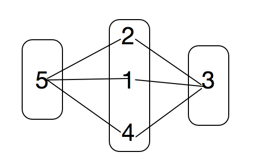
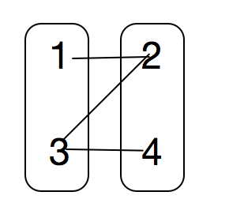

# 016 判断是否是完全多部图 

## 链接和考点

| 栏目         | 详细          |
| ------------ | ------------- |
| 京东编程测试 | 2018.09.08    |
| 考点         | vector2D, dfs |
| 难度         | Easy          |

<br>

## 题意


输出：

```cpp
Yes
No
```

<br>

## 分析 

1-  网上倒是有很多二分图的，

先给出样例的解析

第一个有全连接的，所以是全部图；



第二个样例， 1 和 4 之间没有点相连，所以不是全部图；




<br>

## 测试

A了x

<br>

## 参考答案

给一个二分图判断的例子

```cpp
#include <queue>
#include <cstring>
#include <iostream>
using namespace std;

//const int N = 1000;
//int color[N];


//0为白色，1为黑色
bool bfs(int s, int n,  vector<vector<int> >& graph, vector<int>& color) {
    queue<int> q;
    q.push(s);
    color[s] = 1;
    while(!q.empty()) {
        int from = q.front();
        q.pop();
        for(int i = 1; i <= n; i++) {
            if(graph[from][i] && color[i] == -1) {
                q.push(i);
                color[i] = !color[from];//染成不同的颜色
            }
            if(graph[from][i] && color[from] == color[i])//颜色有相同，则不是二分图
                return false;
        }
    }
    return true;
}


int main() {
    int t;
    cin >> t;
    while (t--){
        int n, m, a, b, i;
//        memset(color, -1, sizeof(color));

        cin >> n >> m;
        vector<vector<int> > graph(1001, vector<int>(n, 0));
        vector<int> color(1001, -1);

        for(i = 0; i < m; i++) {
            cin >> a >> b;
            graph[a][b] = graph[b][a] = 1;
        }
        bool flag = false;
        for(i = 1; i <= n; i++)
            if(color[i] == -1 && !bfs(i, n, graph, color)) {//遍历各个连通分支
                flag = true;
                break;
            }

        if(flag)
            cout << "No" <<endl;
        else
            cout << "Yes" <<endl;
    }


    return 0;
}
/* output
 2
5 7
1 3
1 5
2 3
2 5
3 4
4 5
3 5
4 3
1 2
2 3
3 4
 
 No

Yes
 * /
```


我的解答，


