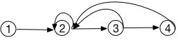

# 023 求重要城市的数量

## 链接和考点

| 栏目         | 详细        |
| ------------ | ----------- |
| 腾讯编程测试 | 2018.09.15  |
| 考点         | graph, tree |
| 难度         | Medi        |

<br>

## 题意

小Q所在王国的n个城市， 城市之间有m条单向道路连接起来。

对于一个城市v， 从城市v出发可以到达的城市数量为x， 从某个城市出发可以达到城市v的城市数量为y， 如果y > x， 则城市v 是一个重要城市（间接可达也算可以到达）。

小Q希望你能帮他计算一下王国中一共有多少个重要城市。

**输入描述**：

>输入包括m+1行，
>
>第一样包括两个数n和m（1 <= n, m < = 1000）, 分别表示城市数和道路数。
>
>接下来m行， 每行两个数u， v（1 <= u, v <= n），表示一条从u到v的有向道路，输入中可能包含重边和自环。

**输出描述：**

> 输出一个数， 重要节点的个数

**输入：**

```
4 3
2 1
3 2
4 3
```

**输出**

```
2
```

**说明**： 城市1和城市2是重要城市。

<br>

## 分析

1-  根据题目，可能包含重边和自环， 会涉及到很复杂的情况， 如下图, 有自环和它环， 2的出度是2，入度是4麽



<br>

## 测试

A了30%

<br>

## 参考答案

刚开始去掉了重边和自环， 然后求出的一个多图遍历。对每一个点，它都会去遍历其它所有节点到它的入度数。

C++ 程序：

```java
//#pragma warning(disable:4786)

#include<map>
#include<iostream>
#include <vector>
#include<stdio.h>
#include<string.h>
#include<iostream>
#include<functional>
#include<queue>
#include<set>
#include<string>
#include<unordered_map>
#include<map>
#include<array>
#include<algorithm>
#include<stack>
using namespace std;


struct node{
    int value;
    int out = 0;
    int input = 0;
    vector<int> road;
    node(int val): value(val) {}
};


void traverse(vector<node>& all, node* beg, int target, vector<node *>& path, int& res, int & level){
    if( beg->value == target && level !=0){
        res++;
        return;
    }


    vector<int>& road = beg->road;
    for( int i=0; i < road.size(); i++ ){
        int index = road[i];
        node* next = &all[index];

        if( find(path.begin(), path.end(), next) == path.end() ){
            path.push_back(next);
            level++;
            traverse(all, next,  target, path, res, level);
            level--;
            path.pop_back();
        }else if( next-> value == target )  // 最后刚好指向自己，自己是环
            res++;
    }
}

int process_each_node( vector<node>& all, int target ){

    int to = 0;
    for( int i=0; i < all.size(); i++ ){        // 包括从自己出发
        node* beg = &all[i];   // begin
        vector<node *> path;
        path.push_back(beg);
        int res = 0;
        int level = 0;
        traverse( all,  beg,  target, path, res, level);
        to += res;
    }
    return to;
}

int main(void)
{

    int n, m;
    cin >> n >> m;
    vector<node> all;           // 存的是路的序号
    for( int i=0; i < n; i++ ){
        node tmp(i);
        all.push_back(tmp);
    }

//    vector<int > out;
    for( int i=0; i < m; i++ ) {
        int sor, des;
        cin >> sor >> des;
        if( sor != des ){       // ignore self
            all[sor-1].out++;
            vector<int>& t_r = all[sor-1].road;
            if( find(t_r.begin(), t_r.end(), des-1) == t_r.end() )      // 去掉重复的边
                all[sor-1].road.push_back(des - 1);
        }

    }

    for( int i=0; i < n; i++ ){
        all[i].input = process_each_node( all,  i );
    }

    int result = 0;
    for( int i=0; i < n; i++ ){
        if( all[i].input > all[i].out ){
            result++;
        }
    }

    cout << result << endl;

    return 0;
}

```

下面A了一个100%的， 有时间可以参考一下别人做的：

```cpp
#include <iostream>
#include <vector>
#include <set>
#include <map>
#include <algorithm>
#include <string>
using namespace std;

vector<vector<int>> nums;
vector<bool> vis;
vector<int> ny;
vector<int> nx;

void find_help(int a)
{
 for (int i = 0; i < nums[a].size(); i++)
 {
  if (vis[nums[a][i]]) continue;
  ny[nums[a][i]]++;
  vis[nums[a][i]] = true;
  find_help(nums[a][i]);
 }
}

int main() {
 nx.clear();
 ny.clear();
 nums.clear();
 int N, M;
 cin >> N >> M;
 nx.resize(N + 1, 0);
 ny.resize(N + 1, 0);
 nums.resize(N + 1);
 int x, y;
 for (int i = 0; i < M; i++) {
  cin >> x >> y;
  nums[x].push_back(y);
 }
 for (int i = 1; i <= N; i++) {
  vis.clear();
  vis.resize(N + 1, false);
  vis[i] = true;
  find_help(i);
  for (int j = 0; j <= N; ++j)
  {
   if (vis[j] == true && j != i)++nx[i];
  }
 }
 int cnt = 0;
 for (int i = 1; i <= N; i++)
 {
  if (ny[i] > nx[i]) ++cnt;
 }
 cout << cnt << endl;
 return 0;
}
```

