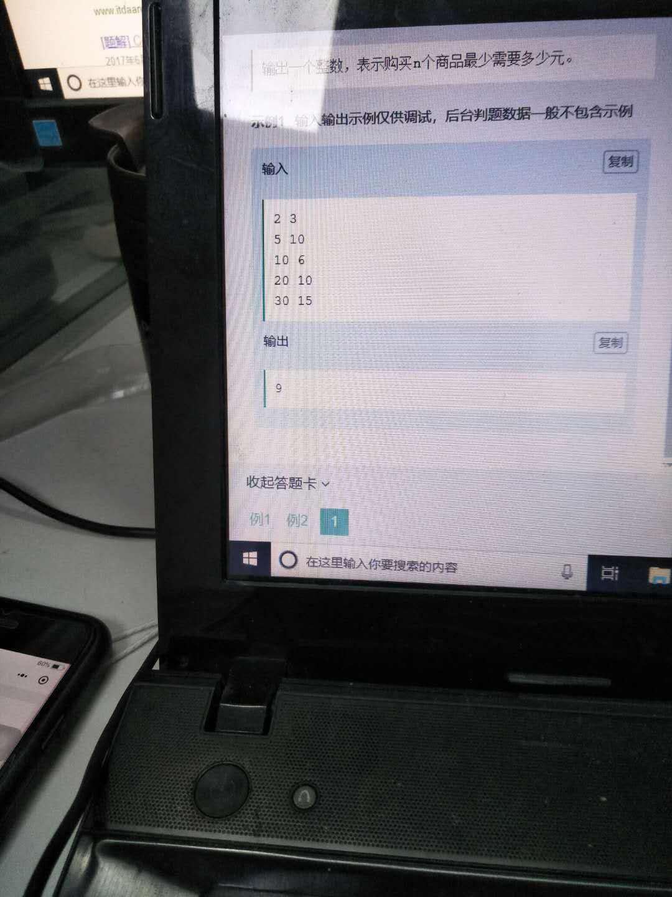

# 027 最大程度的用优惠券

## 链接和考点

| 栏目           | 详细       |
| -------------- | ---------- |
| 拼多多编程测试 | 2018.09.21 |
| 考点           |            |
| 难度           | Hard       |

<br>

## 题意




<br>

## 分析

1-  优先找加高的，然后看有没有最大能减免的优惠券。

<br>

## 测试

A了5%， 匪夷所思啊。。。

<br>

## 参考答案

C++ 程序：

```cpp
    #include<stdio.h>
    #include<string.h>
    #include<iostream>
    #include<functional>
    #include<queue>
    #include<set>
    #include<string>
    #include<unordered_map>
    #include<map>
    #include<array>
    #include<algorithm>
    #include<stack>
    //#include "GlobalHead.h"
    using namespace std;

    typedef struct node{
        int x, y;
        node(int x, int y): x(x), y(y){}
    }node;

    int cmp(node a,node b)	// 先按第一个 x 排序
    {
        if (a.y == b.y)  return a.x > b.x;
        return a.y > b.y;
    }


    //主函数
    int main()
    {
        int n, m;
        cin >> n >> m;
        vector<int> product;
        for(int i=0; i< n; i++){
            int tmp;
            cin >> tmp;
            product.push_back(tmp);
        }

        sort(product.begin(), product.end(), greater<int>());
        // vector<int> product_flag(n,0);

        vector<node> quan;
        for(int i=0; i < m; i++ ){
            int x,y;
            cin >> x >> y;
            node tmp(x,y);
            quan.push_back(tmp);
        }

        sort(quan.begin(), quan.end(), cmp);
    //    cout << "hh" << endl;

        int index_quan = 0;
        for( int i=0; i < product.size(); i++ ){
//            while ( product[i] < quan[index_quan].x ){      // 先减多的
//                index_quan++;
//            }
//
//            if(index_quan < quan.size()){
//                product[i] -= quan[index_quan].y;
//                index_quan++;   // 用完到下一个
//            }else{
//                break;
//            }
            for(auto j=quan.begin(); j < quan.end(); j++){
                if( product[i] >= j -> x ){  // 能抵
                    if( product[i] >= j -> y )
                        product[i] -= j -> y;
                    else
                        product[i] = 0;

                    quan.erase(j);
                }
            }
            sort(quan.begin(), quan.end(), cmp);

        }

        int res;
        for( int i=0; i < product.size();i++ ){
            res += product[i];
        }

        cout << res << endl;

        return  0;
    }
```


