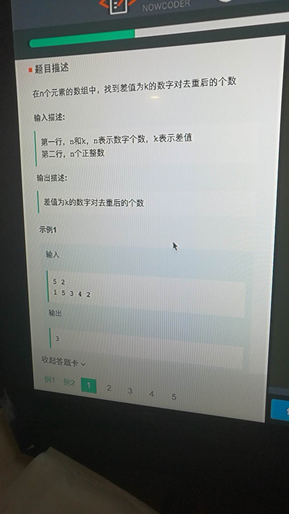

# [easy,数组]20180325_查找两个数字之差为固定值




奇妙之处，是去重了之后，会算上自己-自己。 如果是0，就会有自己减自己的一次机会。

```
#include <bits/stdc++.h>
using namespace std;
typedef long long ll;
const int N = 1e6+7;        // 告诉范围就是为了确定数组范围？
int a[N];
int main()
{
    int n,k;
    scanf("%d%d",&n,&k);
    for(int i=0;i<n;++i) scanf("%d",&a[i]);
    sort(a, a+n);
    n = unique(a, a+n) -a;      // 去除重复后元素的个数
    int r = 0, ans=0;
    for(int l=0; l<n;++l)
    {
        while(r<n&&a[r]-a[l]<k) ++r;
        if(r==n) break;
        if(a[r]-a[l] == k) ++ans;
    }
    printf("%d\n", ans);
    return 0;
}
```