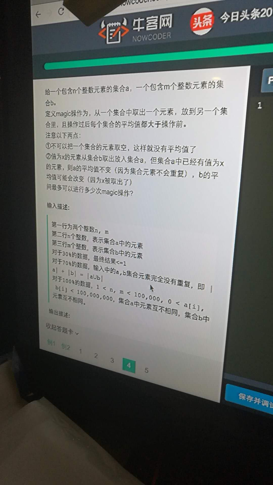

#[hard,math]20180325_两个集合放均值




只能从均值大的集合往均值小的集合里放。

取数只能取出现次数等于1的数
放数只能放没出现过的数
从小的数开始放可以使均值小的集合均值上升慢，均值大的集合均值上升快，这样最优。


```cpp
#include <bits/stdc++.h>
using namespace std;
typedef long long ll;
set<int> sa,sb;
ll suma, sumb;
const long double eps = 1e-14;
inline int cmp(long double a, long double b)
{
    if(fabs(a-b) <= eps) return 0;
    return a>b?1:-1;
}
inline long double jz(ll k, int m)
{
    return (long double)k/m;
}
int main()
{
    int n,m;
    scanf("%d%d",&n,&m);
    for(int i=0; i<n;++i)
    {
        int t;
        scanf("%d",&t);
        sa.insert(t);
        suma+=t;
    }
    for(int i=0;i<m;++i)
    {
        int t;
        scanf("%d",&t);
        sb.insert(t);
        sumb+=t;
    }
    if(cmp(jz(suma, n), jz(sumb, m))==-1)
    {
        swap(suma, sumb);
        swap(n, m);
        sa.swap(sb);
    }
    int mx =n;
    int ans = 0;
    for(auto k : sa)
    {
        if(cmp(k, jz(suma, n)) >= 0) break;
//        printf("%d %d\n",n, k);
        if(!sb.count(k)&&cmp(k, jz(sumb, m))>0)
        {
            ++ans;
            sumb+=k;
            suma-=k;
            sb.insert(k);
            --n;++m;
        }
    }
    printf("%d\n", ans);
```

