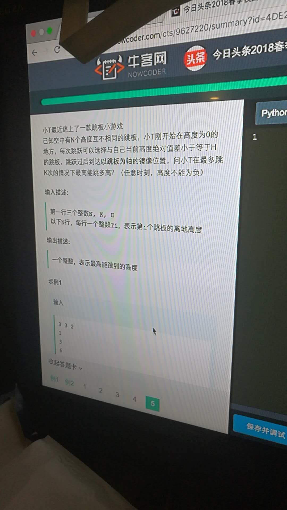

# [hard,math]20180325_跳板问题




BFS

```cpp
#include <bits/stdc++.h>
using namespace std;
const int N = 1e5+1000;
typedef pair<int, int> pii;
bool vis[N];
int a[N];
int main()
{
    int n,k,h;
    scanf("%d%d%d",&n,&k,&h);
    for(int i=0;i<n;++i)
    {
        int t;
        scanf("%d",&t);
        a[t]=1;
    }
    queue<pii> q;
    q.push({0,0});
    int ans = 0;
    while(!q.empty())
    {
        pii p = q.front(); q.pop();
        if(p.second>k) break;
        ans = max(ans, p.first);
        for(int i=1; i<=h; ++i)
        {
            if(a[p.first + i]&&!vis[p.first+2*i])
            {
                vis[p.first+2*i]=true;
                q.push(make_pair(p.first+2*i, p.second+1));
            }
            if(p.first-2*i>0&&a[p.first-i]&&!vis[p.first-2*i])
            {
                vis[p.first-2*i]=true;
                q.push(make_pair(p.first-2*i, p.second+1));
            }
        }
    }
    printf("%d\n", ans);
    return 0;
}

```

