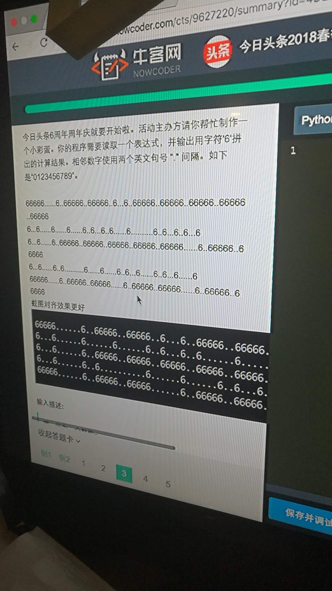
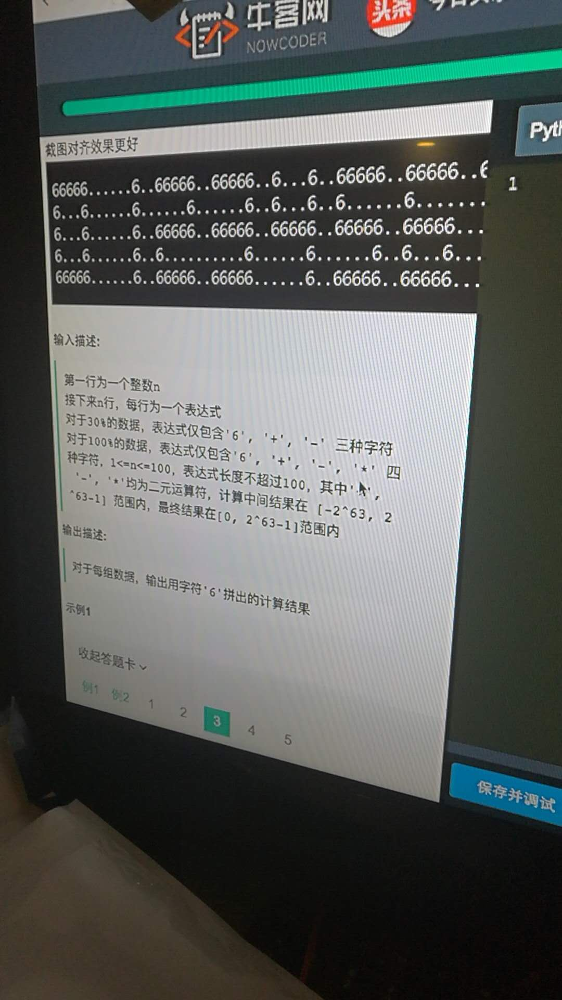

# [hard,string]打印特殊格式的字符数字








```cpp
#include <bits/stdc++.h>
using namespace std;
typedef long long ll;
char s[107];
char G[5][10][8] = {
        {"66666", "....6", "66666", "66666", "6...6", "66666", "66666", "66666", "66666", "66666"},
        {"6...6", "....6", "....6", "....6", "6...6", "6....", "6....", "....6", "6...6", "6...6"},
        {"6...6", "....6", "66666", "66666", "66666", "66666", "66666", "....6", "66666", "66666"},
        {"6...6", "....6", "6....", "....6", "....6", "....6", "6...6", "....6", "6...6", "....6"},
        {"66666", "....6", "66666", "66666", "....6", "66666", "66666", "....6", "66666", "66666"}
};
ll cal()
{
    int n = strlen(s);
    ll sum=0, cur=0, prd=1;
    for(int i=0; i<n; ++i)
    {
        if(isdigit(s[i])) cur=cur*10+s[i]-'0';	// 首席判断数字
        else if(s[i] == '-')
        {
            sum+=prd*cur;
            cur=0;
            prd=-1;
        }
        else if(s[i] == '+')
        {
            sum+=prd*cur;
            cur=0;
            prd=1;
        }
        else
        {
            prd*=cur;
            cur=0;
        }
    }
    return sum+prd*cur;
}
int main()
{
    int T;
    scanf("%d",&T);while(T--)
    {
        scanf("%s", s);
        ll ans = cal();
        for(int i=0; i<5; ++i)
        {
            vector<int> v;
            ll tmp = ans;
            while(tmp) v.push_back(tmp%10),tmp/=10;
            reverse(v.begin(), v.end());
            if(v.empty()) v.push_back(0);
            for(int j=0; j<v.size(); ++j)
            {
                printf("%s%s",G[i][v[j]], j+1==v.size()?"\n":"..");
            }
        }
    }
    return 0;
}


```

