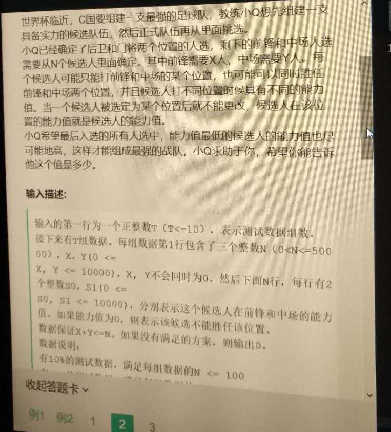
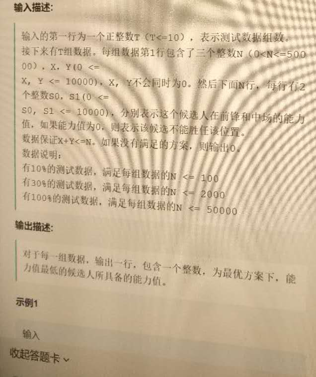
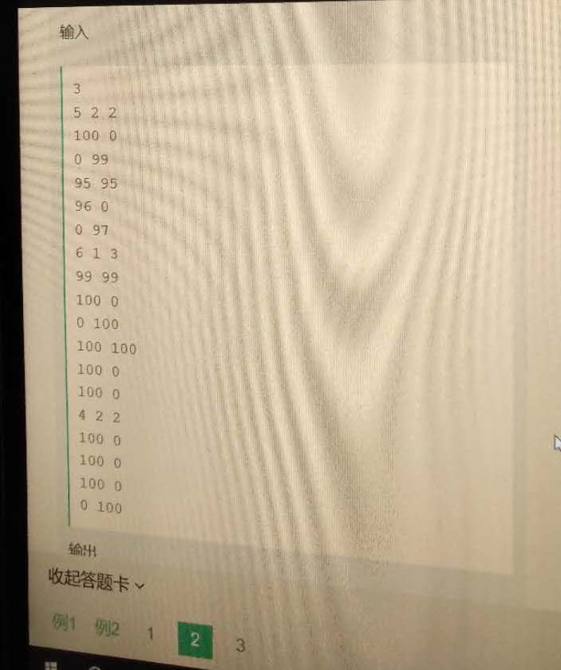
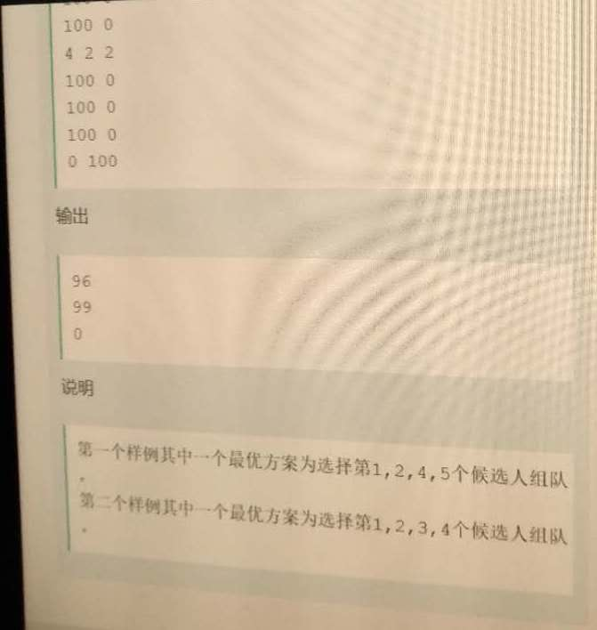

# [网易互娱，交叉重叠问题]20180403_选足球对手









题目的思路是，先各自选指定数目，比如X和Y个，然后重复了k个，分别从排序后的X与Y中，各自取剩下的K个，然后在这K 中取不重复的K个，来替换刚才重复的k个值。

```cpp
#include <bits/stdc++.h>
using namespace std;

void dfs(int X, int Y,multimap<int,int>& xx, bool& flag,multimap<int,int>& yy, vector<int>& occupy,int& res ){
    if( xx.size() < X || yy.size() < Y ){
        flag =  false;
        return ;
    }

    int i =0;
    int min = INT_MAX;
    vector<int> vecX;
    vector<int> vecX_val;
    for( auto it = xx.rbegin(); it != xx.rend(); it ++ ){
//        cout << it -> first << it -> second << endl;
        if( i < X ){
            occupy.push_back(it -> second);
            if( it ->first < min ){
                min = it ->first;
            }
            i++;

        }
        vecX.push_back(it -> second);
        vecX_val.push_back(it -> first);
    }


    vector<int> vecY;
    vector<int> vecY_val;
    i = 0;
    for( auto it = yy.rbegin(); it != yy.rend(); it ++ ){
//        cout << it -> first << it -> second << endl;
        if( i < Y ){
            occupy.push_back(it -> second);
            if( it ->first < min ){
                min = it ->first;

            }
            i++;
        }
        vecY.push_back(it -> second);
        vecY_val.push_back(it->first);
    }

    sort(occupy.begin(),occupy.end());
    vector<int> chong;
    for( int i=0; i< occupy.size();i++ ){
        if( occupy[i] == occupy[i+1] ){
            chong.push_back(occupy[i]);
        }
    }

    int cchong = chong.size();
    vector<int> xxCC;
    vector<int>  yyCC;
    vector<int>  xxCC_val;
    vector<int> yyCC_val;
    for( int j= X; j < X + cchong; j++ ){
        if(j < vecX.size()){
            xxCC.push_back(vecX[j]);
            xxCC_val.push_back(vecX_val[j]);
        }else{
            break;
        }

    }

    for( int j= Y; j < Y + cchong; j++ ){
        if(j < vecY.size()){
            yyCC.push_back(vecY[j]);
            yyCC_val.push_back(vecY_val[j]);
        }else{
            break;
        }

    }

    int m =0;
    map<int,int> mymap;     /// 其实用set就可以。
    while( mymap.size() < cchong ){
        if(xxCC_val.size()>0  && yyCC_val.size() > 0){
            /// 这个地方应该用一个map来处理。
            if( xxCC_val[0] >= yyCC_val[0] ){
                if( min > xxCC_val[0] ){
                    min = xxCC_val[0];
                }
                mymap.insert(make_pair(xxCC[0],xxCC_val[0]));	// 如果有重复的，下次插入相同的数时，不会改变mymap的大小，因为之前已经用过该值，会自动跳到下一个值，然后重新进行比较。
                xxCC_val.erase(xxCC_val.begin());
                xxCC.erase(xxCC.begin());
            }else{
                if( min > yyCC_val[0] ){
                    min = yyCC_val[0];
                }
                mymap.insert(make_pair(yyCC[0],yyCC_val[0]));
                yyCC_val.erase(yyCC_val.begin());
                yyCC.erase(yyCC.begin());
            }

        }else if( xxCC_val.size() > 0 && yyCC_val.size() == 0 ){
            if( min > xxCC_val[0] ){
                min = xxCC_val[0];
            }
            mymap.insert(make_pair(xxCC[0],xxCC_val[0] ));
            xxCC_val.erase(xxCC_val.begin());
            xxCC.erase(xxCC.begin());

        }else if( xxCC_val.size() == 0 && yyCC_val.size() > 0 ){
            if( min > yyCC_val[0] ){
                min = yyCC_val[0];
            }
            mymap.insert(make_pair(yyCC[0],yyCC_val[0]));
            yyCC_val.erase(yyCC_val.begin());
            yyCC.erase(yyCC.begin());
        }else{
            flag = false;
            break;
        }
    }

    res = min;

}


//struct IN{
//    int N,X,Y;
//    int arr[N][2];
//};
int main(){
   int zu;
    cin >> zu;

    vector<int> output;		/// 存放每组将要输出的值
    for( int i=0; i<zu; i++ ){
        int N,X, Y;
        cin >> N >> X >> Y;
        int arr[N][2];
        for(int i=0; i< N;i++){
            int tmp1 , tmp2;
            cin >> tmp1 >> tmp2;
            arr[i][0] = tmp1;
            arr[i][1] = tmp2;
        }

        multimap<int,int> xx;
        multimap<int, int> yy;
        for( int i=0; i < N; i++ ){
            xx.insert(make_pair(arr[i][0],i));
        }

        for( int i=0; i < N; i++ ){
            yy.insert(make_pair(arr[i][1],i));
        }

        int res;
        vector<int> occupy;
        bool flag = true;
        dfs(X, Y,xx, flag,yy, occupy,res );

        if(! flag){
            output.push_back(0);
        }else{
            output.push_back(res );
        }
    }

    for( auto val: output )
        cout << val << endl;

           return 0;
}

```


测试用例如下：

```cpp
3
5 2 2
100 0
0 99
95 95
96 0
0 97
6 1 3
99 99
100 0
0 100
100 100
100 0
100 0
4 2 2
100 0
100 0
100 0
0 100
    
输出结果如下：
96
99
0
```


